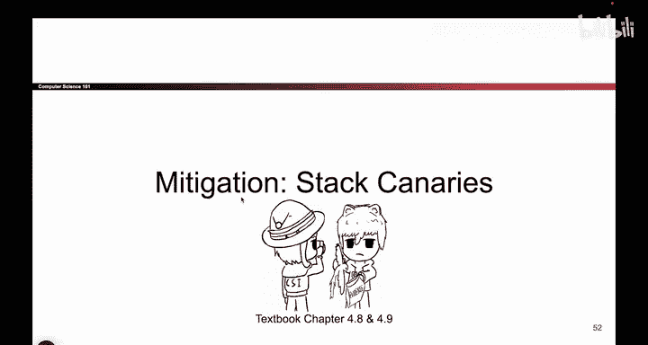
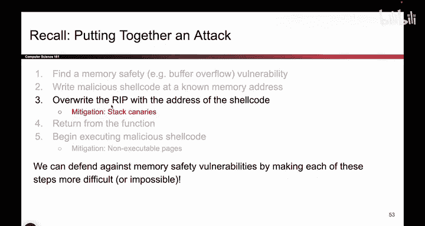

# 071：栈金丝雀类比 🐦

在本节课中，我们将学习第二种内存安全防护机制——栈金丝雀。这种机制旨在增加攻击者利用缓冲区溢出漏洞的难度，但并非完全杜绝攻击。我们将了解其名称的由来、核心思想以及它如何保护程序。

上一节我们介绍了不可执行页防护，它主要针对攻击链的第五步（执行恶意代码）。本节中，我们来看看栈金丝雀，它将目标对准了攻击的第三步——覆盖返回地址。

## 名称的由来 🏔️

在深入技术细节之前，我们先了解“栈金丝雀”这个名称背后的故事。据说，在很久以前的采矿时代，矿工们会在矿井中携带一只金丝雀。

金丝雀是一种会发出响亮叫声的小鸟。矿井中可能积聚有毒气体，这对矿工是致命的。由于金丝雀对有毒气体非常敏感，一旦气体开始积聚，金丝雀就会开始不安地鸣叫，甚至可能死亡。

矿工们工作时，如果发现金丝雀倒下，这就是一个明确的信号，表明有毒气体正在泄漏，所有矿工必须立即撤离。

在这个故事中，金丝雀本身并不被期望能存活下来。它是一个“牺牲品”，被带入矿井的目的不是让它生存，而是让它作为预警信号，保护更有价值的矿工生命。

## 栈金丝雀的核心思想 💡

我们将同样的思路应用到程序栈的保护上。在程序中，栈金丝雀是一个“牺牲值”。

以下是栈金丝雀的核心概念：
*   它本身没有实际意义，程序逻辑不会使用它。
*   我们并不关心它的具体值是什么。
*   它的存在就像矿井中的金丝雀。如果这个值被意外或恶意地改变了（“倒下”了），那就发出了一个明确的警告信号，表明栈上的数据可能遭到了破坏（例如发生了缓冲区溢出）。
*   这个警告给了程序一个机会，可以在造成更大损害（如执行攻击者代码）之前安全地崩溃或终止，从而保护真正有价值的数据和代码流。

虽然原故事有些令人伤感，但栈金丝雀技术本身是一种非常巧妙且有效的防护手段。接下来，我们将具体看看它在栈上是如何布局和工作的。

## 总结 📝

本节课我们一起学习了栈金丝雀防护机制。我们了解了其名称来源于矿工用金丝雀预警有毒气体的历史典故，并理解了其核心思想：在栈上放置一个无意义的“牺牲值”，通过检查该值在函数返回前是否被改变，来探测是否发生了缓冲区溢出攻击。这为目标攻击链的第三步（覆盖返回地址）增加了难度。下一节，我们将具体分析栈金丝雀在内存中的布局和工作原理。