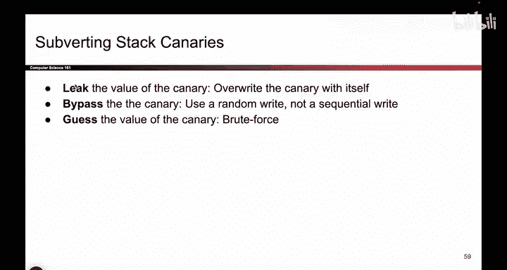
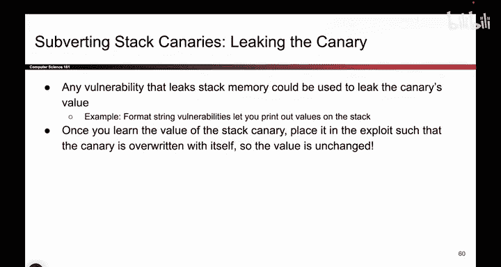

# 073：绕过栈金丝雀防御 🛡️

在本节课中，我们将学习栈金丝雀（Stack Canary）这种防御机制。虽然它能有效阻止经典的缓冲区溢出攻击，但攻击者仍有多种方法可以绕过它。我们将逐一探讨三种主要的绕过策略：泄露金丝雀值、完全避开金丝雀以及暴力猜测金丝雀值。

上一节我们介绍了栈金丝雀如何防御经典的缓冲区溢出攻击。本节中，我们来看看攻击者如何设法绕过这一防御。

## 泄露金丝雀值 🔓

第一种策略是泄露金丝雀值。如果程序存在内存安全漏洞，允许攻击者访问本不应访问的内存区域，那么攻击者就有可能获知金丝雀的值。

例如，利用格式化字符串漏洞可以打印出栈上的值。如果攻击者能够打印栈上的内容，就可能打印出金丝雀值。攻击者可以这样做：先泄露金丝雀值，然后在构造攻击载荷写入内存时，当写到金丝雀所在位置时，不写入破坏性的数据（如`AAAA`），而是写入**原始的金丝雀值**。这样，程序检查金丝雀时会发现其值未被改变，从而绕过检测。

**核心要点**：这一切必须在程序的**单次运行**中完成。因为每次程序重启时，金丝雀值都会改变。你不能在一次运行中记下值，然后在另一次运行中使用。

## 避开金丝雀 🚷

第二种策略是避开金丝雀。栈金丝雀擅长阻止那些从低地址向高地址连续写入的攻击（例如使用`gets`或`strcpy`的函数）。因为在这类攻击中，要覆盖返回地址（RIP），就必须覆盖途中的金丝雀。

然而，并非所有攻击都需要连续写入内存。有些漏洞允许攻击者“绕过”金丝雀进行写入。

以下是此类攻击的例子：
*   **格式化字符串漏洞**：使用`%n`格式化符可以向内存中任意指定地址写入数据，完全不需要覆盖金丝雀。
*   **堆溢出**：如果在堆上进行溢出，根本不会触及栈上的金丝雀。即使金丝雀开启，攻击者仍可能覆盖堆上的关键变量（例如一个认证标志）。

这表明，栈金丝雀能防御常见的连续溢出攻击，但对于更精巧的、能够绕过金丝雀写入的攻击则无能为力。

## 猜测金丝雀值 🎯

最后一种策略是最直接的：猜测金丝雀值。如果金丝雀是随机值，你可以不断尝试猜测。虽然第一次猜中的概率很低，但尝试足够多次后，就有可能成功。

攻击方式如下：在构造攻击载荷时，当写到金丝雀位置时，填入你的**猜测值**，然后继续写入后续内容。如果猜对了，程序会认为金丝雀未被篡改。

那么，猜测的可行性如何？这完全取决于**威胁模型**。

**可行性分析**：
*   **32位系统**：金丝雀通常为32位（4字节），其中8位是固定的“哨兵字节”（nul byte），剩下24位是随机的。猜中的概率约为 **1/(2^24)**，即大约1600万分之一。
*   **64位系统**：金丝雀为64位（8字节），固定8位后，剩下56位随机位，猜中的难度极大。

**环境因素**：
*   **本地环境**：在自己的电脑上可以无限制地尝试。
*   **远程服务器**：服务器可能会检测到大量异常请求（如尝试1600万次）并阻止你，例如断开连接或封禁IP。

**增强防御**：程序可以实施反制措施，极大增加猜测难度：
*   **超时机制**：每次验证失败后强制等待一段时间。
    *   **举例**：若无超时，假设每秒可尝试1万次，破解24位金丝雀约需**30分钟**。若每次失败后增加仅0.1秒超时，破解时间将延长至**3周**。
*   **递增超时**：每次失败后等待时间翻倍，这将使攻击在实际上变得不可能完成。

正如课程所提及，在配套的实践项目（Project 1）中，你并没有足够的时间去暴力猜测金丝雀值。

---

**本节课总结**：我们一起学习了三种绕过栈金丝雀防御的方法：**泄露**、**避开**和**猜测**。栈金丝雀是一种有效的防御手段，但并非无懈可击。其有效性高度依赖于具体的漏洞类型、系统架构（32/64位）以及运行环境（本地/远程）。安全始终是一个攻防对抗的动态过程，理解攻击原理是构建更坚固防御的第一步。