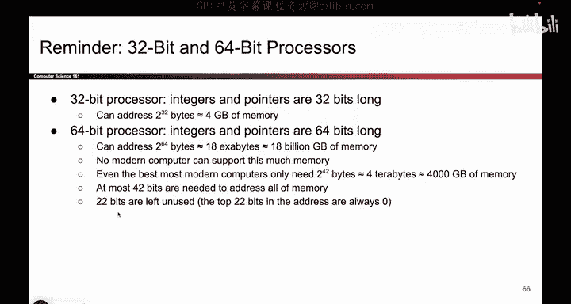

# 074：指针认证 🔐

在本节课中，我们将要学习第三种内存安全防御机制——指针认证。我们将了解它如何工作，它与栈金丝雀的相似之处，以及它为何能提供更强的保护。

## 从栈金丝雀到指针认证

上一节我们介绍了栈金丝雀，本节中我们来看看一种更强大的机制：指针认证。它的核心思想与栈金丝雀类似，都是通过检测内存中的秘密值是否被篡改来防御攻击，但实现方式更加巧妙和强大。

## 利用64位系统的地址空间

首先，我们需要理解现代64位系统的一个关键特性。在32位系统中，地址长度为32位，可寻址约4GB内存。而在64位系统中，地址长度为64位，理论上可寻址高达180亿GB的内存。

然而，现实中没有任何计算机拥有如此巨大的物理内存。这意味着，在64位地址中，高位的许多比特（例如最高的22位）在实际使用中几乎总是为零。即使访问系统可寻址的最高内存地址，其高位也由零填充。

## 指针认证的核心思想

既然这些高位比特未被使用，我们为何不利用它们呢？指针认证正是基于这个想法。它的工作原理如下：

1.  **嵌入秘密值**：当程序将一个地址（指针）存入内存（栈、堆或静态内存）时，系统会将该地址中未使用的高位比特（例如22位）替换为一个秘密的认证码。
2.  **验证秘密值**：当程序后续尝试使用这个地址（例如解引用或跳转）时，系统会检查这些高位比特中的认证码是否有效。
3.  **执行或崩溃**：如果认证码有效，系统会将这些比特重置为零，然后正常访问该地址。如果认证码无效（表明指针可能被攻击者篡改），程序会立即崩溃。

本质上，指针认证为内存中的**每一个指针**都配备了一个“金丝雀”，而栈金丝雀仅为每个函数配备一个。这使得防御粒度更细，覆盖范围更广。

## 指针认证的优势

以下是指针认证的一些关键特性，使其比简单的栈金丝雀更强大：

*   **每个指针拥有唯一认证码**：系统可以为不同的地址生成不同的秘密认证码。这意味着攻击者无法从一个指针“窃取”认证码并用于伪造另一个指针。
*   **基于密码学**：认证码的生成通常基于密码学原理（如消息认证码），使得攻击者在不知道系统主密钥的情况下，几乎不可能伪造有效的认证码。
*   **广泛的覆盖范围**：此机制可应用于内存中任何地方的指针，而不仅仅是栈上的返回地址。

## 指针认证的局限性与现状

尽管非常强大，指针认证也并非完美无缺：

*   **可能的信息泄露**：理论上，攻击者可能通过某些手段诱骗程序泄露特定地址的认证码，或推断出生成认证码的主密钥。
*   **架构依赖性**：目前，指针认证主要在现代ARM架构（如苹果的芯片）中得到硬件支持。x86和RISC-V等架构在制作本课程时尚未原生支持此功能。因此，它的应用受到处理器架构的限制。
*   **实现复杂度**：它需要在汇编语言或编译器层面进行支持，并非所有编程环境都能直接使用。

尽管如此，与之前讨论的简单防御相比，绕过指针认证的难度极大，它代表了当前防御缓冲区溢出等内存安全漏洞的先进技术。

## 总结

本节课中我们一起学习了指针认证机制。我们了解到它如何巧妙地利用64位地址中未使用的高位比特来存储秘密认证码，从而为内存中的每一个指针提供保护。虽然它存在一定的架构依赖性和理论上的攻击面，但指针认证无疑是一种极其强大的内存安全防御工具，能显著增加攻击者实施缓冲区溢出攻击的难度。