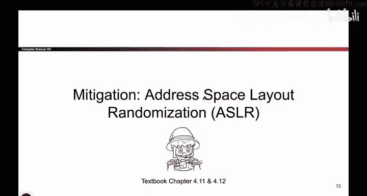
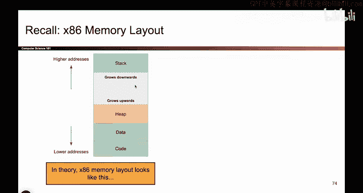
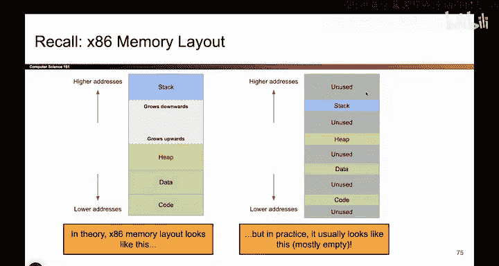

# 075：ASLR概述

在本节课中，我们将要学习最后一种内存安全缓解技术——地址空间布局随机化（ASLR）。我们将了解ASLR如何通过随机化内存布局来增加攻击者利用缓冲区溢出漏洞的难度。

## 攻击步骤回顾

上一节我们介绍了通过栈金丝雀来防止返回地址被覆盖。本节中，我们来看看如何针对攻击流程中的第二步——攻击者将Shellcode写入已知地址——进行防御。

下图展示了典型的攻击步骤：
1.  攻击者将Shellcode写入内存中的某个位置。
2.  攻击者需要知道这个位置的地址。
3.  攻击者用这个地址覆盖返回指令指针（RIP）。
4.  程序执行流跳转到Shellcode并执行。

ASLR的目标是让攻击者无法准确预测Shellcode的存放地址，从而破坏第二步。

## 内存布局的现状

为了理解ASLR的动机，让我们先看看程序在内存中的实际布局。我们通常将内存划分为四个部分：栈、堆、数据段和代码段。

然而，在现实中，程序并不会使用全部的地址空间。例如，在32位系统上，总地址空间为4GB，但程序实际使用的内存远小于这个值。在64位系统上，未使用的空间更是巨大。因此，大部分地址空间实际上是空白的。

这种现状带来了一个关键问题：既然程序没有使用这些空白空间，我们是否可以改变栈、堆、数据段和代码段在地址空间中的位置？

## ASLR的核心思想

答案是肯定的，这正是ASLR的核心思想。ASLR利用了大量地址空间未被使用的事实，在每次程序运行时，随机地调整各个内存段（栈、堆、数据段、代码段）的起始地址。

以下是ASLR可能产生的几种内存布局示例：
*   **布局A**：所有段紧密排列在低地址区域。
*   **布局B**：所有段整体向上移动。
*   **布局C**：各个段被随机打散放置在不同的地址区域。

只要保证栈仍能向下增长、堆仍能向上增长，程序的运行就不会受到影响。但关键的变化是，**所有内存地址都变得不可预测了**。

## ASLR如何阻止攻击

ASLR使得经典的缓冲区溢出攻击难以奏效。回顾最初的攻击方式：攻击者将Shellcode写入缓冲区，然后用Shellcode的地址覆盖RIP。

在启用ASLR后，Shellcode在内存中的地址每次运行都会改变。攻击者无法知道本次运行中应该使用哪个地址来覆盖RIP，从而使得攻击失效。

需要强调的是，ASLR**随机化的是整个内存段的起始地址，而不是段内部数据的相对位置**。例如，栈帧的结构（RIP在上，然后是SFP，最后是局部变量）保持不变，只是整个栈区域被平移到了一个随机的基地址上。内部的相对偏移关系是稳定的，否则程序将无法正常运行。

## 性能影响

我们照例分析一下ASLR的性能开销。ASLR的性能开销非常低，几乎可以忽略不计。

这主要是因为现代操作系统的虚拟内存管理机制本身就在做类似的事情（例如将内存页映射到物理内存的不同位置）。启用ASLR只是在此基础上增加了一层随机化，并不会引入显著的额外负担。因此，通常建议始终开启ASLR以获得安全收益。

## 总结

本节课中我们一起学习了地址空间布局随机化（ASLR）。ASLR通过每次程序运行时随机化内存中栈、堆、数据段和代码段的基地址，使得攻击者难以预测特定数据（如Shellcode）的绝对地址，从而有效防御了依赖于固定地址的经典缓冲区溢出攻击。同时，由于它与操作系统底层机制协同工作，其性能开销极小，是一种高效且重要的安全缓解措施。