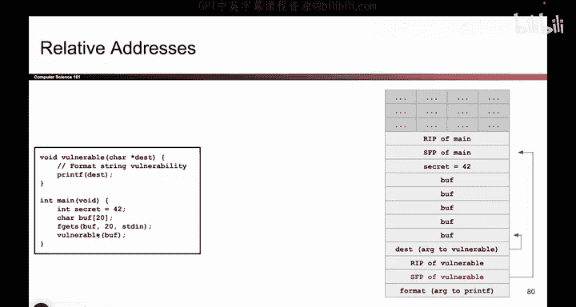
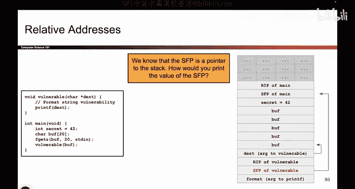

# 076：绕过ASLR

在本节课中，我们将学习地址空间布局随机化（ASLR）的两种主要绕过方法：地址猜测与地址泄露。我们将通过具体的例子来理解攻击者如何利用这些技术来定位内存中的关键数据。

## 概述

上一节我们介绍了ASLR，它通过随机化内存段的绝对地址来增加攻击难度。然而，其相对地址保持不变。本节中我们来看看攻击者如何通过“猜测”或“泄露”地址来绕过ASLR的保护。

## 绕过方法一：地址猜测

第一种方法是直接猜测目标地址。虽然ASLR随机化了地址，但攻击者可以进行多次尝试。

以下是地址猜测可行的几个原因：
*   **地址对齐**：内存地址通常以特定边界对齐。例如，返回地址（RIP）通常是4字节的倍数。这减少了需要猜测的地址空间。
*   **页面对齐**：从操作系统层面看，地址也常与内存页边界对齐，这进一步缩小了猜测范围。

尽管如此，猜测仍然需要大量尝试。在32位系统上，可能需要猜测大约2^20次；在64位系统上，猜测次数可能高达2^36次。其可行性取决于具体的威胁模型。

## 绕过方法二：地址泄露

第二种更有效的方法是泄露一个已知的栈地址。由于ASLR只改变绝对地址而不改变相对布局，一旦获得一个地址，就可以推算出栈上其他所有位置的地址。

例如，如果泄露了某个栈帧的帧指针（SFP）地址，那么：
*   返回地址（RIP）通常位于 `SFP地址 + 4`。
*   局部变量可能位于 `SFP地址 - N`（N取决于变量大小和布局）。

## 地址泄露实例分析

为了更好地理解地址泄露，让我们看一个具体的代码漏洞例子。

以下是一段存在漏洞的C代码示例：
```c
void vulnerable() {
    char buff[64];
    // 假设攻击者可以控制buff的内容
    printf(buff); // 危险！格式化字符串漏洞
}



int main() {
    vulnerable();
    return 0;
}
```
这段代码的问题在于，`printf` 的第一个参数（格式化字符串）直接使用了用户控制的 `buff`。这导致了格式化字符串漏洞。

攻击者可以输入 `%x` 作为 `buff` 的内容。`printf` 会将其解释为格式说明符，并尝试从栈上读取本应是下一个参数的数据进行打印。

假设在调用 `printf(buff)` 时，栈布局简化如下：
| 栈地址（示例） | 内容 |
| :--- | :--- |
| ... | ... |
| 0xbfff040c | 返回地址 (RIP) |
| 0xbfff0408 | 上一个栈帧的帧指针 (SFP) |
| 0xbfff0404 | 局部变量 `secret` |
| 0xbfff0400 | `buff` 数组起始地址 |
| ... | ... |




当攻击者输入 `%x` 时，`printf` 会打印出栈上“第一个参数”位置的值，即 `0xbfff0408` 地址处存储的内容（也就是SFP的值）。假设打印出的值是 `0xbfff0408`。

通过这个泄露的地址，攻击者可以进行如下推算：
*   泄露的地址是：`0xbfff0408`（SFP的地址）
*   因此，返回地址（RIP）的地址大约是：`0xbfff0408 + 4 = 0xbfff040c`
*   局部变量 `secret` 的地址大约是：`0xbfff0408 - 4 = 0xbfff0404`
*   缓冲区 `buff` 的地址可以根据偏移量进一步计算。

即使程序下次运行时栈的基地址变成了 `0xcfff0000`，这些**相对偏移关系依然保持不变**。攻击者只需泄露一个地址，就能计算出所有关键数据的当前位置。


## 总结

本节课中我们一起学习了绕过ASLR的两种主要技术。
1.  **地址猜测**：依赖于地址对齐特性进行暴力尝试，成功率受限于地址空间大小。
2.  **地址泄露**：利用如格式化字符串之类的漏洞，获取栈上的一个已知地址，进而利用固定的相对偏移推算出所有目标地址。这是一种更精确、更常用的方法。


理解这些绕过技术有助于我们认识到，ASLR虽然是一项强大的防御措施，但并非无懈可击，需要与其他安全机制结合使用。