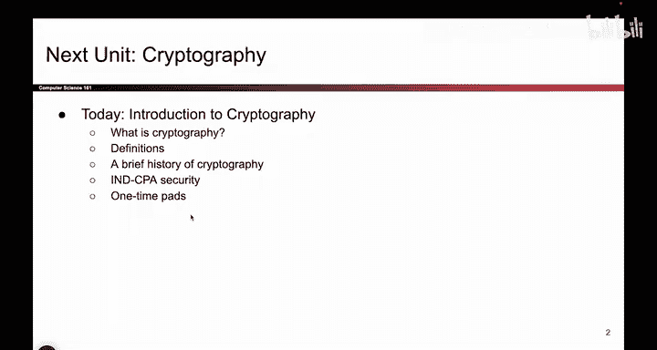
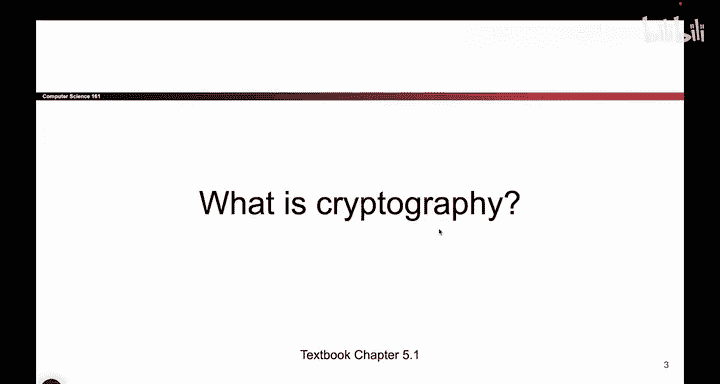

# 078：课程介绍与警告

在本节课中，我们将开始学习密码学，这是本课程的第二个主要单元。我们将从基本定义和历史背景入手，为后续学习奠定基础。

## 什么是密码学？🔐

上一节我们介绍了本单元的主题，本节中我们来看看密码学的核心定义。

密码学是研究在**不安全信道**上进行**安全通信**的学科。具体来说，当通信双方（例如Alice和Bob）需要通过一个可能被攻击者监听或篡改的渠道进行交流时，密码学提供了确保消息**机密性**和**完整性**的方法。

## 课程内容与数学要求 📐

在深入细节之前，我们需要了解本部分课程的特点。

本单元可能是整个课程中数学内容最多的部分。我们会涉及一些数学概念，但会尽力回顾所有必要的前提知识。如果你是数学爱好者，这部分内容可能会让你特别感兴趣。

## 重要警告：请勿自行尝试 🚫

在介绍第一个密码学基础知识之前，我们必须发出一个重要警告：**请不要在家尝试（自行实现密码学协议）**。

本课程的目标是让你成为密码学的“明智消费者”，而非“创造者”。以下是具体原因：

*   **目标**：我们将教你足够的知识，以便你能理解相关讨论、评估现有工具、了解它们的能力与局限。
*   **风险**：密码学涉及精密且脆弱的数学。即使一个微小的错误也可能导致整个系统崩溃，代码变得完全不安全。
*   **现实建议**：在实际工作中，除非你从事密码学研究，否则你不应该自己编写密码协议。你应该使用他人构建的、经过充分验证的库，因为这些库的开发者已经考虑了所有边界情况和安全隐患。

为了说明自行实现密码学的风险，这里有一个真实的故事：

几年前，本课程的一些学生在疫情期间尝试为在线考试等项目编写自己的密码学代码。他们在代码中引入了一个微小的错误，导致**考试题目可能被提前查看**。尽管他们在学习时也看到了类似的警告幻灯片，但仍然选择了自行编写。现在，他们的经历成为了警示后来者的案例。

因此，请记住：使用经过严格审查的现有库，不要编写自己的密码学代码。我们教授的知识不足以让你安全地做到这一点。

---

本节课中，我们一起学习了密码学的基本定义、本单元的内容特点，以及一个至关重要的安全警告：永远不要尝试自行实现密码学协议，而应依赖成熟、经过验证的库。