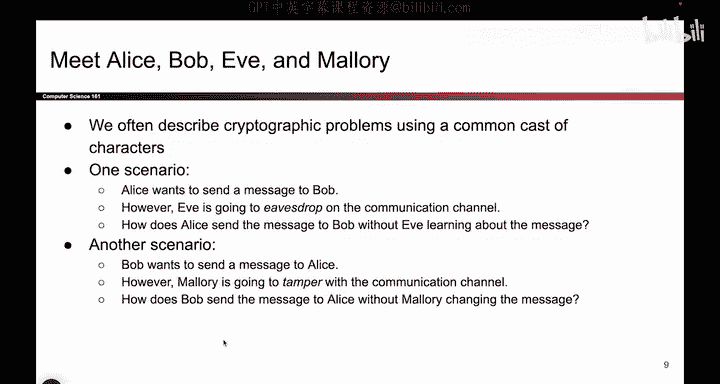

# 079：定义与柯克霍夫原则


在本节课中，我们将学习密码学中的一些基本定义和核心原则。我们将认识密码学中常见的角色，理解保密性、完整性和真实性这三个核心目标，并深入探讨对称密钥与非对称密钥模型。最后，我们将学习一个至关重要的安全原则——柯克霍夫原则，它指导我们如何构建健壮的密码系统。

## 密码学中的角色

在密码学论文和讨论中，我们通常使用一些约定俗成的角色名称来描述不同的场景。了解这些角色有助于我们清晰地讨论安全模型。

以下是这些核心角色及其作用：

*   **爱丽丝和鲍勃**：他们是主角，通常的目标是通过不安全的通信渠道相互发送消息。
*   **夏娃**：她是窃听者，可以读取在信道上发送的数据。
*   **马洛里**：她不仅是窃听者，还能拦截并修改传输中的数据。

通常，我们的目标是让爱丽丝和鲍勃在面对夏娃或马洛里（或两者兼具）的威胁时，仍能实现安全通信。



## 密码学的核心目标

上一节我们介绍了通信中的各方角色，本节中我们来看看密码学旨在保护数据的三个核心目标。这些目标定义了安全的通信应具备哪些特性。

密码学旨在实现以下三个主要目标：

*   **保密性**：像夏娃和马洛里这样的对手无法读取我们的消息。
*   **完整性**：对手无法在未被察觉的情况下更改我们的消息。如果消息被更改，应有某种机制能向我们发出警报。
*   **真实性**：消息的原始发送者能够证明消息确实来自他们，而非冒名顶替者。

保密性关乎保护秘密信息不被读取，而完整性和真实性则关乎验证消息的来源和是否被篡改。在某些威胁模型中，完整性和真实性紧密相关。

## 密钥：密码学的基础构件

在明确了安全目标之后，我们需要工具来实现它们。任何密码方案中最基本的构建块就是**密钥**。

密钥是一段秘密数据（例如一串0和1），用于保护我们的消息安全。根据密钥的使用方式，主要分为两种模型：


*   **对称密钥模型**：爱丽丝和鲍勃共享一个只有他们知道的秘密密钥。加密和解密使用同一个密钥。
    ```python
    # 概念示例：使用同一个密钥K进行加密和解密
    ciphertext = encrypt(plaintext, key_K)
    plaintext = decrypt(ciphertext, key_K)
    ```
*   **非对称密钥模型**：每个人都拥有一对密钥：一个公开的公钥和一个私密的私钥。我们将在后续课程中详细讨论。

## 柯克霍夫原则

了解了密钥的重要性后，我们来看一个指导密码系统设计的核心安全原则。这个原则强调了密钥作为唯一秘密的重要性。

柯克霍夫原则指出：**一个密码系统应该是安全的，即使攻击者完全了解系统的所有工作细节。系统中唯一需要保密的就是密钥本身。**

这意味着，即使攻击者知道你的加密算法、代码实现等一切信息，只要他不知道密钥，就无法攻破系统。这样做的好处是：
1.  如果系统设计遵循此原则，即使代码泄露，也只需更换密钥即可恢复安全，成本很低。
2.  如果依赖“隐匿式安全”（即希望攻击者不知道系统如何工作），一旦系统细节泄露，就必须从头重写整个系统，代价高昂。

因此，遵循柯克霍夫原则意味着将所有安全性都建立在密钥的保密性之上，而不是算法的保密性上。

---

本节课中我们一起学习了密码学的基本框架。我们认识了爱丽丝、鲍勃、夏娃和马洛里这些经典角色，明确了保密性、完整性和真实性三大安全目标，并了解了对称与非对称密钥模型的基础概念。最后，我们深入理解了柯克霍夫原则，它教导我们构建密码系统时应将安全性完全寄托于密钥的保密，而非算法的隐匿。这是设计健壮、可维护的密码系统的基石。