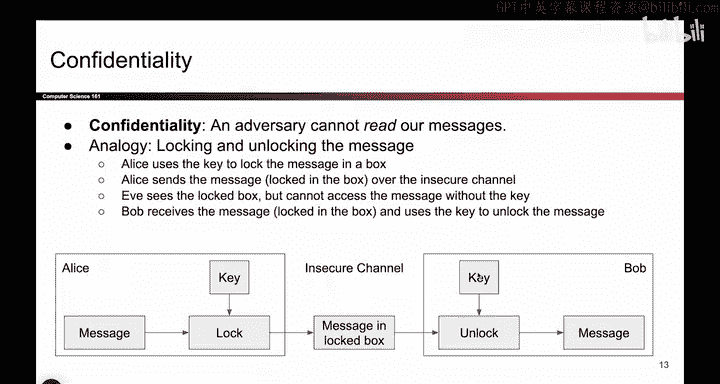
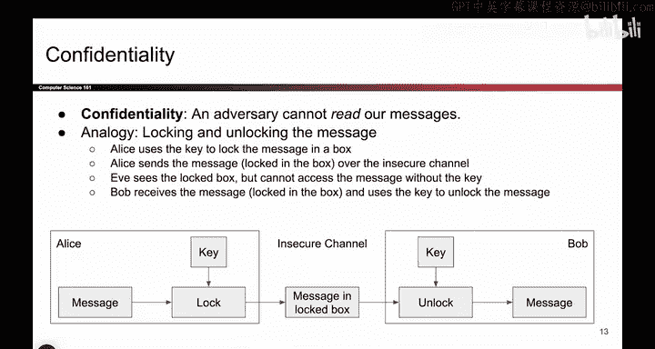
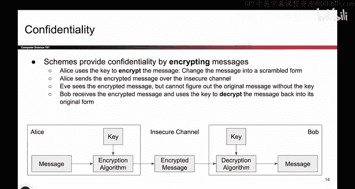
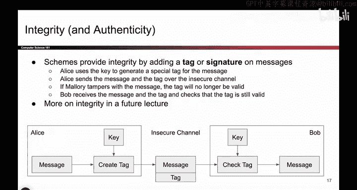

# 080：实现机密性、完整性与真实性

在本节课中，我们将学习如何在实际中实现密码学系统的三个核心属性：机密性、完整性与真实性。我们将通过物理类比来理解这些概念，并探讨它们在代码中的具体表现形式。

## 实现机密性 🔒

上一节我们介绍了密码学系统的三个目标属性。本节中，我们来看看如何实现其中的第一个——机密性。

机密性的定义是：**攻击者无法读取我们的秘密消息**。一个物理类比是，将消息放入一个盒子并上锁。在对称密钥模型中，Alice和Bob拥有一把其他人都没有的密钥。Alice会将她的消息放入盒子，用这把密钥锁上盒子。这样，消息就被安全地保护在盒子里了。

Alice可以通过不安全的信道发送这个盒子。任何攻击者（如Eve）都无法打开它，因为她没有钥匙。当Bob收到盒子后，他可以使用解锁操作，用自己的密钥打开盒子，取出里面的消息。因此，通过物理类比，实现机密性的所有秘密都来自于密钥。

在实际代码中，我们无法使用真实的盒子，而是通过**加密消息**来实现。Alice将她的消息和密钥作为两个输入，运行一个**加密算法**。这是一个接收消息和密钥两个参数，并输出一个经过“打乱”的消息版本（即密文）的代码片段。攻击者Eve即使看到这个加密后的消息，也无法理解其内容，因为她没有密钥。

当Bob收到加密消息后，他会将密文和密钥作为两个参数，提供给一个**解密算法**。这段代码会接收密文和密钥，并输出原始消息。这类似于我们刚才描述的盒子操作，但使用的是实际的代码。作为密码学协议的设计者，我们需要设计的就是加密算法和解密算法这两个代码片段。

以下是实现机密性的核心流程：
*   **加密过程**：`密文 = 加密算法(明文, 密钥)`
*   **解密过程**：`明文 = 解密算法(密文, 密钥)`

这里再补充一个术语：加密前的原始消息有时被称为**明文**，加密后被打乱的消息有时被称为**密文**。

## 实现完整性与真实性 🔐

接下来，我们探讨第二个定义：完整性与真实性。这个属性是：**攻击者无法在未被察觉的情况下更改消息内容**。

我们将通过为消息创建“封印”来实现这一点。物理类比是，在信件上贴上一个特殊的封条。只有Alice能用她的特殊“胶带”生成这个封条，其他人无法伪造。当Alice发送消息时，消息不仅包含内容，还附有这个封条。

Bob收到带有封条的消息后，可以打开它并检查封条是否完好。如果攻击者Mallory试图篡改消息，她就必须破坏这个封条。当Bob检查时，会发现封条已被破坏，从而得知消息已被更改。

在实际代码中，Alice拥有消息和密钥。她不是生成一个实体的封条，而是运行一个算法来为消息创建一个**标签**。这个算法以密钥和消息为输入，输出一个能标识该消息来自Alice的唯一代码（即标签）。然后，她将消息和这个标签一起通过不安全信道发送出去。

Bob收到消息和标签后，除了能看到消息本身，还可以使用标签和自己的密钥来检查标签是否被篡改。我们需要编写的这段检查代码，以密钥和标签为输入，输出一个布尔值（真或假），以指示该消息是否被篡改过，或者它是否仍是原始的有效消息。

因此，我们需要编写两个算法：一个用于创建标签，另一个用于检查标签的有效性。所有旨在确保完整性的算法大致都遵循这种模式。

以下是实现完整性与真实性的核心流程：
*   **标签生成**：`标签 = 生成算法(消息, 密钥)`
*   **标签验证**：`验证结果 = 验证算法(消息, 标签, 密钥)` （结果为真或假）

## 总结 📝

本节课中，我们一起学习了如何实现密码学系统的三个核心属性。

我们首先通过“上锁的盒子”这一类比，理解了如何利用加密和解密算法来实现**机密性**，确保消息内容不被未授权者读取。

接着，我们通过“信件封条”的类比，探讨了如何利用标签生成和验证算法来实现**完整性与真实性**，确保消息在传输过程中未被篡改，并能验证其来源。

理解这些基本模型和算法结构，是进一步学习具体加密方案（如AES）和完整性验证方案（如HMAC）的重要基础。