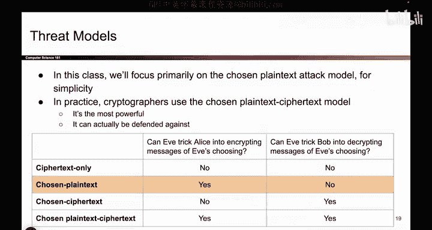
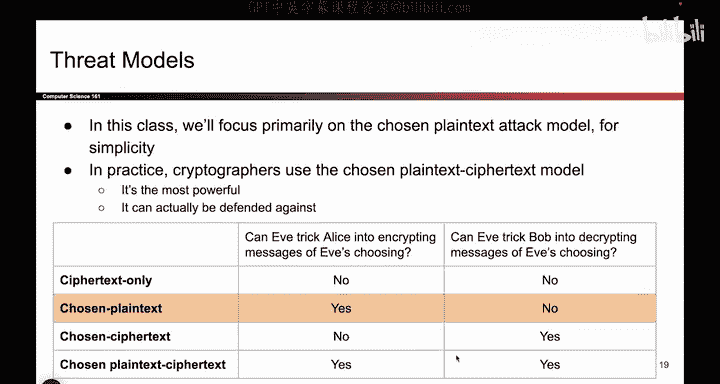
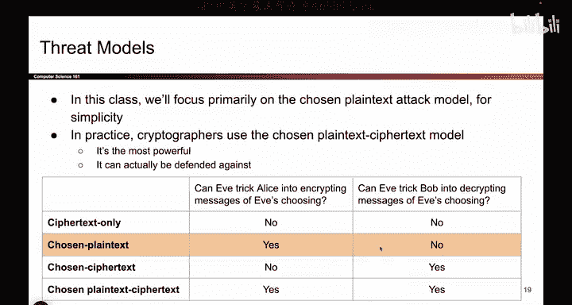
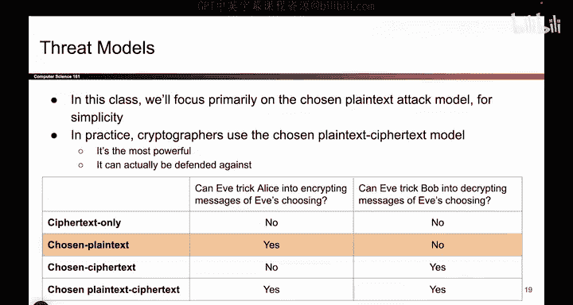

# 081：威胁模型（选择明文攻击）🔐

在本节课中，我们将学习密码学中的威胁模型，特别是针对保密性的攻击模型。我们将重点介绍选择明文攻击，并理解攻击者Eve可能具备的额外能力。

---

## 概述

之前我们介绍了两个虚构的攻击者：窃听者Eve和篡改者Mallory。他们分别能够窃听和篡改消息。然而，现实中的攻击者可能具备更多能力。为了更准确地模拟这些攻击者，我们需要建立更全面的威胁模型。本节课将探讨四种不同的威胁模型，并详细讲解其中一种——选择明文攻击模型。

---

## 威胁模型的重要性

Eve和Mallory是虚构人物，用于模拟现实世界中的攻击者。因为现实中的攻击者除了窃听和篡改外，还可能进行其他操作，所以我们需要赋予这些虚构角色更多能力，以便更真实地反映潜在威胁。

---

## 攻击者的额外能力

我们可以根据威胁模型，赋予Eve两种额外的能力：

1.  **诱骗Alice加密指定消息**：Eve能否诱骗Alice使用其密钥加密Eve选择的消息？例如，Eve能否让Alice加密单词“potato”？
2.  **诱骗Bob解密指定密文**：Eve能否诱骗Bob使用其密钥解密Eve提供的密文？

根据Eve是否具备这两种能力，我们可以组合出四种不同的威胁模型。

---

## 四种威胁模型

以下是四种威胁模型及其名称：

*   **唯密文攻击**：Eve仅能窃听密文，既不能诱骗Alice加密，也不能诱骗Bob解密。
*   **选择明文攻击**：Eve可以诱骗Alice加密其选择的明文，但不能诱骗Bob解密。
*   **选择密文攻击**：Eve不能诱骗Alice加密，但可以诱骗Bob解密其提供的密文。
*   **选择明文与选择密文攻击**：Eve既能诱骗Alice加密，也能诱骗Bob解密。这是四种模型中最强大的一种。

在本课程中，我们将重点讨论**选择明文攻击**模型。

---

## 选择明文攻击详解

在选择明文攻击模型中，Eve能够诱骗Alice使用其密钥加密Eve选择的任何消息。Eve本身并不知道密钥，但她能利用Alice的加密操作来协助自己。然而，Eve**不能**诱骗Bob解密消息。

**核心概念**可以用以下方式描述：
*   **攻击者能力**：Eve → Alice: `Encrypt(Key_Alice, Plaintext_Eve)`
*   **攻击者限制**：Eve → Bob: `Decrypt(Key_Bob, Ciphertext_Eve)` ❌ (不允许)

在实际应用中，密码学家通常以最强大的模型（即选择明文与选择密文攻击）为目标来设计协议。因为如果能防御最强大的攻击者，那么协议自然也能防御能力较弱的攻击者。但为了课程学习的循序渐进，我们在此先聚焦于选择明文攻击。

---

## 一个重要的补充说明

关于诱骗Bob解密的能力，有一个细微但重要的限制：Eve不能诱骗Bob去解密**她自己刚刚诱骗Alice加密得到的那个密文**。如果允许这样做，那么整个加密的目的就被完全破坏了，因为Eve可以直接通过Bob得到她选择的明文。

---

## 总结

本节课我们一起学习了密码学中的威胁模型。我们了解到，为了模拟现实世界中复杂的攻击者，需要为虚构角色Eve定义不同的能力组合，从而形成四种威胁模型：唯密文攻击、选择明文攻击、选择密文攻击，以及最强大的选择明文与选择密文攻击。我们重点探讨了**选择明文攻击**，即攻击者可以获取指定明文的加密结果，但无法获取解密密文的能力。理解这些模型是设计和评估加密方案安全性的基础。