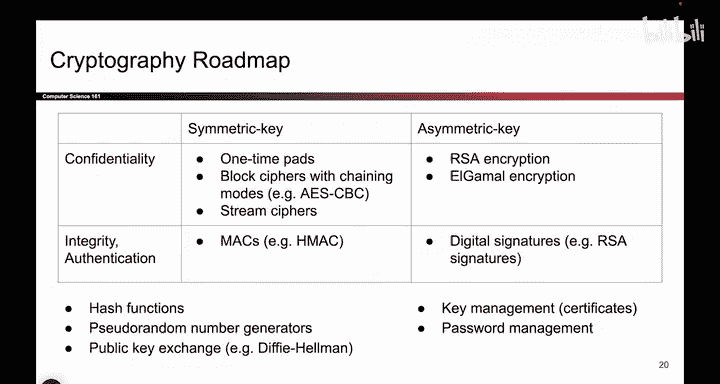
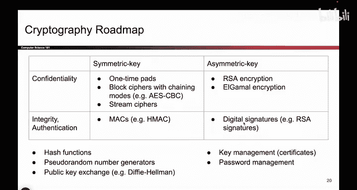
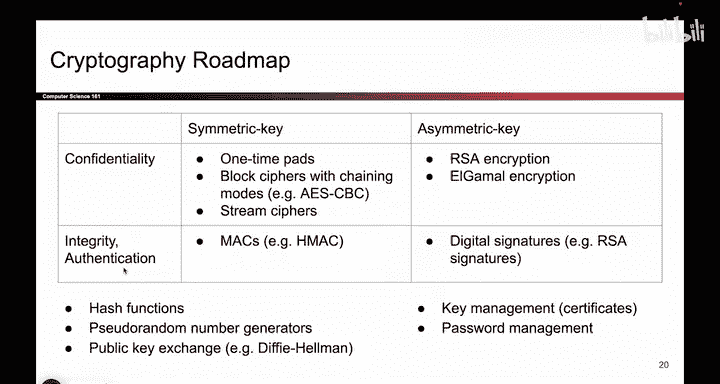
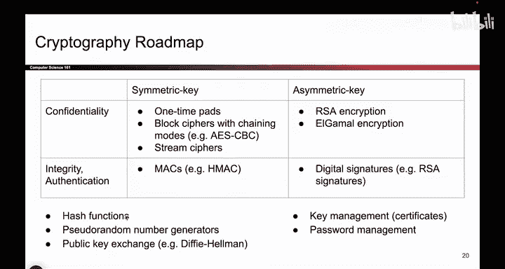

# 082：密码学路线图 🗺️

在本节课中，我们将学习密码学方案的分类框架，即“密码学路线图”。这个框架通过两个核心问题，帮助我们系统地理解不同类型的密码学方案及其目标。

## 概述

这张图展示了我们可以设计出的四种不同组合的密码学方案。理解这个分类框架是学习后续具体方案的基础。

## 方案分类的两个维度

分类基于两个核心问题，由此形成一个2x2的表格。

### 第一个维度：密钥类型

第一个问题关乎方案中使用的密钥类型：是**对称密钥方案**还是**非对称密钥方案**？

*   **对称密钥方案**：Alice和Bob共享一个**只有他们知道**的**秘密密钥**。公式可以表示为：`K_AB = K_BA`，其中K是共享的密钥。
*   **非对称密钥方案**：Alice、Bob以及其他人各自拥有一对**公私钥**。例如，Alice拥有私钥`SK_A`和公钥`PK_A`。

根据你的选择，方案会落入表格的这两列之一。

### 第二个维度：安全目标

第二个问题关乎方案提供的安全属性：是提供**机密性**，还是提供**完整性/认证**？

*   **机密性**：确保信息内容不被未授权方读取。
*   **完整性/认证**：确保信息在传输过程中未被篡改，并能验证发送者的身份。

大多数方案主要提供其中一种属性，而非同时提供两者。若需同时满足，则需要组合多种方案。根据你的方案目标，它会落入表格的这两行之一。

## 探索四个象限

我们将逐一探讨这个表格的四个象限。

1.  **首先**，我们将学习提供机密性的对称密钥方案。
2.  **接着**，我们将转向提供完整性和认证的对称密钥方案。
3.  **然后**，我们会研究提供机密性的非对称密钥方案。
4.  **最后**，我们将探讨提供完整性和认证的非对称密钥方案。

在学习过程中，我们还会看到一些用于构建这些方案的辅助工具。例如，后面会讲到的**HMAC**方案，就依赖于我们将要详细讨论的**哈希函数**。

## 总结

本节课我们一起学习了密码学方案的分类路线图。我们了解到，可以通过**密钥类型**（对称/非对称）和**安全目标**（机密性/完整性认证）这两个维度，将密码学方案系统地分为四类。这为我们后续深入学习具体的协议和方案提供了一个清晰的框架。