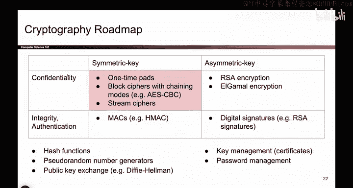
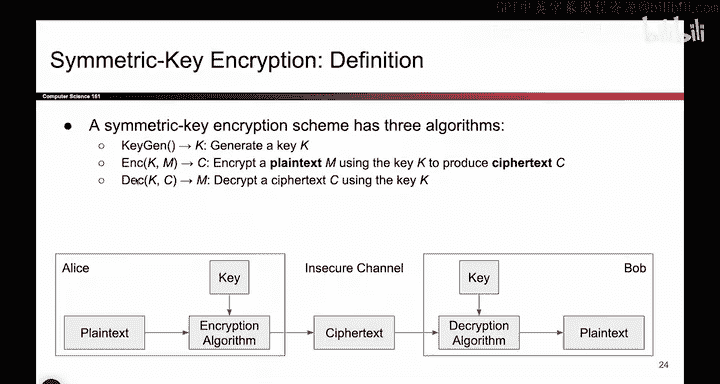

# 083：对称密钥加密 🔐

在本节课中，我们将要学习密码学中的第一种加密方案——对称密钥加密。我们将了解其基本概念、组成部分以及所需的关键属性。

---

上一节我们介绍了密码学的整体路线图。现在，我们进入路线图的左上角象限，即**对称密钥模型**。目前，我们只关注如何提供**机密性**，暂不涉及完整性和身份验证。

对称密钥加密方案可以拆解为两个词来理解：
*   **加密**：意味着我们关心**机密性**，而不一定是完整性或身份验证。
*   **对称密钥**：意味着爱丽丝和鲍勃共享**同一个秘密密钥**。爱丽丝知道它，鲍勃知道它，其他人都不知道。

目前，我们暂不考虑他们如何获得这个共享密钥。你可以假设密码学之神从天而降，赐予了爱丽丝和鲍勃一个共享密钥。稍后我们将看到他们实际上是如何获得这样一个密钥的。

此外，在本密码学单元的这一部分，我们假设所有消息都表示为**比特串**，即一长串的1和0。这是一个合理的假设，因为任何你想要发送的数据，无论是文本、图像还是视频，都可以在加密前编码成一堆1和0。因此，我们不关心用户编码的是什么，我们只将其视为任意的1和0序列，我们的目标就是安全地将这个序列通过信道传输。

---

上一节我们回顾了对称密钥加密的定义。本节中，我们来看看作为密码方案设计者，我们的具体任务是什么。

我们的目标是设计两个算法来填充这两个方框：一个**加密算法**和一个**解密算法**。

*   **加密算法** 接收两个参数：密钥 `K` 和明文 `M`。它应该输出密文 `C`，即明文经过打乱后的版本，攻击者无法读取。
*   **解密算法** 接收密钥 `K` 和密文 `C`。它应该输出明文 `M`，即原始的、未打乱的消息。

因此，我们作为密码方案设计者的工作就是设计这两个算法，从而为用户提供一个可用的方案。有时人们还会定义**密钥生成方案**，说明爱丽丝和鲍勃最初是如何获得这两个密钥的。但今天，我们假设他们已经拥有了一个他人不知道的秘密密钥，因此我们将注意力集中在加密和解密上。

---

我们已经明确了需要设计的组件。那么，我们对加密和解密算法有哪些属性要求呢？我认为我们关心以下三点：

以下是三个关键属性：

1.  **正确性**：它必须能正常工作。这意味着，如果你用某个密钥加密一条消息，然后鲍勃用同一个密钥解密，你应该能得到原始消息。如果鲍勃解密密文后得到的是不同的消息，那就非常荒谬了。用数学公式表达就是：`Decrypt(K, Encrypt(K, M)) = M`。这表示无论使用什么密钥，如果你用该密钥加密一条消息，然后用同一个密钥解密，你应该得到原始的明文。
2.  **效率**：我们需要这些算法具有合理的速度，以便用户实际使用它们。请记住要考虑人为因素：如果我们构建的加密和解密算法速度极慢，用户根本就不会使用它。因此我们需要一定程度的效率。我们不会对此进行过于严格的定义，但我们不能构建那些慢得离谱、用户不愿使用的东西。
3.  **安全性**：我们已经说过，这里的定义是**机密性**。在不安全信道中、不知道秘密密钥的攻击者，应该无法弄清楚明文是什么。

以上就是构成一个良好加密方案的三个属性。

---

本节课中，我们一起学习了对称密钥加密的基本框架。我们明确了其核心是使用共享密钥，并定义了设计者需要构建的加密和解密算法。同时，我们确立了衡量一个对称密钥加密方案是否合格的三个关键标准：**正确性**、**效率**和**安全性（机密性）**。