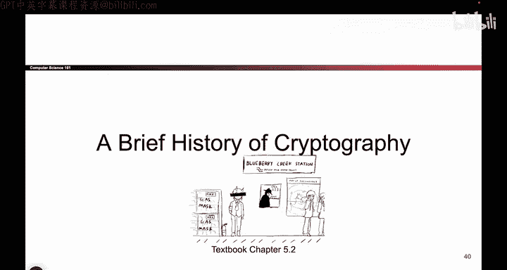
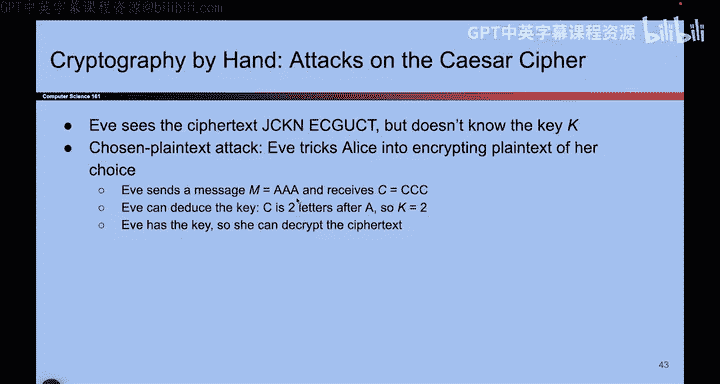

# 088：历史 - 凯撒密码

在本节课中，我们将学习密码学的早期历史，并重点分析一个非常古老的加密方案——凯撒密码。我们将运用之前学过的定义来分析其安全性，看看它如何抵御攻击，以及它为何最终被证明是不安全的。

---

上一节我们介绍了密码学的基本定义和分析框架，本节中我们来看看历史上第一个著名的加密方案。

## 凯撒密码的定义

凯撒密码是一个非常简单的加密方案。根据我们的定义，一个加密方案需要包含密钥生成算法、加密函数和解密函数。

以下是该方案的形式化描述：

**密钥生成算法 (Gen)：**
Alice和Bob需要协商一个密钥。他们只需共同选择一个介于0到25之间的整数。这个数字就是密钥。
例如，他们可以约定密钥 `k = 13` 或 `k = 24`。

**加密函数 (Enc)：**
加密函数接收两个参数：密钥 `k`（0到25之间的整数）和明文 `m`（我们暂时假设它是由英文字母组成的单词）。
加密过程是：将明文中的每个字母，在字母表中向后移动 `k` 个位置。
例如，如果明文是 `dog`，密钥 `k = 3`：
*   `d` -> 向后移动3位 -> `g`
*   `o` -> 向后移动3位 -> `r`
*   `g` -> 向后移动3位 -> `j`
因此，密文 `c = grj`。

用公式表示，对于单个字母 `p`（其字母序号为 `a`，`a=0`对应`a`，`a=25`对应`z`），加密过程为：
`c = (a + k) mod 26`

**解密函数 (Dec)：**
解密是加密的逆过程。接收密钥 `k` 和密文 `c`，将密文中的每个字母在字母表中向前移动 `k` 个位置。
例如，对于密文 `grj` 和密钥 `k = 3`：
*   `g` -> 向前移动3位 -> `d`
*   `r` -> 向前移动3位 -> `o`
*   `j` -> 向前移动3位 -> `g`
因此，恢复出明文 `dog`。

用公式表示，对于密文字母 `c`（其字母序号为 `b`），解密过程为：
`p = (b - k) mod 26`

---

了解了凯撒密码的工作原理后，我们来看看攻击者Eve如何破解它。

## 对凯撒密码的攻击

### 暴力破解攻击

假设攻击者Eve截获了一段密文，例如 `jbegnq`。她不知道密钥是什么。

一种最简单的攻击方法是尝试所有可能的密钥。因为密钥空间只有26种可能（0到25），所以Eve可以轻松地尝试每一种。

以下是可能的尝试结果：
*   用密钥 `k=1` 解密：得到 `iafdmp`
*   用密钥 `k=2` 解密：得到 `hzecol`
*   ...
*   用密钥 `k=10` 解密：得到 `attack`

当Eve尝试到 `k=10` 时，她得到了一个有意义的英文单词 `attack`。结合上下文和常识，她可以推断出这就是原始明文，并且密钥是10。这种尝试所有可能密钥的方法称为**暴力破解**。由于凯撒密码的密钥空间极小，它无法抵抗这种攻击。

### 选择明文攻击

现在，让我们考虑一个更强的攻击模型——选择明文攻击。在这个模型下，Eve可以诱使Alice加密任何Eve选择的明文。

假设Eve请求Alice加密明文 `aaa`。Alice用她的秘密密钥（假设是 `k=2`）加密后，将密文 `ccc` 返回给Eve。

Eve现在知道 `aaa` 被加密成了 `ccc`。她可以轻易推断出：从 `a` 到 `c` 需要移动2位，因此密钥 `k = 2`。一旦Eve知道了密钥，她就可以解密任何截获的密文。

这个例子说明了为什么选择明文攻击是危险的：一个不安全的方案可能会通过加密特定明文而直接泄露密钥。

---

本节课中我们一起学习了凯撒密码，这是一个基于字母移位的古老加密方案。我们使用形式化的定义描述了它的密钥生成、加密和解密过程。通过分析，我们发现它非常不安全：其极小的密钥空间使其无法抵抗暴力破解；甚至在选择明文攻击下，密钥会直接泄露。这为我们理解现代密码学为何需要巨大的密钥空间和抵抗更强攻击的能力奠定了基础。