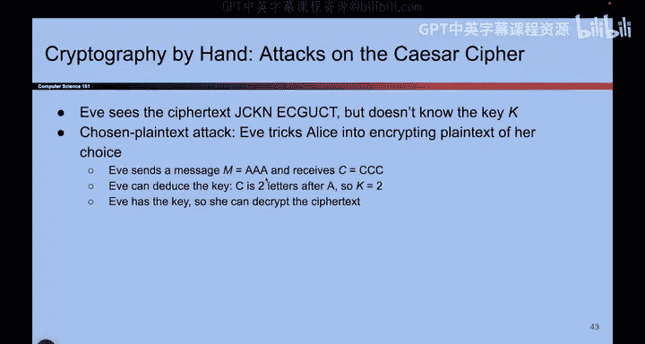

# 089：历史 - 替换密码

在本节课中，我们将学习凯撒密码的演进版本——替换密码。我们将了解其工作原理、密钥生成方式、加密解密过程，并分析其安全性，特别是面对不同攻击时的表现。

上一节我们介绍了凯撒密码，它是一种简单的移位加密。本节中我们来看看一种更复杂的加密方法：替换密码。

## 密钥生成

在凯撒密码中，密钥是一个简单的数字（如移位量2）。替换密码的密钥则完全不同。它不再是一个数字，而是一个完整的映射表。这个表定义了每个字母随机映射到另一个字母的规则。

**密钥公式表示**：`K = { (A→N), (B→Q), (C→L), ..., (Z→?) }`

其中，映射是完全随机的，没有顺序规律。例如，A映射到N，B映射到Q，C映射到L，这些目标字母的选取是随机的。Alice和Bob各需持有此密钥的一份副本，而世界上的其他人都不能拥有。

## 加密过程

加密时，你使用密钥表，并按照正向查找字母进行替换。

以下是加密步骤：
1.  获取明文消息。
2.  对于明文中的每个字母，在密钥表中查找其对应的密文字母。
3.  将所有密文字母组合成密文。

例如，使用上述密钥，单词“dog”的加密过程为：
*   d → Z
*   o → P
*   g → V
因此，密文为“ZPV”。

## 解密过程

解密是加密的逆过程，需要使用相同的密钥，并在密钥表中进行反向查找。

以下是解密步骤：
1.  获取密文消息和密钥。
2.  对于密文中的每个字母，在密钥表中查找其对应的明文字母（即找到映射为该密文字母的原始字母）。
3.  将所有明文字母组合成明文。

例如，对于密文“ZPV”：
*   V → g
*   P → o
*   Z → d
因此，解密后得到原始明文“dog”。

## 安全性分析

现在我们来分析替换密码面对不同攻击时的安全性。

### 暴力攻击

攻击者Eve可以尝试所有可能的密钥来破解密文。

**密钥空间计算**：第一个明文字母有26种可能的密文映射，第二个有25种，以此类推。总的可能密钥数量是26的阶乘（26!），这大约相当于2^88种可能性。尝试所有密钥需要极其漫长的时间，可能超过太阳系的寿命。因此，虽然理论上可行，但实践中暴力攻击并不可行。

### 选择明文攻击

如果Eve能够发起选择明文攻击，即可以诱使Alice加密她选择的特定消息，那么情况就不同了。

以下是攻击步骤：
1.  Eve请求Alice加密一个包含所有字母的消息，例如“ABCDEF...Z”。
2.  Alice使用她的密钥加密此消息，输出结果（例如“NQLZKR...”）。
3.  这个输出直接就是密钥的完整映射表。Eve通过对比她选择的明文（字母表）和得到的密文，就能完全重建出密钥。

因此，替换密码无法抵御选择明文攻击。在实际历史中，密码分析者还会利用语言统计特性（例如，字母‘E’的出现频率很高）来辅助分析，但这门课程不会深入探讨这些古典密码分析技术。

本节课中我们一起学习了替换密码。它是一种通过随机字母映射表进行加密的方法，相比凯撒密码有更大的密钥空间。我们明确了其加密和解密都依赖于同一个密钥表。虽然它能抵抗低效的暴力攻击，但在选择明文攻击面前非常脆弱。这为我们理解现代密码学需要满足的安全属性奠定了基础。