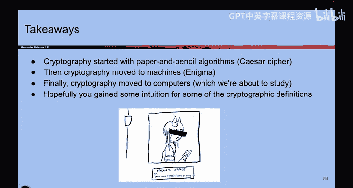
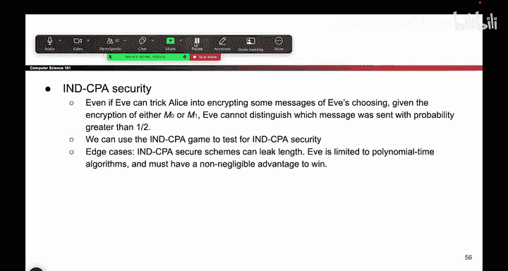

# 091：课程总结 🎯

在本节课中，我们将回顾现代密码学的基本概念和定义，为后续学习具体的加密方案打下基础。我们将从历史背景出发，逐步介绍现代密码学的核心思想、关键角色、安全属性以及威胁模型，最后总结CPA安全性的定义及其重要性。

## 概述

密码学的核心目标是在不安全的信道上实现安全通信。随着计算机技术的发展，现代密码学已完全由软件和代码实现，不再依赖手工加密。本节将系统梳理之前介绍的所有密码学基础定义。

## 从历史到现代

上一节我们探讨了二战时期的密码设备（如转子机和插线板）。本节中，我们来看看现代密码学的开端。1976年，Diffie和Hellman发表了一篇开创性论文，标志着现代密码学时代的来临，他们也因此获得了图灵奖。尽管历史上的加密方法很有趣，但我们将重点关注在计算机上用代码实现的软件密码学。

## 核心原则与警告

在深入细节之前，必须强调一个关键原则：**绝对不要尝试自己编写密码算法**。密码学极其复杂，本课程所授知识不足以让你创建安全的加密系统。一个微小的错误就可能导致整个系统崩溃。因此，请务必使用经过严格审查的现有密码库。

## 关键角色与安全目标

以下是密码学场景中常见的角色：

*   **Alice 和 Bob**：希望安全通信的双方。
*   **Eve**：窃听者，试图截获并阅读机密信息。
*   **Mallory**：主动攻击者，不仅能窃听，还能篡改消息。

密码学主要保障三个安全属性：

1.  **机密性**：防止未授权方读取信息。通过**加密**实现。
2.  **完整性**：确保信息在传输过程中未被篡改。
3.  **真实性**：确认信息确实来自声称的发送者。后两者通常通过为消息附加**标签**（如MAC）来实现。

## 柯克霍夫原则与威胁模型

一个基本原则是**柯克霍夫原则**：必须假设攻击者了解整个加密系统的所有细节和代码。**所有的安全性必须仅依赖于密钥的保密性**。这是现代密码学设计的基石。

我们讨论了多种威胁模型，并重点聚焦于**选择明文攻击**。在这种模型下，攻击者Eve能够诱使Alice加密Eve自己选择的消息（类似于一战中的“诱饵”消息）。这是衡量加密方案强度的一个重要标准。

## CPA安全性详解

前面我们介绍了各种攻击模型，本节中我们重点剖析**选择明文攻击下的不可区分性**安全定义，即**CPA安全性**。这是今天最核心的内容。

我们可以用一场“游戏”来定义CPA安全：

1.  Eve可以不断请求Alice为她加密任何她选择的消息（模拟CPA能力）。
2.  随后，Eve提交两个等长的消息 `M0` 和 `M1` 给Alice。
3.  Alice随机选择其中一个（比如 `Mb`, 其中 `b` 是随机比特0或1）进行加密，并将密文返回给Eve。
4.  Eve的目标是猜出 `b` 的值，即哪个消息被加密了。

**CPA安全**的定义是：即使Eve拥有选择明文攻击的能力，在上述游戏中，她猜中 `b` 的概率也不会比随机猜测（50%）更好。用公式表示，她的优势 `Advantage(Eve)` 是可忽略的：

`Advantage(Eve) = | Pr[Eve guesses correctly] - 1/2 | ≈ 0`

如果Eve的猜测准确率显著高于随机猜测，则说明该加密方案泄露了信息，是不安全的。这个定义的精妙之处在于，它要求方案能抵御**任何**可能的攻击策略，包括尚未发明的策略。

## 定义的重要边界条件

为了使CPA安全定义严谨且实用，我们需要记住三个边界条件：

*   **消息长度**：CPA安全方案**可能泄露消息的长度**。因此，在挑战阶段，Eve提交的两个消息 `M0` 和 `M1` 必须长度相等。
*   **计算时间**：Eve被限制在**多项式时间**内运行。我们不关心那些需要宇宙寿命才能完成的攻击。
*   **优势值**：Eve的优势必须是**不可忽略的**，这样才能转化为实际有效的攻击。

## 总结

本节课中，我们一起学习了现代密码学的基础框架。我们回顾了密码学的核心目标——在不安全信道上安全通信，并强调了使用现有成熟密码库的重要性。我们明确了Alice、Bob、Eve和Mallory等关键角色，以及机密性、完整性和真实性三大安全目标。我们深入理解了柯克霍夫原则和选择明文攻击威胁模型。最后，我们详细探讨了CPA安全性的形式化定义及其三个关键边界条件，为后续分析和评估具体的对称加密方案做好了准备。下节课，我们将开始探讨第一个具体的对称密码方案。