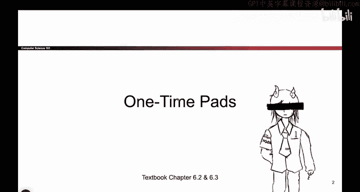
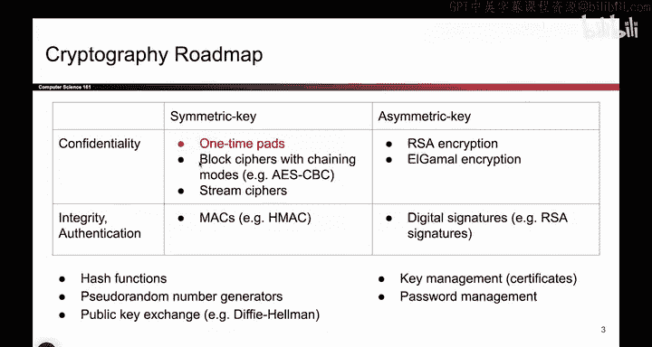
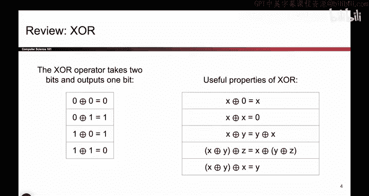
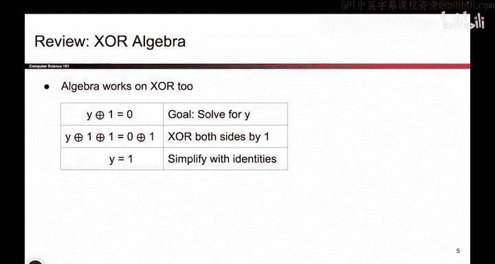
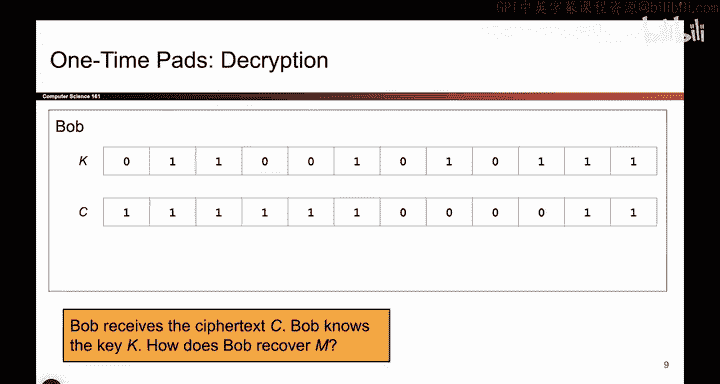

# 092：一次性密码本定义

在本节课中，我们将继续密码学的学习旅程，首先介绍一次性密码本，然后讨论分组密码。我们将从一次性密码本开始，这是你将看到的第一个加密解密方案。

在开始之前，请记住，根据我们的学习路线图，我们仍处于左上角的象限。我们正在研究专门提供机密性的方案，并且是在对称密钥的背景下进行。这意味着爱丽丝和鲍勃共享一个其他人不知道的密钥。现在，我们将看到众多可能的对称密钥方案之一，它能够提供机密性。

## 异或运算回顾

在介绍一次性密码本之前，需要回顾一个称为异或的按位运算。它接收两个比特，输出一个比特。具体来说，如果两个输入相同，则输出0；如果两个输入不同，则输出1。

以下是异或运算的一些有用性质：
*   `0 XOR 0 = 0`
*   `0 XOR 1 = 1`
*   `1 XOR 0 = 1`
*   `1 XOR 1 = 0`

一个特别有用的性质是：`(X XOR Y) XOR X = Y`。你可以这样理解：如果你将一个比特与自身进行异或，结果为0；而0与任何比特异或，该比特保持不变。因此，如果你有一个由两个比特异或得到的值，再与其中一个比特进行异或，那个比特就会“抵消”，只剩下另一个比特。这个性质在后面会用到。

此外，你也可以用异或进行“代数”运算。例如，给定方程 `1 XOR Y = 0`，要求解Y。你只需在等式两边同时异或1：`(1 XOR Y) XOR 1 = 0 XOR 1`。由于 `1 XOR 1 = 0`，左边抵消后剩下Y，右边 `0 XOR 1 = 1`，因此得到 `Y = 1`。这个例子很简单，但更复杂的方程也可以这样处理。以上是对异或运算的回顾。

## 密钥生成

现在我们已经了解了异或运算，接下来看看一次性密码本是如何工作的。首先需要生成密钥。爱丽丝和鲍勃都需要拥有一个其他人不知道的共享密钥。

生成方法很简单：抛掷一系列硬币，得到一串随机的1和0，这就是我们的密钥。回想一下凯撒密码的密钥是1到26之间的一个数字，而替换密码的密钥是字母的某种映射。在一次性密码本中，密钥是一个随机选择的比特串，即通过抛硬币得到的一串1和0。爱丽丝知道它，鲍勃知道它，其他人都不知道。

## 加密过程

那么如何加密呢？记住，加密函数接收两个参数：密钥`K`和明文消息`M`，然后输出一个东西：密文`C`。

加密算法很简单：使用异或运算来扰乱消息`M`的比特，保密性来自于密钥`K`。它的工作原理符合直觉：对消息的每一个比特进行异或操作。

以下是加密过程的示例：
*   明文 `M`: `1011`
*   密钥 `K`: `0101`
*   密文 `C` = `M XOR K` = `1110`

具体操作是：对于每一个比特，取对应的密钥比特和消息比特进行异或，得到对应的密文比特。对每一个输入比特和密钥比特都执行此操作，就得到了对应的密文。直观上看，这个密文被完全打乱了。不知道密钥的人无法得知原始消息是什么，他们只能看到这些混乱的比特。这就是加密过程。

然后，密文`C`通过不安全的信道发送给鲍勃。在这个过程中，攻击者无法读取这个被打乱的密文。

## 解密过程

鲍勃如何解密呢？解密函数接收两个参数：之前相同的密钥`K`和刚刚收到的密文`C`。我们的解密算法需要在这两个输入之间进行一些运算，以输出原始消息`M`。它接收两个输入，输出原始消息。

事实证明，解密只需要再进行一次按位异或运算。取密钥的比特和密文的比特，对每一个对应的比特进行异或，得到的输出就是原始的明文。

以下是解密过程的示例：
*   密文 `C`: `1110`
*   密钥 `K`: `0101`
*   明文 `M` = `C XOR K` = `1011`

这就是鲍勃解密消息的方法。

## 一次性密码本定义总结

以上就是一次性密码本的定义。

用文字总结如下：
*   **密钥生成**：随机生成一个密钥`K`。与我们将要看到的后续方案不同的一点是，每条消息都需要一个不同的密钥。每次你想加密新内容时，爱丽丝和鲍勃都必须回到这个算法，重新生成一个之前从未使用过的新密钥。这仅对一次性密码本成立，原因我们稍后会解释。
*   **加密算法**：`C = M XOR K`。你只需对两个输入进行按位异或。
*   **解密算法**：`M = C XOR K`。同样对两个输入进行按位异或。

本节课中，我们一起学习了密码学中的一个基础概念——一次性密码本。我们首先回顾了异或运算的关键性质，然后详细介绍了该方案的三个核心组成部分：随机生成密钥、通过异或进行加密以及通过异或进行解密。理解这个简单的方案是学习更复杂加密技术的重要基础。