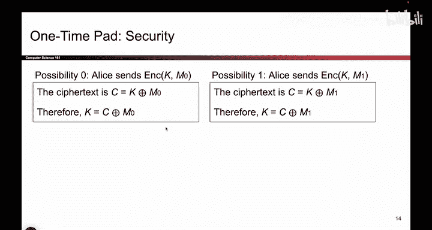
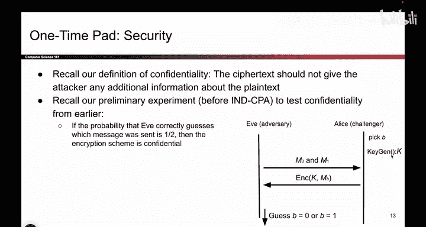
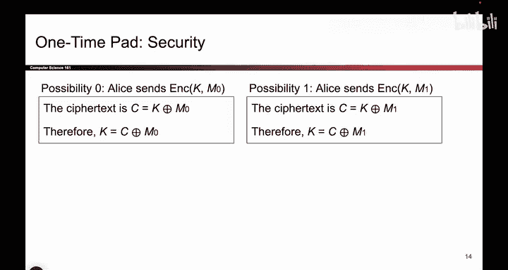
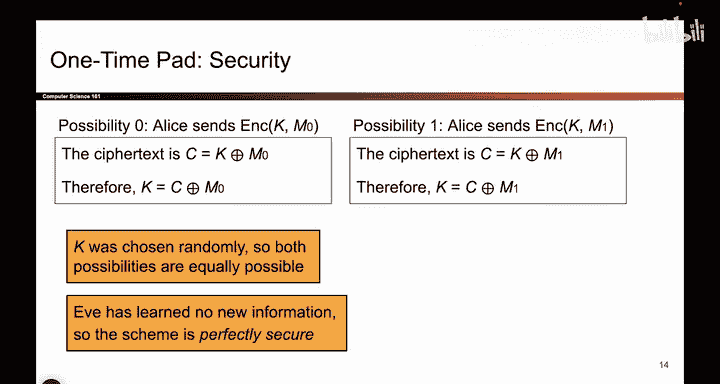

# 093：一次性密码本的正确性与安全性 🔐

在本节课中，我们将学习一次性密码本（One-Time Pad）加密方案。我们将探讨其加密和解密过程如何正确工作，并分析其安全性。课程将包含代数证明和安全性论证，以帮助初学者理解这一经典加密方案的核心原理。

---

## 正确性验证 🔍

上一节我们介绍了加密的基本概念，本节中我们来看看一次性密码本加密和解密过程的正确性。一个自然的问题是：如果我加密一条消息，然后再解密它，这个过程真的有效吗？一点代数知识可以帮助我们确信它是有效的。

加密时，你将密钥 `K` 与消息 `M` 进行异或运算：
`C = K XOR M`

解密时，你取原始的密文 `C`（即 `K XOR M`），并再次与密钥 `K` 进行异或运算：
`M' = C XOR K = (K XOR M) XOR K`

记住之前提到的那个方便的性质：如果你将某个值与自身进行异或，它们会相互抵消。这个性质正好在这里发生作用。

利用这个性质，这两个 `K` 相互抵消，你就得到了原始消息 `M`：
`M' = M XOR (K XOR K) = M XOR 0 = M`

这个小代数证明帮助我们确信，一次性密码本能正确地完成工作。

---

## 安全性分析 🛡️

接下来我们应该问的问题是：一次性密码本是否提供安全性？这个问题有点微妙。原因在于，我们上次花了很多时间提出的IND-CPA（选择明文攻击下的不可区分性）定义，并不能完全适用于一次性密码本。因为在IND-CPA游戏中，我们通常在整个游戏中使用同一个密钥，以便攻击者Eve可以说“加密这个”，然后Alice忠实地用该密钥加密。而在一次性密码本中，由于我们每次都在更换密钥，游戏需要稍作修改才能适用。但我们仍然可以证明一次性密码本提供某种程度的安全性。

让我们尝试证明这一点。我将用一种与IND-CPA游戏略有不同的方式来证明一次性密码本的安全性，因为密钥每次都在变化。你现在不必过多思考IND-CPA的细节。这里有一个数学证明，向你展示无论Eve尝试做什么，这个方案都是安全的。Eve可以发明我们从未听说过的新方法，这个方案仍然是安全的。

其安全性的原因在于，我们将考虑我们可能处于的两种不同“世界”。假设Eve知道（类似于IND-CPA游戏），被加密的消息要么是 `M0`，要么是 `M1`。Alice要么加密了“猫”（cat），要么加密了“狗”（dog），但我们不知道她加密了哪一个。

换句话说，我们处于两个可能的宇宙之一：
*   在宇宙1中，加密的消息是“猫”，发送出去的消息是 `K XOR cat`。
*   在另一个宇宙中，加密的消息是“狗”，发送出去的消息是 `K XOR dog`。

Eve看到的密文 `C` 是 `K XOR cat` 或 `K XOR dog`，但她不知道自己处于哪个世界。

让我们来思考Eve在两个世界中应该做什么。

假设我们在世界0。如果我们在世界0，那么 `M0` 必须是“猫”。Eve知道这一点，并且她知道密文 `C`，因为那是通过信道发送的。如果她做一点代数运算，她可以看到：
`K = C XOR M0 = C XOR cat`
这就是密钥。所以，如果我们在世界0，并且Eve知道我们在世界0，她可以推导出这个密钥。

另一方面，如果我们在世界1，使用完全相同的技巧，Eve知道密文 `C`，她知道 `M1`（在这个世界里是“狗”）。所以她可以知道 `K` 的值：
`K = C XOR M1 = C XOR dog`

因此，**如果Eve知道她处于哪个世界，她实际上可以得出那个世界的密钥**。

不幸的是，Eve并不知道我们当前处于哪个世界。所以事实证明，Eve必须猜测：我是在 `K` 等于这个值的世界，还是在 `K` 等于那个值的世界？而她并不知道 `K`。所以这两个可能的密钥都是可能的，Eve无法知道使用了哪个密钥。这两个密钥都是看似合理的密钥，因为我们随机生成了密钥，我们可能拥有来自世界0的密钥，也可能拥有来自世界1的密钥，我们不知道。

在这种情况下，Eve的策略是取密文 `C`（它是这两个值之一），然后：
以下是Eve可能进行的操作：
*   与“猫”进行异或，得到一个可能的密钥。
*   与“狗”进行异或，得到另一个可能的密钥。

然后她就陷入了困境。这两个密钥看起来都合理。无法判断哪一个比另一个更可能。换句话说，Eve完全不知道加密的是哪一个：是猫还是狗？我们无法知道。试图找出密钥对我们没有任何帮助，因为这两个密钥的可能性完全相同。

这个巧妙的小安全证明基本上向我们展示了，这个方案不会泄露信息。如果Eve不知道密钥，并且她收到的是“猫”或“狗”的加密结果，她在学习哪个被加密方面并没有变得更好。她没有获得关于密钥或哪个消息被加密的任何额外信息。这两个世界是同等可能的。

这就是证明一次性密码本提供完美安全性（在我们将看到的某些约束条件下）的小安全证明。

---

## 总结 📝

本节课中我们一起学习了一次性密码本加密方案。我们首先通过代数运算验证了其加密和解密过程的正确性，核心在于异或运算的自反性质：`(K XOR M) XOR K = M`。接着，我们深入分析了其安全性。通过构建一个“两个世界”的模型，我们证明了即使攻击者Eve截获了密文，并且知道明文只能是两个选项之一，她也无法确定实际加密了哪个消息，因为两个可能的密钥都同样合理。这论证了一次性密码本在理想条件下（如密钥真随机、与消息等长、且只使用一次）能够提供完美的保密性。