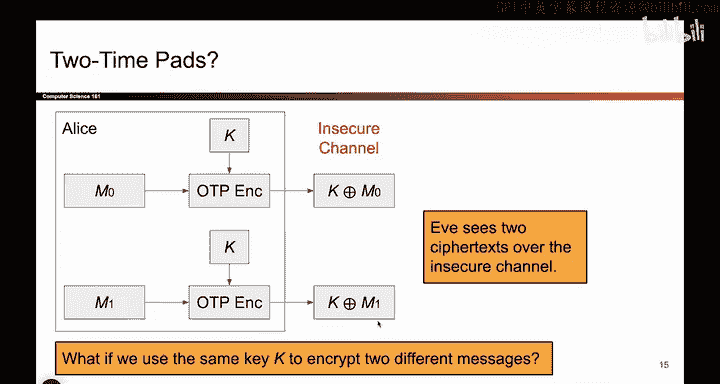
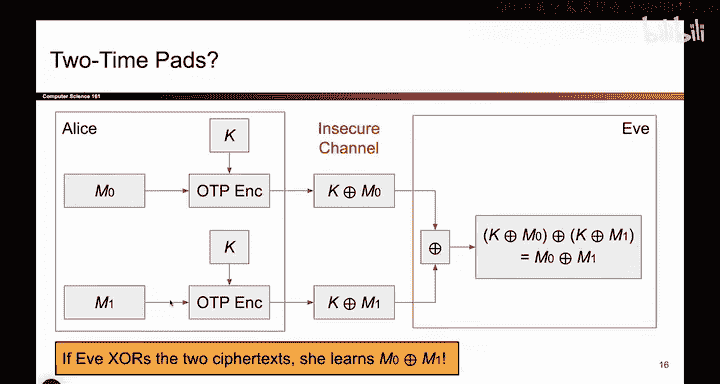
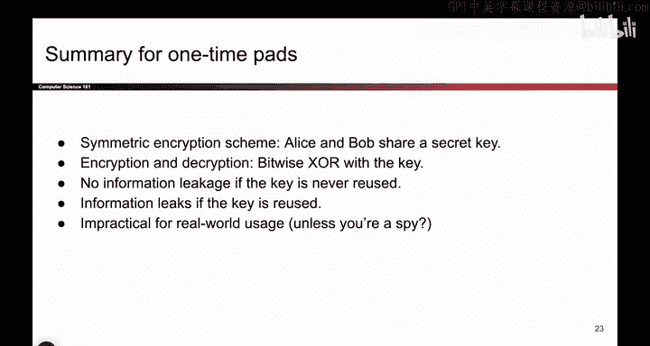

# 094：一次性密码本的问题与局限性 🔐

在本节课中，我们将要学习一次性密码本（One-Time Pad）加密方案在实际应用中面临的约束和问题。我们将探讨为什么重复使用密钥会破坏其完美的安全性，并分析该方案在现实世界中不常被使用的两个主要原因。

## 一次性密码本的约束条件

上一节我们介绍了，一次性密码本在特定约束下是完美安全的。本节中我们来看看这些约束具体是什么。

在使用一次性密码本方案时，你必须为加密的每一条消息使用不同的密钥。你加密一条消息，就为它生成一个密钥。如果你之后想加密另一条不同的消息，你必须生成另一个不同的密钥。

你可能会想，如果我偷懒呢？如果我不想为两条独立的消息生成两个独立的密钥，而是想偷懒，直接重复使用我已经在用的同一个密钥呢？

如果你这样做，就会遇到非常危险的情况。让我们来看看具体会发生什么。

## 重复使用密钥的危险性

以下是重复使用密钥导致的问题：

*   **攻击者获得两条密文**：假设你的第一条消息是 **M0**，你用密钥 **K** 通过异或（XOR）加密算法加密它，得到密文 **C0 = K ⊕ M0**。攻击者伊芙（Eve）可以看到 **C0**。之后，你取消息 **M1**，因为偷懒而使用同一个密钥 **K** 加密，得到密文 **C1 = K ⊕ M1**。攻击者伊芙同样可以看到 **C1**。
*   **安全性证明失效**：现在我们遇到了问题。因为伊芙同时看到了 **C0** 和 **C1**，我们之前的安全性证明不再适用。她实际上可以了解到关于 **M0** 和 **M1** 的一些信息。
*   **攻击者能推导出信息**：伊芙可以这样做：她将两条密文进行异或操作：**C0 ⊕ C1 = (K ⊕ M0) ⊕ (K ⊕ M1)**。由于异或运算中相同的 **K** 会相互抵消，结果变为 **M0 ⊕ M1**。这意味着伊芙现在知道了 **M0** 和 **M1** 的异或值。这很危险，这是她之前不知道但现在知道的信息。

所以，这是一个如果你两次使用相同密钥的情况。这不像之前我们有两个平行宇宙的假设，这是一个宇宙中爱丽丝（Alice）用同一个密钥先加密 **M0**，后来又加密 **M1**。如果爱丽丝这样做两次，我们就有大问题了，因为伊芙了解到了她之前不知道的关于这两条消息的信息。

最初，她对 **M0** 和 **M1** 一无所知。现在，她知道了两条消息的异或值。这很危险。我们给了伊芙本不该拥有的信息。

## 泄露信息的后果

以下是泄露信息可能带来的具体后果：

*   **获取部分信息**：在英文文本中，**M0 ⊕ M1** 的结果告诉伊芙 **M0** 和 **M1** 中哪些比特位是相同的。例如，如果这个比特串的第15位是0，那就意味着 **M0** 的第15位和 **M1** 的第15位必须相同。这是她本不该学到的信息。或者，如果你发现第30位在这个异或结果是1，那就意味着 **M0** 的第30位和 **M1** 的第30位必须不同。这也很危险。
*   **完全破解另一条消息**：如果伊芙因为某些原因（例如泄露或线索）知道了 **M0**，她可以直接用 **C1** 与 **M0** 进行异或：**C1 ⊕ M0 = (K ⊕ M1) ⊕ M0**。由于 **M0** 与自身异或的部分会抵消（假设她知道完整的 **M0**，并能推导出 **K**，进而得到 **M1**），她就能知道 **M1**。因此，有了这些部分信息，如果伊芙知道一个值，她就能猜出另一个，这同样非常糟糕。

所有这些都说明，泄露任何形式的信息，即使是像异或值这样的信息，也是危险的，我们不应该这样做。

因此，从这一切中得出的结论是：如果你使用一次性密码本，你**必须**每次都生成一个全新的密钥。如果你偷懒，两次使用同一个密钥，你就在向伊芙泄露信息，这破坏了你加密方案的机密性。

所以，一次性密码本只有在你遵循其名称，**一次性**使用每个密钥时才是完美的。这就是为什么它叫“一次性”密码本，而不是“两次性”密码本，因为那样不安全。

## 一次性密码本在现实中的局限性

在完全离开一次性密码本这个话题之前，让我们简要谈谈为什么它们没有在现实生活中被广泛使用，尽管我们已经证明了它们是安全的。我们说过，只要你每次都使用不同的密钥，即为每次加密重新生成密钥，我们就证明了其安全性。那么，为什么人们不在现实生活中使用一次性密码本呢？为什么我们不就此打住，不再设计更多的加密方案呢？

以下是关于一次性密码本的两个主要问题：

1.  **密钥生成成本高**：每次加密都必须生成一个新密钥。这实际上并非没有成本。爱丽丝或鲍勃（Bob）必须去抛硬币（或使用其他随机源）来生成1和0。而事实证明，生成真正随机的1和0并不像看起来那么容易。所以一个问题就是生成密钥是昂贵的，而且你每次都必须这样做。
2.  **密钥分发困难**：如果爱丽丝和鲍勃都有一个密钥，到目前为止，我们假设密码学之神已经赐予他们一个没有其他人知道的相同密钥。但在现实生活中，这不会发生。在现实生活中，你必须将密钥传达给另一个人。如果爱丽丝生成了一个密钥，她必须安全地把它交给鲍勃，这就引出了一个有点可笑的问题：如果爱丽丝和鲍勃已经费尽周折来安全地传递这个秘密密钥，并且他们拥有这种安全传递密钥的方式，那他们为什么不直接用那个方式来传递实际的消息呢？这是一个有点傻的观点，但如果你已经在生成密钥，并且费尽周折安全地发送密钥，为什么不直接安全地发送消息呢？谁还需要一次性密码本？因此，事实证明密钥分发是昂贵的。事实上，它如此昂贵，以至于直接用你的密钥分发通道来发送消息效果是完全一样的。

这两个问题基本上都归结为一个事实：你每次加密消息时都必须生成一个密钥，而这成本太高了。

## 一次性密码本的有限用途

就是这样。一次性密码本有一些有限的用途。我们不会再看到它们，但在现实生活中，你可以想象有一些用途。我能想到的一个用途是：也许存在一种情况，你当前有能力安全地交换密钥，但之后你将失去那个安全通道。那么你可以做的是，趁你现在还有那个安全通道时，交换大量密钥。爱丽丝和鲍勃约定好1000个密钥，然后后来当安全通道中断时，他们不再有安全通道来发送密钥或消息，但他们有1000个预先生成的密钥。所以现在他们可以使用一次性密码本来交换多达1000条消息，而且你实际上可以手工完成这个操作。

所以这不是一次性密码本非常实际的用途，但在现实生活中你可能会看到它。我不知道这在今天还有多现实，但你可以想象，比如一个间谍，也许他们做的是：当他们在自己国家家里时，生成一本密钥簿。他们自己有一本副本，国内总部的人也有一本副本。然后一旦他们外出在敌国执行间谍任务，就可以使用他们之前生成的秘密密钥来加密消息。

除非你是间谍，否则你不需要这样做，但这可能是说明一次性密码本有用处的一个例子。所以对计算机来说不是最实用的，但也许如果你是一个在丛林中手工加密东西的间谍，一次性密码本可能是你想用的。我想显然这在第一次世界大战中被使用过，但如果你好奇的话，可以去查查。

## 总结

本节课中我们一起学习了关于一次性密码本的总结。它是一种对称加密方案，因为爱丽丝和鲍勃共享一个秘密密钥。我们看到了加密和解密方案。我们说过，如果你每次都使用不同的密钥，就不会泄露任何信息；然而，如果你重复使用密钥，你就在向伊芙泄露信息。因此，你必须每次都使用不同的密钥。所以，结果是，这对于现实世界的使用来说并不实用，因为你每次想要加密某些东西时都必须重新生成密钥——除非你是一个间谍。😊