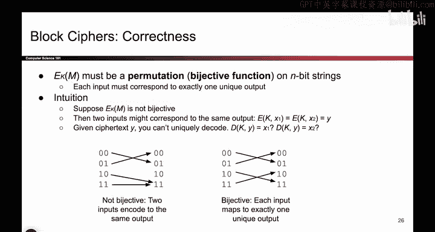

# 095：分组密码定义 🔐


在本节课中，我们将要学习分组密码的基本定义。我们将了解它如何工作，以及它与一次性密码本的区别。

上一节我们介绍了对称密钥方案中的一次性密码本及其局限性。本节中我们来看看一种更实用的替代方案：分组密码。

## 分组密码是什么？🔍

分组密码是一种加密方案，它接收两个参数：一个密钥 `K` 和一个消息 `M`，并输出一个密文字符串 `C`。其函数形式可以表示为：

```
C = E_K(M)
```

其中 `E` 是加密函数，`K` 是密钥，`M` 是明文，`C` 是密文。

理解分组密码的一种直观方式是将其视为一个“箭头图”。我们可以列出所有可能的明文和密文，然后用箭头表示哪个明文映射到哪个密文。例如，如果我想加密比特串 `01`，箭头会告诉我它加密为 `00`；如果我想加密 `10`，箭头会告诉我对应的密文是 `11`。

## 作为函数族的分组密码 👨‍👩‍👧‍👦

分组密码实际上可以看作是一个函数族。`E_K(M)` 中的下标 `K` 表示，分组密码是一个庞大的函数集合。你可以将其视为一个接收两个参数（密钥和消息）并输出密文的函数，就像我们见过的其他加密方案一样。

另一种有用的思考方式是：存在一个包含许多不同“箭头图”的大家族，每个图都展示了输入到输出的映射。你通过固定密钥 `K` 的值，从这个大家族中选定一个具体的函数。一旦你选择了 `K`，例如 `K=1`，就意味着你选定了这个函数族中的第一个具体函数。这个具体的函数会告诉你每个可能的明文对应的确切输出。

因此，分组密码是一个庞大的函数族，统称为 `E`。一旦你选定一个密钥 `K`，范围就缩小到其中一个具体的、具有唯一映射关系的函数。

## 正确性：双射的要求 ✅

现在我们知道分组密码是什么了，接下来应该问它是否正确。事实证明，有些分组密码是正确的，有些则不是，这取决于你如何实现 `E` 和绘制这些箭头。

以下是两种情况的例子：

*   **无效的分组密码（非双射）**：在这个例子中，两个不同的输入（例如 `10` 和 `11`）可能映射到同一个输出（例如 `11`）。当接收方鲍勃收到密文 `11` 时，他无法唯一确定它解密后是 `10` 还是 `11`。我们称这种函数不是**双射**的。构建分组密码时必须避免这种情况。
*   **有效的分组密码（双射）**：在这个例子中，每个箭头都指向一个唯一的输出。如果鲍勃收到 `11`，他可以唯一地将其解密回 `10`；如果收到 `10`，则可以唯一地解密回 `11`。右侧的图是我们想要的。一个有效的分组密码应该被设计成：对于每个可能的密钥（`K=1`， `K=2`， `K=1000` 等），其映射图都看起来像这样，即每个输入都唯一地映射到一个输出，并且每个输出也只有一个输入对应。

此外，分组密码定义在固定的输入长度上。如果 `n=2`，则每个图都有 2 比特的输入和 2 比特的输出。如果 `n=30`，你就需要为每个可能的密钥绘制 2³⁰ 个输入到 2³⁰ 个输出的映射图。

在现实中，设计这些算法时，没有人会真的写出一个包含 2³⁰ 列的大表格。他们实际上是编写一段代码，可以根据需要为每个密钥生成这些映射关系。

## 数学定义与属性 📐

让我们用更数学化的方式再看一下分组密码的定义。

加密函数 `E` 是一段有人编写的代码，它接收一个 `n` 比特的明文 `M` 和一个 `k` 比特的密钥 `K`，并输出一个 `n` 比特的密文 `C`。其中 `n` 和 `k` 都是预先确定的固定值。

```
C = E(K, M)
```



解密函数 `D` 则执行预期的操作：它接收密文 `C` 和密钥 `K`，并输出对应的明文 `M`。

```
M = D(K, C)
```

如果你打开 `E` 或 `D` 查看内部，它确实是一段代码。但你可以认为这段代码的功能就是维护着所有这些带有箭头的表格，展示每个 `n` 比特输入如何映射到一个 `n` 比特输出。每个密钥对应一张表格，一旦你固定了密钥，你就确定了使用哪一张具体的映射表。

分组密码的一些重要属性包括：
1.  **正确性**：正如之前讨论的，加密函数必须是一个**排列**（双射）。每个箭头必须指向恰好一个输出，并且该盒子内的所有箭头都必须满足这一点。
2.  **效率**：希望这个算法执行速度相对较快，这样人们才愿意使用它。
3.  **安全性**：我们将在接下来的课程中讨论安全性，但安全性是分组密码设计的核心目标。

---

本节课中我们一起学习了分组密码的定义。我们了解到分组密码是一个函数族，通过密钥选择其中一个具体的、具有双射（一一对应）映射关系的函数。我们还探讨了正确性的要求，即加密必须是可逆的排列，并简要提及了其数学表示和核心属性。下一节，我们将深入探讨分组密码的安全性。