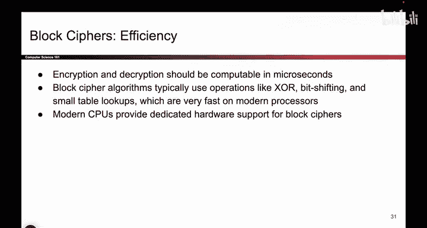
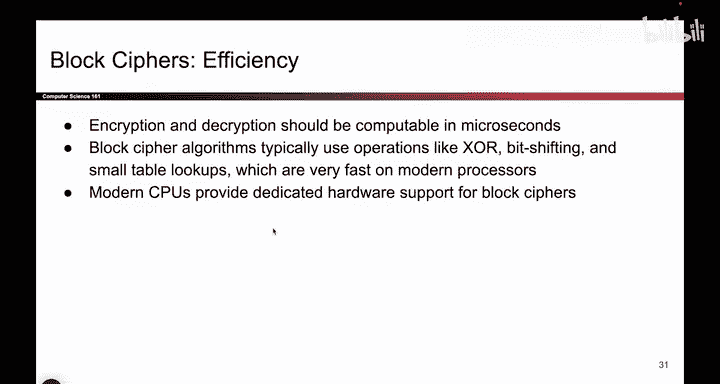
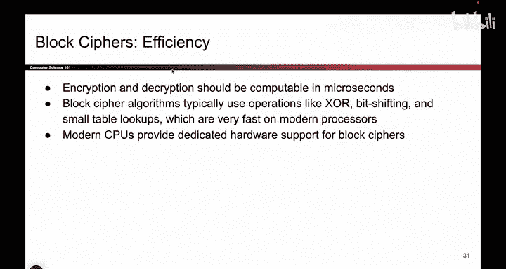
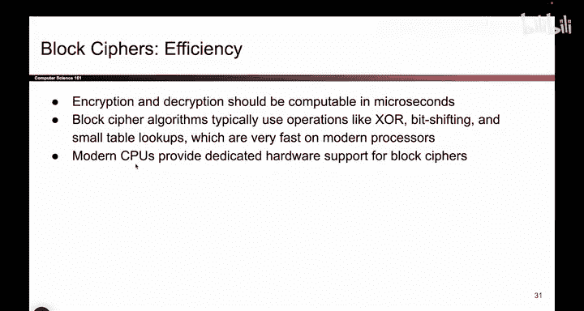
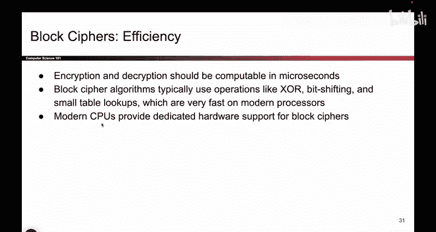
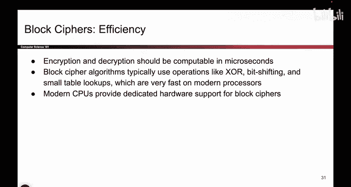

# 097：分组密码效率 🔐

在本节课中，我们将要学习分组密码的效率特性。我们已经讨论了分组密码的安全性，现在可以探讨其效率方面。

## 从“箭头”到代码

上一节我们介绍了分组密码的安全性模型。本节中我们来看看其效率实现。

尽管我们习惯用“箭头”来直观表示分组密码的映射关系，但必须记住，其本质是一段代码。这段代码接收输入 `n` 和密钥 `K`，通过运算决定具体的映射关系。虽然“箭头”模型有助于我们理解安全游戏，但实际执行的是代码。

## 高效的操作

分组密码的代码执行现代计算机擅长的高速操作。

以下是其核心操作类型：

*   **异或运算**：例如 `A XOR B`
*   **位移操作**：例如 `bits << 2`
*   **查表操作**：例如 `value = lookup_table[index]`

这些操作不涉及复杂的数学运算，如求幂或除法。代码主要通过移动和组合比特位来生成之前提到的映射“箭头”。因此，分组密码的运行速度通常非常快。

## 硬件优化

事实上，现代CPU被专门设计来高效处理分组密码。

因为分组密码被广泛使用，所以CPU制造商有意优化其架构以加速相关操作。这不仅意味着计算机天生擅长这些操作，更意味着我们正在专门为分组密码构建更高效的计算机。这是一个良性循环：分组密码因其高速而被鼓励使用，而用户在实际加密时几乎不会察觉到时间消耗。

## 算法背后的故事

那么，分组密码的具体代码是如何诞生的呢？这里有一个背景故事。

分组密码的算法需要由人来设计。在20世纪90年代末和21世纪初，曾举办了一场竞赛来选拔最佳的分组密码设计。

以下是一些关于这场竞赛的细节：

*   竞赛目的是选出将成为标准的分组密码算法。
*   **Rijndael** 算法最终赢得了这场竞赛。
*   本课程上学期的讲师 David Wagner 教授设计了一个进入前五名的算法。

在另一个可能的世界里，我们使用的可能是David Wagner的算法。但在现实中，**Rijndael** 算法被采纳为标准。这意味着，现在当我们需要加密和解密信息时，公认使用的是Rijndael算法（即AES）。那些可以生成映射“箭头”的不同代码方案中，Rijndael成为了被装入“黑盒”的标准选择。

## 总结

本节课中我们一起学习了分组密码的效率特性。我们了解到，分组密码通过执行异或、位移和查表等计算机擅长的高速操作来实现高效加密。现代CPU甚至为此进行了专门的硬件优化。此外，我们知道了当前广泛使用的AES（Rijndael）算法是通过公开竞赛选拔出的标准。高效与安全的结合，使得分组密码成为现代加密的基石。