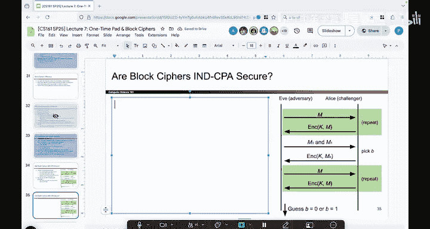

# 098：分组密码不具备IND-CPA安全性

在本节课中，我们将探讨分组密码在适应性选择明文攻击（IND-CPA）模型下的安全性。我们将通过一个互动游戏来演示，为什么确定性的加密方案（包括分组密码）无法满足IND-CPA安全性的要求。

上一节我们证明了分组密码的行为类似于随机置换，但这并未证明其在面对主动攻击者时的安全性。本节中，我们来看看如何通过一个游戏来检验其IND-CPA安全性。

## 进行IND-CPA游戏

我们将共同进行IND-CPA安全游戏。在这个游戏中，我将扮演诚实的参与者Alice，使用一个带有秘密密钥的分组密码。你将扮演攻击者Eve，目标是破解我的加密方案。

我的加密方案基于一个分组密码，其密钥`K`对你保密。从你的视角看，由于我们之前证明的性质，加密过程看起来是随机的。但实际上，对于给定的输入，加密输出是确定的，由密钥`K`唯一决定。

现在，游戏开始。根据IND-CPA游戏规则，你需要首先提供两个等长的明文消息供我加密。

以下是游戏步骤：

1.  你选择两个等长的消息`M0`和`M1`。
2.  我随机选择其中一个消息（`M0`或`M1`）进行加密，并将密文`C`返回给你。
3.  你可以利用“选择明文攻击”的能力，要求我加密任何你选择的消息（除了`M0`和`M1`本身），我会忠实使用密钥`K`进行加密并返回结果。
4.  最后，你需要判断我最初加密的密文`C`对应的是`M0`还是`M1`。

## 游戏过程演示

假设你选择的消息是：
*   `M0` = `dog`
*   `M1` = `cat`

我随机选择其中一个（比如`M1`，即`cat`）进行加密。加密过程可以表示为：
`C = Encrypt(K, cat)`
我得到密文`C`并交给你。此时，你无法从`C`直接看出它对应的是`dog`还是`cat`。

接下来，你利用选择明文攻击的权力。你可以要求我加密任何消息。

你要求我加密`dog`。我执行加密：
`C1 = Encrypt(K, dog)`
并将`C1`返回给你。

你又要求我加密`cat`。我执行加密：
`C2 = Encrypt(K, cat)`
并将`C2`返回给你。

现在，你收到了三个密文：最初挑战的密文`C`，以及你请求得到的`C1`（`dog`的加密）和`C2`（`cat`的加密）。

由于分组密码是确定性的，即用相同密钥加密相同明文总会得到相同密文。因此，你可以简单地比较`C`与`C1`和`C2`。

你发现`C`与`C2`完全相同，而与`C1`不同。由此，你可以100%确定地推断出，我最初加密的消息是`cat`（即`M1`）。

你赢得了游戏。

## 结论与总结

本节课中我们一起学习了IND-CPA安全游戏，并通过实践演示证明了分组密码不具备IND-CPA安全性。

核心原因在于分组密码是**确定性的**。确定性意味着：
`Encrypt(K, M) == Encrypt(K, M)` 总是成立。
攻击者可以利用选择明文攻击获得任意明文的密文。当挑战密文与某个已知明文的密文匹配时，攻击者就能立即识别出加密的原始消息。

因此，我们得出一个更普遍的结论：**任何确定性的加密方案都不是IND-CPA安全的**。这是一个重要的洞察，因为它告诉我们，为了达到IND-CPA安全，加密方案必须引入随机性（或不可预测性），使得每次加密相同明文都会产生不同的密文。

虽然分组密码本身是确定性的且不满足IND-CPA安全，但它们是构建安全加密方案（如我们后面将看到的加密模式）的重要基石。理解其局限性是正确使用它们的第一步。