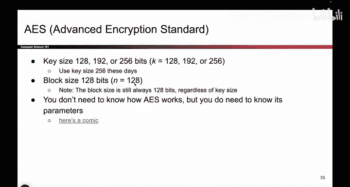
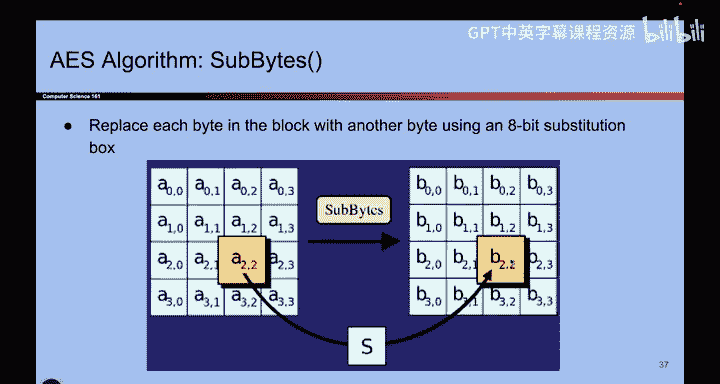
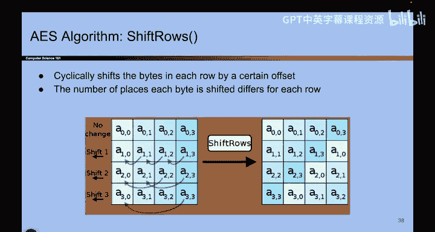

# 099：分组密码的实现与问题 🔐

在本节课中，我们将要学习分组密码在现实世界中的具体实现，特别是AES算法，并探讨其存在的两个主要问题：安全性和可用性限制。

---

## 分组密码的实际应用：AES

上一节我们介绍了分组密码的基本概念。本节中我们来看看现实中实际使用的分组密码标准。

现实中广泛使用的分组密码是**AES**（高级加密标准）。它基于Rijndael算法。当时也可以选择Twofish算法，但最终选择了AES。

以下是关于AES的关键信息：

*   **密钥长度**：AES支持不同的密钥大小。根据密钥大小的不同，有AES-128、AES-192和AES-256。每种版本的工作原理大致相同，但输入的密钥长度不同。如今，大多数人使用AES-256，因为它最长，最难被暴力破解。但即使是AES-128，暴力破解也极其困难。
*   **分组大小**：分组大小固定为128位。这意味着 `n = 128`。
*   **工作原理**：一旦选定一个特定密钥，你就得到了一个从所有128位输入到所有128位输出的映射。在这个映射图中，有 `2^128` 条箭头。我们并不真的绘制这个图，而是用代码来确定箭头指向哪里。其核心思想是：一个 `2^128` 个输入到 `2^128` 个输出的映射。

你不需要了解AES内部的具体运作，只需要知道它进行了一系列比特位重排操作。你需要了解的是其输入输出规格，以及这些是普遍接受的常用大小。AES是现实中人们真正使用的算法。

---

## AES的内部机制（简要了解）

如果你真的想了解AES内部发生了什么，这里有一些额外的幻灯片（内容不详细讲解）。但你可以看到，它进行了大量计算机擅长的比特操作，例如减法、移位、混合列、移动数据、交换字节等。它进行所有这些重排操作，但最终的行为正如我们之前展示的：它是一个置换，每个输入恰好对应一个输出，但攻击者不知道具体对应哪个输出。看起来就像随机撒下了一堆箭头。

它进行了大量的混合操作来扰乱输入，使得攻击者无法得知原始信息。这是一个很长的算法。

所以，你不需要知道算法的具体细节，只需要知道它进行了大量移位和混合操作即可。

---

## AES的安全性证明

那么，是否有人真正证明了AES的行为就像一个随机置换？是否有人证明过攻击者夏娃无法区分两个盒子？答案实际上是否定的。

没有人真正证明过夏娃无法区分这两个盒子。可能存在某种攻击，让夏娃能够辨别出其中一个盒子来自AES，例如通过非常仔细地检查代码，发现代码生成的箭头集合比另一种更常见。但就我们所知，AES已经存在20年了，尚未被攻破。因此，它被认为是足够安全的。

尽管没有形式化的证明，但基本上所有人都在使用它：银行、美国政府、以及你我。这就是现代分组密码算法的通用标准。

---

## 分组密码存在的问题

在我们完全结束分组密码的讨论之前，让我们谈谈为什么我们不能就此止步，宣布胜利并说我们已经设计好了密码方案。

我们不能就此止步的原因在于我们已经看到的一些问题。

**第一个问题非常严重：分组密码不具备NCPA安全性。**

它们的行为确实像随机的，这意味着攻击者不知道箭头指向哪里。但是，由于你使用同一个密钥多次加密消息，它们不具备NCPA安全性。对于之前看到的攻击（要求我加密两次相同的内容，我得到相同的输出），它是确定性的。

直观上，这并不安全。因为作为攻击者，你可以检测到某人何时发送了两次相同的消息。如果爱丽丝发送了很多消息，你注意到其中两个密文相同，你现在就有了线索：爱丽丝两次发送了那个东西。你学到了本不该知道的信息。NCPA游戏反映了这种模型：你不希望这种情况发生，它迫使爱丽丝在方案是确定性的场景中输掉。游戏反映了现实：我们不希望人们知道内容是否被加密了两次。

因此，分组密码不具备NCPA安全性。我们需要寻找更好的、具备NCPA安全性的东西。

**第二个问题我们之前有所暗示，但尚未真正解决：输入和输出是固定大小的。**

实际上，现实中的AES只能加密128位的消息。如果你的消息更短，你无法将其输入算法，算法不理解你的输入。如果你的输入太长，你也无法将其输入算法，算法同样不理解。你看到的所有那些比特移位和混合操作，如果输入不是恰好128位，就无法工作。

所以，如果你想加密更长或更短的内容，你不能直接使用分组密码。

---

## 总结与展望

本节课中我们一起学习了分组密码的两个主要问题：
1.  **安全性问题**：由于确定性加密，分组密码不具备NCPA安全性。
2.  **可用性问题**：分组密码只能处理固定长度（如128位）的消息。

为了解决这两个问题，我们实际上将**把分组密码作为构建模块**，用来构建更强大的方案。这个新方案将具备NCPA安全性，并能解决消息长度限制的问题。这就是我们接下来要学习的内容。