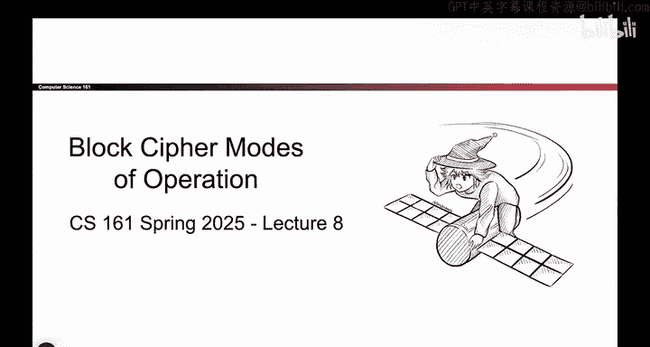
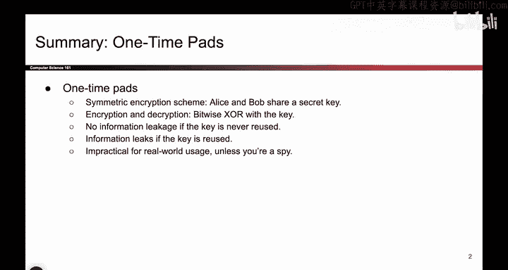

# 101：分组密码回顾 🧩

在本节课中，我们将回顾分组密码的基本概念，并探讨其在实际应用中面临的两个主要问题。我们将从一次性密码本开始，逐步过渡到分组密码，并理解其安全定义和局限性。

---

上一节我们介绍了对称加密的基本假设，即通信双方共享一个秘密密钥。现在，我们来回顾一下具体的加密方案。

## 一次性密码本

在对称加密中，假设爱丽丝和鲍勃共享一个其他人不知道的密钥。加密过程是**按位异或**操作，解密过程同样是**按位异或**操作。如果我们每次使用不同的密钥，这个方案是安全的。但每次使用不同的密钥是不切实际的。

## 分组密码的引入

这引导我们提出了下一个概念：**分组密码**。分组密码接收一个 **K** 位密钥和一个 **M** 位明文，并输出一个 **M** 位密文。我们可以将其理解为：密钥 **K** 决定了我们想要使用的从明文到密文的映射关系。

以下是分组密码的核心工作方式：
*   存在许多不同的从明文到密文的映射，每个密钥对应一个映射。
*   一旦选定一个密钥，就确定了该特定密钥下所有明文到密文的映射。
*   加密时，只需将明文映射到对应的密文。
*   解密时，将密文映射回对应的明文。

为了使这个过程正确，所绘制的映射箭头必须构成一个**双射**，即每个明文应恰好对应一个密文。

## 分组密码的安全性定义

我们定义，如果一个分组密码看起来像一个**随机排列**，那么它就是安全的。具体来说，如果给攻击者两个排列：一个是所有箭头完全随机绘制的排列，另一个是通过未知密钥运行分组密码代码生成的排列，攻击者无法区分哪个来自分组密码，哪个是随机生成的。这就是我们使用的安全定义。

我们认为分组密码相对高效，因为它涉及大量计算机擅长的异或和位移操作。现代标准是 **AES**，这是实际运行的代码。

## 分组密码的局限性

然而，我们不能止步于此，因为分组密码存在两个主要问题：
1.  分组密码不是 **IND-CPA** 安全的。它不符合特定的机密性定义，因为它是确定性的。
2.  它仅限于加密长度恰好为 **M** 位的消息。

---

本节课中，我们一起回顾了从一次性密码本到分组密码的发展，明确了分组密码通过模拟随机排列来定义安全性，同时也指出了其确定性加密和固定长度限制两大缺陷。在接下来的课程中，我们将构建更好的方案来解决这些问题。