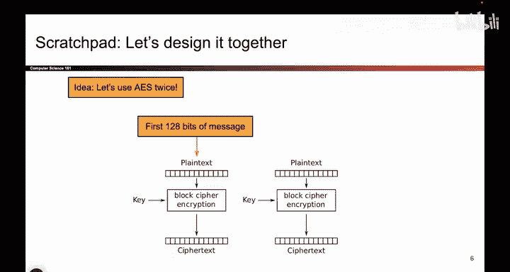
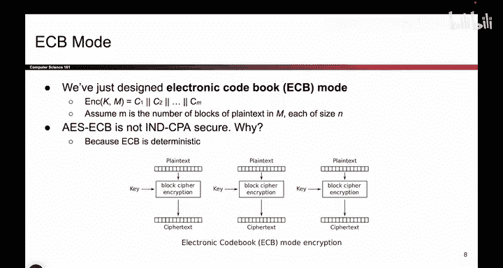
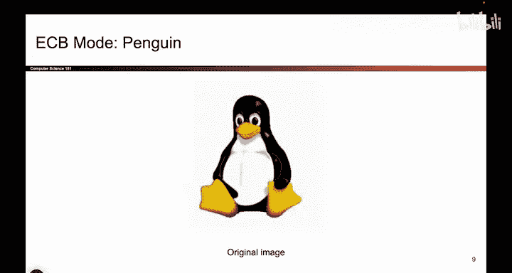

# 102：分组密码工作模式之ECB模式 🔐


在本节课中，我们将学习如何将基础的分组密码（如AES）扩展为能够加密任意长度消息的通用加密方案。我们将从最简单的模式——ECB模式开始，并理解其工作原理与安全缺陷。

## 从分组密码到长消息加密

上一节我们介绍了基础的分组密码，它只能加密固定长度（例如128位）的消息。本节中我们来看看，当我们需要加密更长的消息时，该如何设计。




基础的分组密码可以表示为：
```
C = E(K, P)
```
其中 `E` 是加密函数，`K` 是密钥，`P` 是128位明文，`C` 是128位密文。

它的一个主要问题是只能处理固定长度的输入。如果消息长度不是128位，该函数便无法工作。

## ECB模式的设计思路


为了解决长消息加密的问题，一个直观的想法是将长消息分割成多个128位的块，然后对每个块**独立地**使用相同的密钥进行加密。

以下是实现此想法的具体步骤：
1.  将长消息 `M` 分割成若干个128位的明文块：`P1, P2, ..., Pn`。
2.  对每个明文块 `Pi`，使用相同的密钥 `K` 和相同的加密算法 `E` 进行加密，得到密文块 `Ci = E(K, Pi)`。
3.  将所有密文块按顺序连接起来，形成最终的密文 `C = C1 || C2 || ... || Cn`。

这种模式被称为**ECB（Electronic Codebook，电子密码本）模式**。它成功地将分组密码的应用范围扩展到了任意长度的消息。

## ECB模式的安全性分析

虽然ECB模式解决了加密长消息的问题，但我们仍需检验它是否满足我们期望的IND-CPA（不可区分的选择明文攻击）安全。



ECB模式的核心问题在于它是**确定性的**。对于相同的明文块，无论加密多少次，都会产生完全相同的密文块。

这种确定性导致了严重的安全漏洞。攻击者可以通过观察密文中重复出现的模式，来推断明文中哪些部分是相同的。一个著名的例子是“ECB企鹅”图：当一张图片的每个像素被当作一个独立块用ECB模式加密后，虽然单个像素的颜色被改变了，但相同颜色的像素会被加密成相同的密文，导致原始图片的轮廓依然清晰可见。

因此，攻击者可以在IND-CPA游戏中轻松获胜：只需提交两个仅在部分块有差异的明文，观察密文中哪些块发生了变化，即可判断加密的是哪一个消息。这证明ECB模式无法提供我们所需的保密性。



## 课程总结

本节课中我们一起学习了第一个分组密码工作模式——ECB模式。
*   我们了解了如何通过分块加密来扩展分组密码的功能，以加密任意长度的消息。
*   我们分析了ECB模式的工作原理，并认识到其**确定性**的本质是导致其不安全的关键原因。
*   通过“ECB企鹅”的例子，我们直观地看到了确定性加密如何泄露明文中的模式信息，从而无法达到IND-CPA安全标准。


ECB模式虽然简单，但不安全，不应在实际需要保密性的场景中使用。在接下来的课程中，我们将探索更安全的工作模式。