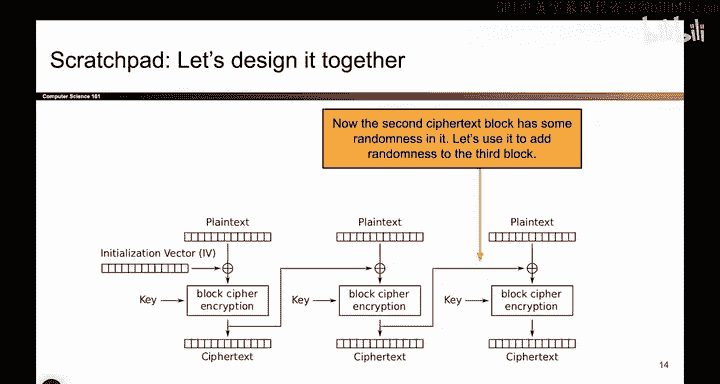
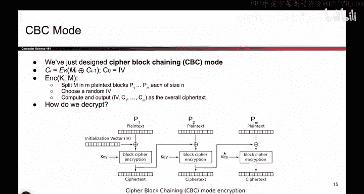
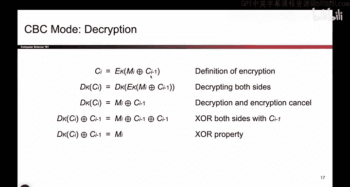
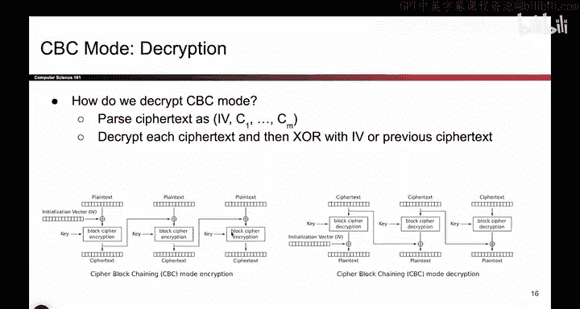

# 103：CBC模式设计 🔐

在本节课中，我们将学习如何设计一种比ECB模式更安全的加密模式。我们将探讨ECB模式存在的问题，并介绍如何通过引入随机性来构建一种称为“密码块链接”（CBC）模式的新方案。我们将详细讲解其工作原理、加密与解密过程，并解释其如何提升安全性。

---

上一节我们介绍了ECB模式，它虽然能加密长明文，但存在安全性问题。本节中，我们来看看如何设计一种更好的方案，以提供更强的安全性。

ECB模式不满足IND-CPA安全性的主要原因是其确定性。加密相同内容多次会得到相同的输出。为了使其变得非确定性，我们开始引入一些随机性。

如果在某个地方加入一些随机比特，也许就能使得多次加密相同内容时，输出不再每次都相同。这得益于我们为每次加密消息添加的不同随机性。

尝试加入一些随机性。也许不是直接加密明文本身，而是将明文与一些随机性混合后再加密。

现在，输入到分组密码的不仅仅是明文，而是明文与某个随机字符串进行异或的结果。这个小符号代表异或操作。这意味着我们将明文与所谓的“初始化向量”（IV）进行异或，IV是每次加密都不同的随机比特串。

如果将其通过加密块，密文每次看起来都应该不同。如果对相同的明文块加密10次，虽然传入的明文相同，但IV会不同10次。因此，密文输出也应该不同。这正在逐步解决之前企鹅图片暴露的问题。

这很好。现在，我的第一个密文块每次都会不同。但我还没有解决其他问题。如果第二个明文块相同，其密文仍然相同。我仅为消息的第一部分添加了随机性，但后续部分没有。

我应该继续扩展。将刚刚学到的思路扩展到使其他块也变得随机。一个可能的想法是添加更多的初始化向量。为每个块都生成一个随机值。这虽然可行，但需要大量的随机性。

因此，我将采用一个更巧妙的方法。我意识到这个密文块本身就是随机的。其输入是随机的，分组密码对其进行了扰乱。所以这是一个不可预测的随机值。

与其生成一个新的随机比特串作为第二个初始化向量，不如直接使用这个密文块。这是一个不可预测的随机值，为什么不用它来打乱和随机化第二个块呢？

对于这个明文块，不是直接传入，而是与前一个密文块进行异或。你可以将其视为我们用来与第二个明文块进行异或的另一个随机比特串。

现在，这个密文输出也应该不可预测，因为前一个密文块每次不同，所以这个输入每次不同，因此输出每次也应不同。

也许你已经猜到接下来的步骤。我们对后续的块重复此过程。这个块也需要被打乱。我们只需将前一个密文块的输出连接到这个块的输入，依此类推。

如果我们这样不断地链接下去，现在所有的输出都应该是不可预测和随机的。我们的目标只是说明ECB模式不是IND-CPA安全的，因为它是确定性的。我希望在整个加密过程中添加随机性。所以我从一个随机值开始，然后将其传播到整个加密过程中。现在，一切都应该是随机的。

我还没有向你证明这是正确的或有效的。我只是添加了一些随机性。事实证明，这确实有效。它有一个名字，叫做“密码块链接”模式，因为你将前一个块链接到当前块。

我们可以将其写成一个公式。你可以问，如何写出第i个密文块？你正在加密某个东西，它是分组密码的输出。那么我在加密什么？我在加密第i个明文块与前一个密文块的异或结果。这只是将图片转换为公式，如果你更喜欢公式的话。

为了简化，我们说第0个密文块就是这个IV。你不必这样做，但这使得符号表示更简洁，当你将其技术上称为C0时。

用文字描述，如何加密？首先，获取你的消息，它现在可以是任意长度，不必是128比特。将其分割成一系列连续的明文块，每个块128比特。计算这个随机IV。抛一些硬币，选择这个随机值。然后根据这张图计算密文。

现在我们有了一个加密方案。我们引入了一些随机性。请注意，随机性并不能保证安全性，但至少这不再是确定性的。所以我们有了一个方案。

现在，让我们思考这个方案的加密、安全性以及其他属性。

---

上一节我们介绍了CBC模式的加密过程。本节中，我们来看看如何解密，以恢复原始消息。

我们关心的一个属性是，如何实际取回原始消息。如果我这样加密一堆消息，并加入所有这些随机性，原始消息是否还能被输出，这一点似乎并不立即明确。

为了向自己证明原始消息可以从密文中恢复，有几种方法可以解决这个问题。一种方法是使用图片。

如果你喜欢图片，我们可以尝试看图。让我们思考一下密文。它就在那里。你可以访问它。有一件事我没有明确提到，但确实是事实：你也会将IV作为密文的一部分发送。当Bob收到消息时，他收到所有密文块加上IV。他得到全部。

那么Bob如何解密呢？他可以通过某种方式反向运行这个图。那会是什么样子？我会取密文，然后通过的不是加密（因为我要反向操作），而是解密。这就是我们在解密图中看到的。你取密文，通过分组密码解密块。这相当于在这个图中反向操作。

解密后，你仍然得到明文与IV异或的结果。但我想抵消掉IV。我不想要那个，我想要原始明文。所以一旦解密，你再与IV进行一次异或。记住我们方便的异或属性：如果你将这个值与IV异或，IV会抵消，我就得到了原始明文。

因此，推导这个解密图的一种方法就是反向运行这个加密图。对于后续的块也是如此。对于第二个块，我从密文开始，通过反向的分组密码解密块运行它。这就是解密。然后我仍然需要异或掉一些随机性。这里的随机性是前一个密文块。所以当我得到这个分组密码解密的结果时，我将其与前一个密文块异或。前一个密文块抵消了，我就得到了原始明文。

所以，得到这个解密图的一种方法是查看加密图，并思考如何反向工作。

现在，如果你不喜欢图片，我们也可以用一些代数来解决它。对于喜欢数学的你，另一种找出解密方程的方法是写出加密方程，然后解出明文。

这是我们之前看到的方程，它代表了加密图。它告诉我们，给定一些消息和之前的密文，如何得到下一个密文块。

现在，如果你想解密，你需要解出M。所以我们只需要做一些代数运算来解出M。我们该怎么做？我们可以对两边应用操作。所以我在两边都应用D_K。记住，当你加密某物然后解密它时，这两个操作会抵消。

所以我得到了这个方程。很好。但我想分离出M_i。所以我将两边都与C_{i-1}进行异或。就是这样，利用我们方便的异或属性，这两项抵消了，我得到了M_i的方程。

这告诉我如何根据给定的密文进行解密。所以，如果你不喜欢图片，代数是解决这个问题的另一种方法。

---

在本节课中，我们一起学习了如何设计CBC加密模式。我们首先指出了ECB模式因确定性而存在的安全问题。接着，我们通过引入初始化向量（IV）和将前一个密文块链接到当前块的处理，构建了CBC模式。我们详细讲解了其加密过程，公式表示为：**C_i = E_K(M_i ⊕ C_{i-1})**，其中C_0 = IV。然后，我们探讨了解密过程，可以通过反向运行加密图或通过代数求解实现，解密公式为：**M_i = D_K(C_i) ⊕ C_{i-1}**。CBC模式通过在整个加密过程中传播随机性，解决了ECB模式的确定性缺陷，为构建更安全的加密方案奠定了基础。