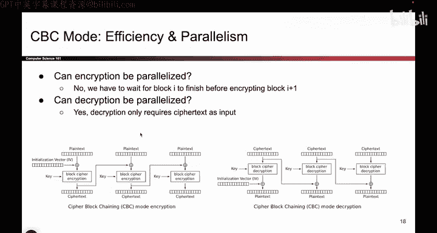
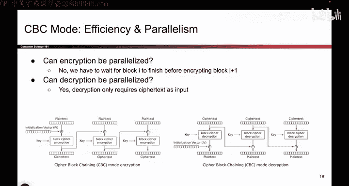
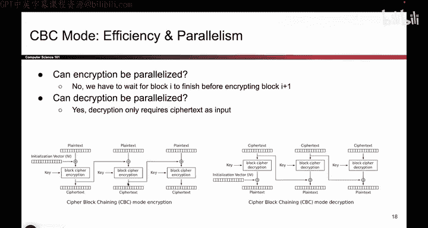
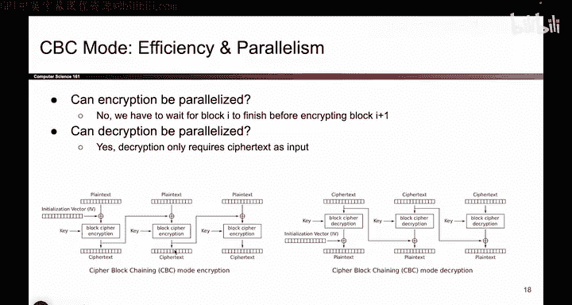
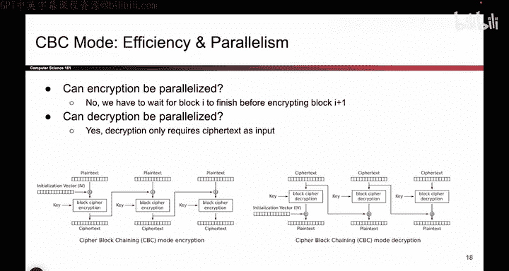
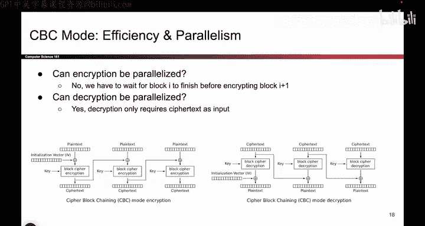

# 104：CBC模式效率分析 🔍

在本节课中，我们将要学习CBC（密码块链接）模式的效率特性，特别是其加密和解密过程是否能够并行化处理。理解这些特性对于评估和优化加密算法的实际应用性能至关重要。

上一节我们介绍了CBC模式的基本原理以及加密和解密流程。本节中我们来看看CBC模式在效率方面的表现。

## 并行化分析 🚀

一个我们关心的问题是效率。我们希望分组密码能为用户相对快速地运行。因此，我们可能会问：能否并行运行此模式？如果能，那将非常理想。这里的“并行”指的是可以同时加密所有数据块。

如果能够并行化，当你拥有10个数据块时，你可以同时加密所有10个块，完成速度将快10倍。如果不能并行化，则意味着你必须一次加密一个块，这仍然有效，只是速度稍慢。这里我们分析的是性能，而非正确性。

### 加密过程的并行性

首先的问题是，我们能否并行化该算法的加密部分？

观察加密流程。假设我想加密第三个数据块。在并行化场景下，我希望将不同的块分配给计算机的不同部分处理。那么，是否有人可以仅凭自身、无需其他信息就加密第三个块？

他们需要明文。我们有明文，因为它是输入。我们也有密钥，它也是加密的输入之一。

但是，加密前需要与上一个密文进行异或操作的这个值呢？我没有这个值。我必须等待前一个块的处理者完成，才能获得他们的密文输出，而在一开始我并没有这个值。

因此，不幸的是，加密无法并行化，因为每个块都必须排队等待前一个块完成，才能计算自己的块。例如，第三个块必须等到第二个块输出其密文后才能运行。所以，加密过程无法并行化，你必须等待前面的块完成。

### 解密过程的并行性

那么解密呢？再次观察图示，你可能会因为这些箭头而倾向于认为它无法并行化，但我们必须仔细分析。

让我们看看解密算法的输入。有密文，我们有吗？我们有。密文是解密的输入。我们有密钥吗？我们有。密钥是解密的输入之一。那么这个值（指前一个密文）呢？这个值是前一个密文。我们有前一个密文吗？是的，我们有。

请记住解密的定义：它接收一个密文和密钥，然后进行解密。因此，在算法一开始，你就拥有了所有的密文。所以，你需要当前的密文，你拥有它；你需要前一个密文，你也拥有它。你拥有所需的一切，无需等待前面的块完成。

因此，所有这些解密块实际上可以并行运行，这相当不错。

## 总结 📝

本节课中我们一起分析了CBC模式的效率特性。

我们分析了加密是否可以并行化，结论是**不可以**。因为每个块的加密都依赖于前一个块的密文输出，形成了顺序依赖。

我们也分析了解密是否可以并行化，结论是**可以**。因为在解密开始时，所有密文块都已作为输入可用，每个块的解密操作是独立的。

这种加密与解密在并行性上的不对称性，是CBC模式的一个重要效率特征。