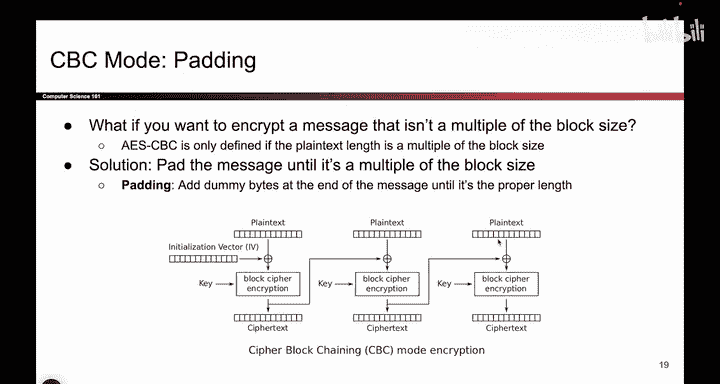
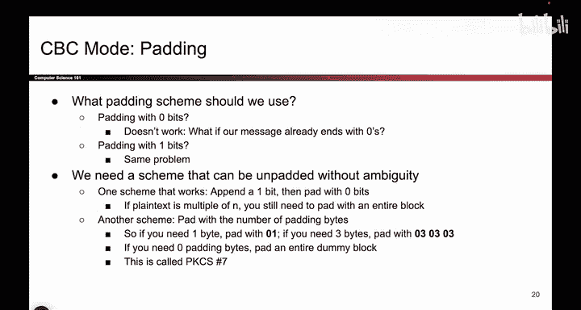

# 105：CBC模式填充

在本节课中，我们将要学习在CBC（密码块链接）加密模式中，当消息长度不是块大小的整数倍时，如何处理消息填充问题。我们将探讨为什么需要填充、填充不当可能带来的风险，以及一种常见的解决方案。

## 概述

上一节我们介绍了CBC模式的基本工作原理。本节中我们来看看当待加密消息的长度不是块大小的整数倍时，会发生什么情况，以及如何通过“填充”来解决这个问题。

## 消息长度问题

CBC模式要求每个明文块的大小必须与加密算法（如AES）的块大小完全一致。例如，AES的块大小是128位（16字节）。如果消息长度恰好是128位的整数倍（如256字节），那么一切正常。你可以将消息分成两个完整的块进行加密。

但如果消息长度是257位呢？那么前两个块各占128位，最后会剩下一个孤立的位。这就引出了一个关键问题：当消息长度不是块大小的整数倍时，加密过程还能正常工作吗？

答案是不能。加密协议在这种情况下没有定义。具体来说：

1.  在XOR操作中，你需要将128位的密文块与不足128位的明文块进行异或，这是未定义的。
2.  块加密函数（如AES加密）要求输入恰好是一个完整块（128位），你无法向其输入一个不完整的块。

因此，我们需要一种方法使所有消息的长度都变为块大小的整数倍。

## 填充的引入

解决方案是在消息末尾添加“填充字节”。这些是虚拟字节，不属于实际消息内容，只是为了将消息长度扩展到下一个块大小的整数倍。

例如，如果有一个257位的消息，最后一个块只有1位。你可以添加127个填充字节，使最后一个块也变成完整的128位。这样，整个消息就变成了384位（3个完整的块），可以进行正常的CBC加密。



填充过程可以用以下伪代码描述：
```python
def pad_message(message, block_size):
    # 计算需要填充的字节数
    padding_length = block_size - (len(message) % block_size)
    # 如果消息长度恰好是块大小的整数倍，则填充一个完整的块
    if padding_length == 0:
        padding_length = block_size
    # 创建填充字节并附加到消息末尾
    padded_message = message + bytes([padding_length] * padding_length)
    return padded_message
```

## 填充方案的选择

现在的问题是：我们应该用什么值来填充呢？这需要非常小心，因为存在一些容易掉入的陷阱。

以下是几种可能但存在问题的方案：

*   **全部填充零**：在消息末尾添加零直到达到块大小。
    *   **问题**：如果原始消息本身就以零结尾（例如“支付100美元”），解密方无法区分哪些零是消息内容，哪些是填充。错误地移除填充可能导致“100”变成“1”。
*   **全部填充一**：在消息末尾添加一。
    *   **问题**：与填充零类似，如果消息以“1”结尾（例如“支付211美元”），同样会产生歧义。

填充任何恒定值都会导致“歧义”问题。解密方无法明确知道消息的结束位置和填充的开始位置。

## 一种可行的填充方案

为了避免歧义，需要更巧妙的方案。一种常见且有效的方法是：**用填充的字节数量本身作为填充值**。

例如，如果需要填充5个字节，就用5个值为`0x05`的字节进行填充。如果需要填充一个完整的块（16字节），就用16个值为`0x10`的字节填充。

这种方案（如PKCS#7）之所以有效，是因为最后一个字节的值明确告诉了解密方需要移除多少填充字节。即使消息末尾的字节恰好与填充值相同，解密算法也能通过检查倒数第二个、第三个字节等来正确解析。

以下是一个示例：
```
原始消息: "Hello" (5字节)
块大小: 8字节
需要填充: 3字节
填充后消息: "Hello" + 0x03 + 0x03 + 0x03
```
解密后，读取最后一个字节`0x03`，就知道需要移除最后3个字节。

## 总结



本节课中我们一起学习了CBC模式中的填充问题。我们了解到，由于块加密算法要求输入长度固定，当消息长度不是块大小的整数倍时，必须在末尾添加填充字节。简单地用零或恒定值填充会导致歧义，使解密方无法正确恢复原始消息。一种稳健的解决方案是使用填充长度本身作为填充值，这能确保填充可以被明确识别和移除。在后续作业中，你将有机会更深入地探索和实践不同的填充方案。