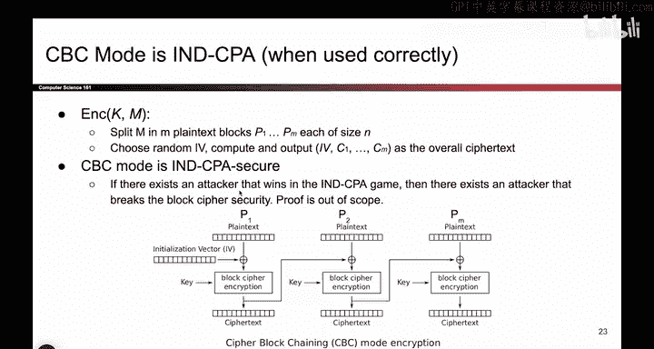

# 106：CBC模式安全性 🔐

在本节课中，我们将要学习CBC（密码块链接）模式的安全性。我们将探讨其安全性的前提条件，特别是初始化向量（IV）的重要性，并分析如果错误使用IV会如何导致信息泄露。最后，我们会将CBC模式与之前学过的ECB模式进行对比。

---

## CBC模式的安全性要求

上一节我们介绍了CBC模式的工作原理和效率特性。本节中我们来看看其安全性。

通过深入分析可以证明，在特定条件下，CBC模式是IND-CPA（不可区分的选择明文攻击）安全的。这个方案安全的一个非常重要的前提是：**必须随机生成初始化向量（IV）**。这是CBC模式满足安全要求的必要条件。

如果IV不是随机生成的，例如每次都使用一个固定的值，那么当相同的明文被加密时，就会产生相同的密文。加密过程就变回了确定性的，这将导致我们在IND-CPA游戏中失败。

需要提醒的是，仅仅在加密方案中加入随机性，并不能保证它就是IND-CPA安全的。例如，一个非常愚蠢的方案：先使用ECB模式加密，然后在末尾附加一些随机比特。即使加入了随机性，这个方案仍然是不安全的。

以下是两个关键点：
*   确保IV是随机生成的。
*   随机性本身并不能保证安全，但它是实现安全的一个必要条件。

---

## 重复使用IV的后果

我们已经知道，如果两次使用相同的IV，并且两次的明文也相同，那么产生的密文输出也会相同。这就像“企鹅图”案例一样，会导致信息泄露。但情况可能更糟。

考虑两个不同的消息，但它们开头有一些相同的词。例如，两条消息都以“Dear Bob”开头。那么，它们的前两个明文块可能是相同的。

假设我们用相同的IV和密钥加密这两条消息。让我们逐步分析：

1.  加密第一条消息的第一个块（橙色）。输入是橙色明文块、红色IV和密钥，输出得到某个密文块 `C1`。
2.  加密第二条消息的第一个块（同样是橙色）。输入是相同的橙色明文块、相同的红色IV和相同的密钥。输出将得到完全相同的密文块 `C1`。

攻击者看到这两个相同的 `C1`，就能推断出这两条消息是以相同的第一个块开始的。

情况会变得更糟。让我们看第二个块：

3.  加密第一条消息的第二个块（蓝色）。输入是蓝色明文块和上一个密文 `C1`。
4.  加密第二条消息的第二个块（蓝色）。输入也是蓝色明文块和上一个密文 `C1`。

由于输入完全相同，第二个密文块 `C2` 也必然相同。现在，攻击者知道这两条消息的前两个块都相同。

最终，当加密到第一个出现差异的块时（例如，第三条消息块一个是紫色，一个是绿色），密文才会开始变得不同。但在此之前，我们已经泄露了本不该泄露的信息：这两条消息开头有相同的几个词。

因此，重复使用IV不仅会使方案变成确定性的（相同明文产生相同密文），还会泄露“相似”消息的信息——这里“相似”指的是消息开头有相同的几个块。我们必须非常小心，避免两次使用相同的IV。

---

## 总结与证明思路

让我们回顾一下CBC模式及其安全性和工作原理。

加密方案流程如下：
1.  将消息分割成块。
2.  **选择一个随机IV**（不要只是选0）。
3.  根据图示计算密文。

在保证不重复使用IV的前提下，CBC模式是IND-CPA安全的。如果你想证明这一点，会用到一种称为“归约证明”的方法。其思路大致是：如果一个攻击者能够攻破CBC模式，那么他也能攻破底层的分组密码。如果我们假设底层的分组密码是安全的，那么我们就可以认为CBC模式也是安全的。

---

## CBC与ECB的视觉对比

在我们结束CBC模式的讨论前，最后再看一次“企鹅图”。这次我们将使用CBC模式来加密它。

这意味着对于每个像素块，我们不再使用ECB模式，而是使用CBC模式进行加密。现在，你完全看不到企鹅的轮廓了。它仍然隐藏在密文中（可以被解密），但已被完全伪装起来。这比ECB模式中企鹅轮廓依稀可见的情况要好得多。

**CBC加密效果：**
（图像显示为随机噪声，无可见图案）

**ECB加密效果（对比）：**
（图像显示依稀可见的企鹅轮廓）

---

本节课中我们一起学习了CBC模式安全性的核心要求，即必须使用随机且唯一的IV。我们分析了重复使用IV会导致确定性加密和部分明文信息泄露的风险。最后，通过图像加密的直观对比，我们看到了CBC模式在隐藏数据模式上相对于ECB模式的巨大优势。记住，正确使用随机性是构建安全加密方案的关键。