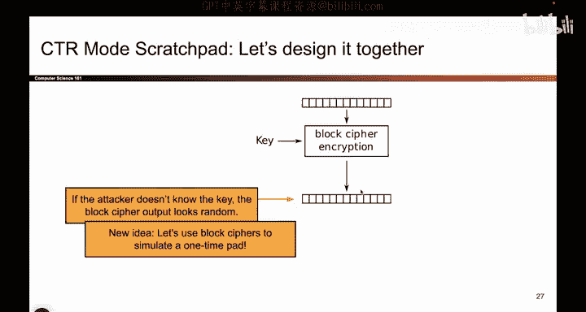
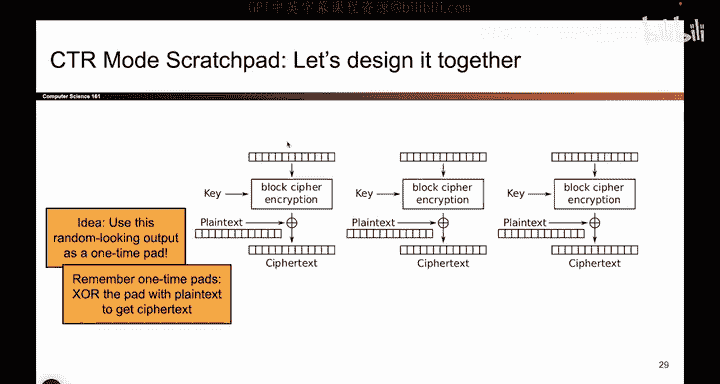
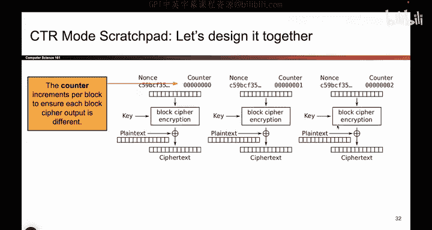
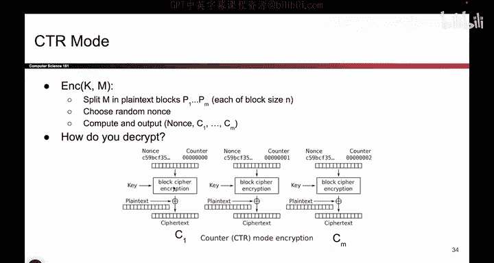

# 107：CTR模式设计 🧩

在本节课中，我们将一起学习并设计第二种加密方案——CTR模式。我们将逐步构建它，并分析其所有特性。

## 概述

CTR模式的设计灵感并非直接源于分组密码，而是更多地借鉴了一次性密码本的思想。我们的目标是模仿一次性密码本的安全行为，但避免每次加密都需要生成新密钥的繁琐过程。为此，我们将结合一次性密码本和分组密码的特性来构建这个新方案。

## 设计思路

上一节我们回顾了一次性密码本，本节我们来看看如何改进它。一次性密码本在密钥不重复使用的情况下是安全的。每次加密使用不同的密钥与明文进行异或运算，就能得到密文。我们的目标是模仿这种行为，但无需每次都生成新密钥。

为了实现这个目标，我们需要引入第二个关键想法：分组密码。回想一下，如果攻击者不知道密钥，分组密码的输出看起来是随机的。一个安全的分组密码，其输出与随机排列是不可区分的。这意味着，从攻击者的视角看，这个输出值就像随机生成的一样好。

那么，如果我们利用这个“看起来随机”的输出，并结合一次性密码本的思想呢？这样我们就不必每次都生成新密钥了。这就像是将一次性密码本和分组密码的伪随机性融合在一起。

## 构建CTR模式

我们将融合上述两个想法，构建一个基于分组密码、但形似一次性密码本的加密方案。

我们可能需要不止一个分组的随机性，以便加密更长的消息或多个消息。因此，我们需要多次运行分组密码加密。只要攻击者不知道密钥，所有这些输出在攻击者看来都如同随机比特。我们可以生成足够多的这种伪随机输出，然后将它们用作一次性密码本的密钥流。

具体操作如下：我们生成伪随机输出，然后将其与明文进行异或运算以得到密文。如果还有更多明文，我们就生成更多伪随机输出，继续异或加密。因此，这个方案的上半部分是利用分组密码生成伪随机输出，下半部分则是之前的一次性密码本加密过程。

## 关键组件：随机数与计数器

这个方案还缺少一个关键部分：我们输入到分组密码里的是什么？目前方案是确定性的，如果多次运行相同的加密，会得到相同的伪随机输出，这缺少了随机性。

因此，最后的拼图是将一些随机性作为分组密码的输入。我们选择一个随机数，称为**Nonce**，并将其输入分组密码。用密钥加密后，结果应该是随机的。

然而，如果每次都用相同的Nonce，那么每次的输出都会相同，这相当于重复使用一次性密码本的密钥，是不安全的。为了解决这个问题，我们引入一个**计数器**。

以下是具体步骤：
1.  取Nonce加上0，输入分组密码，得到第一个伪随机输出块。
2.  取Nonce加上1，输入分组密码，得到第二个伪随机输出块。
3.  取Nonce加上2，输入分组密码，得到第三个伪随机输出块，依此类推。

这样，所有的输出都会不同。因为分组密码表现得像随机排列，即使输入只改变一个比特（例如从0变为1），产生的输出也会完全不同且不可预测。这让我们能获得大量看似随机的输出来用作一次性密码本的密钥。

## CTR模式工作原理

我们将两个想法结合，设计出了称为CTR（计数器）模式的方案。请注意，计数器必须为每个分组递增，以确保每个分组密码的输出都不同。

其工作流程如下：
1.  选择一个随机生成的Nonce。**每次加密只需生成一次Nonce**。
2.  取Nonce，后面附加（或加上）0，用你的密钥进行分组密码加密，得到第一个伪随机输出块，这就是你的一次性密码本密钥。
3.  将此密钥与第一段明文进行异或运算，得到第一段密文。
4.  如果还有更多明文，取Nonce加上1，用相同的密钥进行分组密码加密，得到下一个伪随机输出块。
5.  将其与下一段明文异或，得到下一段密文。
6.  重复此过程，直到整个消息加密完毕。

在整个过程中，**你使用的是同一个密钥**。这正是我们为了避免每次使用不同密钥而设定的目标。所有输出之所以不同，是因为计数器在不断变化。密钥保持不变且攻击者未知，计数器确保了输出的差异性。

用文字概括就是：你将消息分割，生成看似随机的输出块，然后将每个明文块与对应的分组密码输出块进行异或加密。

## 总结

本节课中，我们一起学习了CTR模式的设计。我们从一次性密码本的安全特性出发，结合了分组密码能产生伪随机输出的能力，通过引入Nonce和计数器，构建了一个既能保证安全、又无需每次加密都更换密钥的高效加密方案。CTR模式的核心在于使用相同的密钥，但通过递增的计数器输入来生成独一无二的密钥流，从而实现对明文的加密。