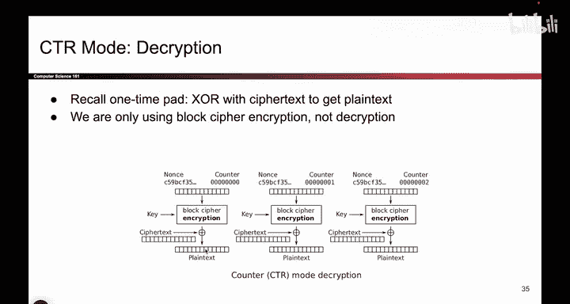
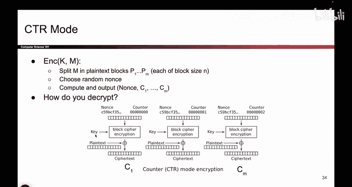
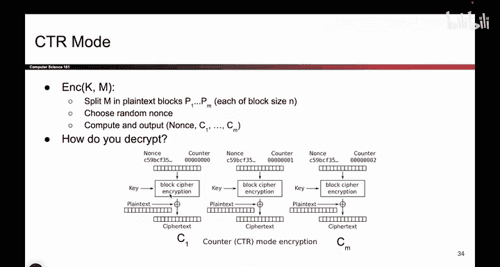
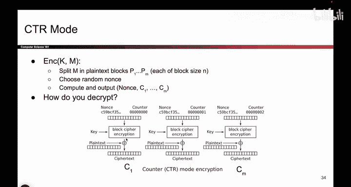
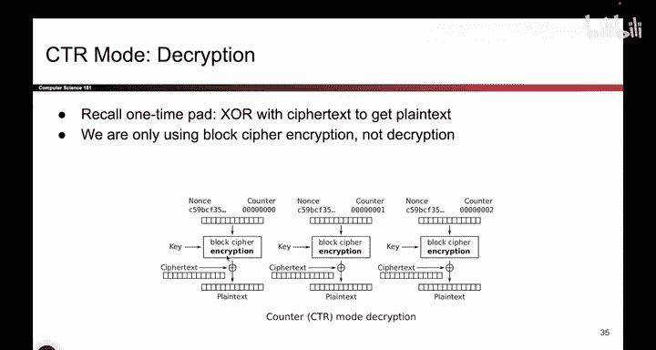
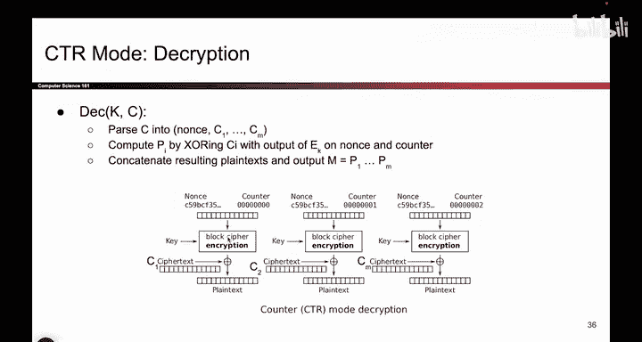

# 108：CTR模式解密 🔐


在本节课中，我们将学习计数器模式（CTR）的解密过程。我们将通过图解和公式两种方式来理解解密是如何进行的，并解释为什么解密时需要使用与加密相同的正向块密码操作。

---

## 概述


上一节我们介绍了CTR模式的加密过程。本节中，我们来看看如何对CTR模式加密的密文进行解密。解密的核心思想与一次性密码本（One-Time Pad）的解密原理相同。

---

## 解密原理：图解方式

观察CTR模式的加密图，我们可以将其视为一种一次性密码本。加密时，明文与一个由块密码生成的“垫片”（pad）进行异或运算，得到密文。

以下是加密过程的图示：


那么，一次性密码本是如何解密的呢？解密时，你需要将密文与相同的“垫片”再次进行异或运算，即可恢复出原始明文。

因此，接收者Bob需要做的是：





1.  使用与发送者Alice完全相同的算法（相同的密钥、Nonce和计数器值）重新生成那个“垫片”。
2.  将收到的密文与此“垫片”进行异或运算。

解密过程的图示如下：


---

## 关键点：使用块密码加密模式


这里有一个容易令人困惑的关键点：在解密过程中，为了重新生成“垫片”，我们必须使用块密码的**加密**模式，而不是解密模式。



原因在于，块密码在CTR模式中的作用仅仅是生成一串看似随机的比特流（即“垫片”）。为了在解密端得到完全相同的比特流，我们必须以完全相同的方向运行相同的块密码算法。在加密过程中，这个方向就是加密，因此在解密时，我们也必须使用加密操作。

虽然解密时使用加密块看起来有违直觉，但这是必要的，以确保双方生成的“垫片”一致。生成“垫片”后，只需将其与密文异或即可得到明文。

这个过程可以总结为以下伪代码：

```python
# 解密过程伪代码
def ctr_decrypt(ciphertext, key, nonce):
    plaintext = b""
    for i, block in enumerate(ciphertext):
        # 使用加密模式生成垫片
        counter = nonce + i
        pad = block_cipher_encrypt(counter, key)
        # 将密文块与垫片异或
        plaintext_block = xor(block, pad)
        plaintext += plaintext_block
    return plaintext
```

---

## 解密原理：公式推导

我们也可以通过公式来理解这个过程。假设对于第 *i* 个块，加密过程为：

**Cᵢ = Pᵢ ⊕ E(K, Nonce || i)**


其中：
*   **Cᵢ** 是密文块
*   **Pᵢ** 是明文块
*   **E** 是块密码加密算法
*   **K** 是密钥
*   **⊕** 表示异或运算


那么解密过程，即求解 **Pᵢ**，可以通过将等式两边同时与垫片 **E(K, Nonce || i)** 进行异或来完成：






**Pᵢ = Cᵢ ⊕ E(K, Nonce || i)**


可以看到，公式中使用的仍然是加密函数 **E**。这再次印证了，解密时需要运行与加密时完全相同的块密码加密操作来生成垫片。

---

## 总结

本节课中，我们一起学习了CTR模式的解密。

1.  **核心思想**：CTR模式的解密原理与一次性密码本相同，即 **密文 ⊕ 垫片 = 明文**。
2.  **关键步骤**：解密者必须使用与加密者完全相同的参数（密钥、Nonce、计数器）和相同的**块密码加密算法**来重新生成“垫片”。
3.  **重要提示**：解密过程中不需要使用块密码的解密功能。块密码在CTR模式中仅用作伪随机数生成器，因此始终运行在加密方向。




理解这一点，就掌握了CTR模式对称加解密的全过程。