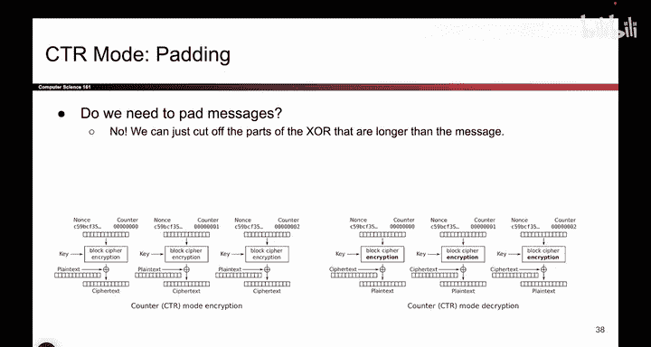
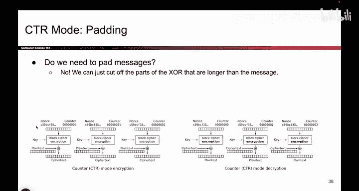
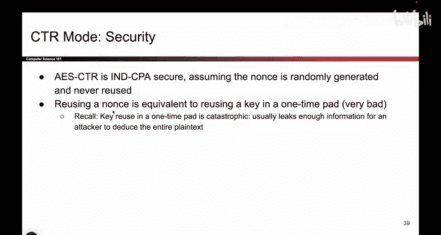
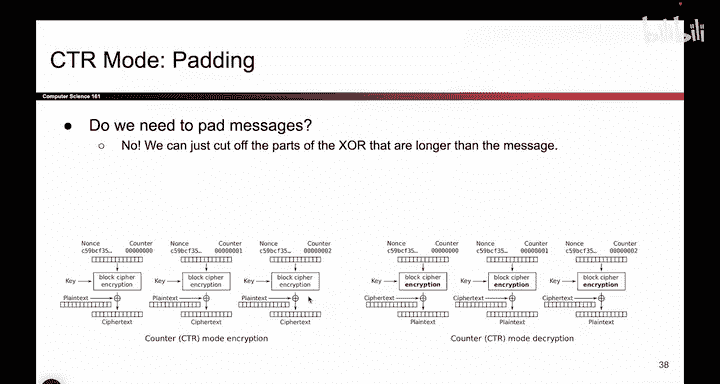
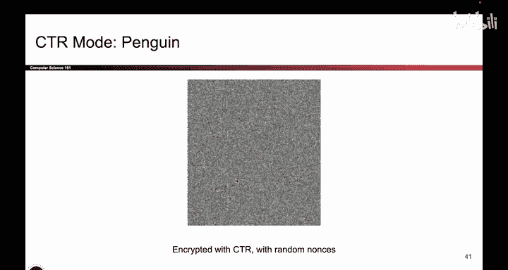

# 109：CTR模式特性 🔐

在本节课中，我们将探讨CTR（计数器）模式的各种特性，包括其效率、并行化能力、填充需求以及安全性。我们将与之前讨论过的CBC模式进行对比，以更好地理解CTR模式的优势和潜在风险。

## 并行化能力 ⚙️

上一节我们介绍了CTR模式的基本工作原理，本节中我们来看看它的并行化能力。CTR模式在加密和解密过程中都支持并行处理。

以下是CTR模式支持并行化的原因：

*   **加密并行化**：每个明文块的加密过程是独立的。要加密第30个块，只需计算 `E(k, nonce+30)` 生成密钥流，然后与第30个明文块进行异或。此过程不依赖于任何其他块。
*   **解密并行化**：解密过程同理。要解密密文块，只需使用相同的 `nonce` 和计数器值重新生成密钥流，然后与密文块异或即可恢复明文。每个块的处理也是独立的。

因此，CTR模式在加密和解密两个方向上都支持高效的并行计算。

## 填充处理 📦

与CBC模式不同，CTR模式在处理明文长度不是分组长度的整数倍时，无需进行填充。

以下是CTR模式无需填充的原理：

*   **关键区别**：在CTR模式中，**明文从不直接输入分组密码进行加密**。需要加密的是计数器值。
*   **处理最后一块**：对于最后一块不完整的明文（例如只有1字节），算法仍会使用对应的计数器值生成完整的128位（16字节）密钥流。
*   **截断操作**：然后，只取密钥流的前1字节（与不完整明文的长度相同）与明文进行异或，生成密文。剩余的127位密钥流被直接丢弃。
*   **解密过程**：解密时，接收方用相同的 `nonce` 和计数器重新生成相同的128位密钥流，同样只取前1字节与密文异或，即可恢复原始明文。

由于分组密码的输入（计数器）始终是完整的块，因此没有填充要求。这种通过截断密钥流来适配明文长度的方式，是CTR模式的一个巧妙特性。

## 安全性分析 🔒

现在我们来分析CTR模式的安全性。与CBC模式类似，CTR模式的安全性也依赖于一个关键前提。

以下是CTR模式安全性的核心要点：

*   **安全性证明**：在密码学中，可以证明（通过归约证明），只要每次加密都使用一个新的随机数（`nonce`），AES-CTR模式是IND-CPA安全的（即在选择明文攻击下具有不可区分性）。
*   **重用 `nonce` 的灾难性后果**：如果两次加密使用了相同的 `nonce` 和密钥，那么生成的密钥流就会相同。这实质上等同于**两次使用了相同的“一次一密”密钥**。
*   **两次一密的风险**：正如我们之前课程所学的，两次一密是极不安全的。攻击者将两个密文异或，可以得到两个对应明文的异或值：`c1 ⊕ c2 = (p1 ⊕ stream) ⊕ (p2 ⊕ stream) = p1 ⊕ p2`。这可能会泄露大量信息，如果其中一个明文已知，另一个明文将立即被破解。

因此，**绝对不要重复使用 `nonce`**。否则，系统的安全性将彻底崩溃。

## 正确与错误的示例 🐧

为了直观理解，我们可以看一些图像加密的示例：

*   **正确使用（每次使用新 `nonce`）**：加密后的图像看起来是完全随机的噪声，没有任何原始图像的轮廓可见，这符合安全加密的预期。
*   **错误使用（重用 `nonce`）**：加密后的图像可能会泄露信息，安全性失效。这警示我们必须遵循正确的加密实践。

历史上就有因错误使用密码学而导致安全漏洞的案例。例如，某些学生项目在自行实现加密方案时，意外地重复使用了初始化向量（IV，在CTR模式下即 `nonce`），导致整个系统的安全防护形同虚设。

**核心教训是：不要尝试自己设计和实现密码学方案。其中存在太多微妙的陷阱，例如 `nonce` 的意外重用，就足以摧毁整个系统的安全性。**

## 总结 📝

本节课中我们一起学习了CTR模式的几个关键特性：
1.  **高效并行**：CTR模式允许加密和解密过程完全并行化，提升了处理速度。
2.  **无需填充**：由于明文不直接参与分组密码运算，CTR模式可以自然地处理任意长度的消息，无需填充。
3.  **安全依赖**：CTR模式达到IND-CPA安全性的**绝对前提**是每次加密都使用一个唯一的、不可预测的 `nonce`。重用 `nonce` 会导致灾难性的安全失败，相当于实施不安全的“两次一密”。

请始终使用标准库中经过严格测试的加密实现，并确保正确管理 `nonce` 等参数。