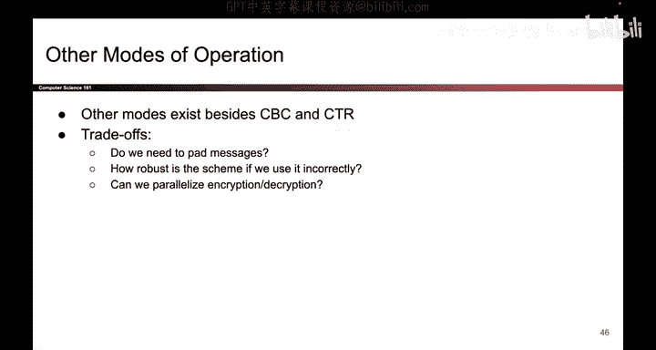
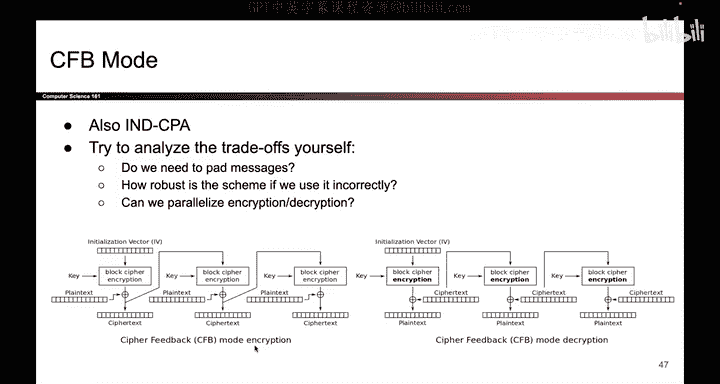

# 112：其他加密模式 🔐

在本节课中，我们将学习除CBC和CTR之外的其他分组密码加密模式。我们将了解如何分析一个加密模式，并思考其安全性、效率等方面的权衡。课程最后会提供一个名为CFB的加密模式供你自行分析练习。

上一节我们介绍了CBC和CTR等常见加密模式。本节中我们来看看其他可能存在的加密模式，并学习如何分析它们。

需要指出的是，其他加密模式确实存在。有时在考试中，可能会提出一个新的模式让你分析思考。

分析时的权衡问题非常相似。我们需要思考以下几个核心问题：

以下是分析加密模式时需要考量的一系列关键问题：
*   填充是否必要？
*   在加密方向上能否并行化处理？
*   在解密方向上能否并行化处理？
*   如果重复使用初始化向量（IV）会怎样？
*   会泄露什么信息？

如果你想在家练习，可以思考以上所有问题。这里有一个练习供你尝试。

这个练习叫做CFB（Cipher Feedback）加密模式。我们不会在课上现场分析，但你可以回家后思考该方案的权衡利弊，并尝试自己回答上述问题。

如果你想核对答案，我们已将其附在此处。你可以自行查阅验证。

本节课中我们一起学习了如何分析一个加密模式，重点关注了填充必要性、并行化能力、IV重用风险和信息泄露等关键权衡点。通过课后分析CFB模式的练习，你可以巩固这些分析技能。