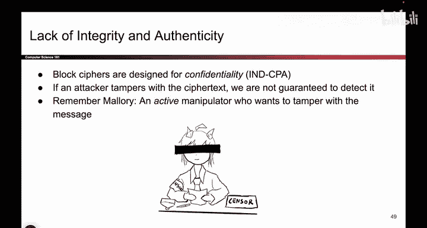
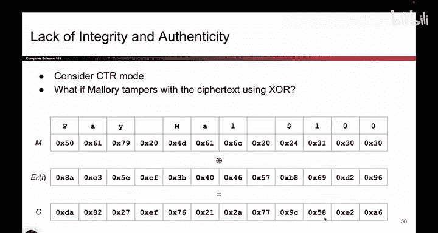
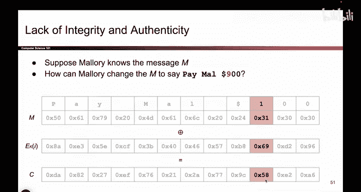
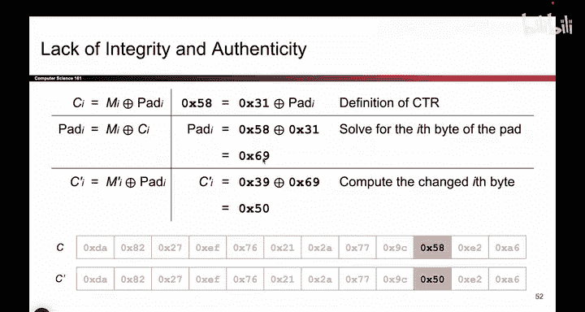
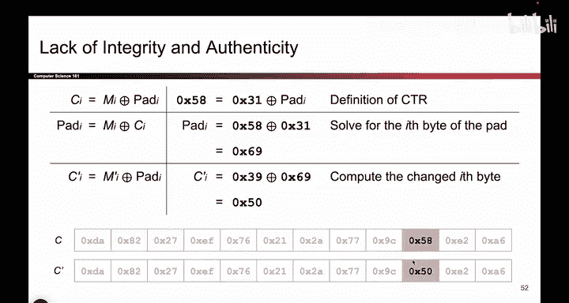
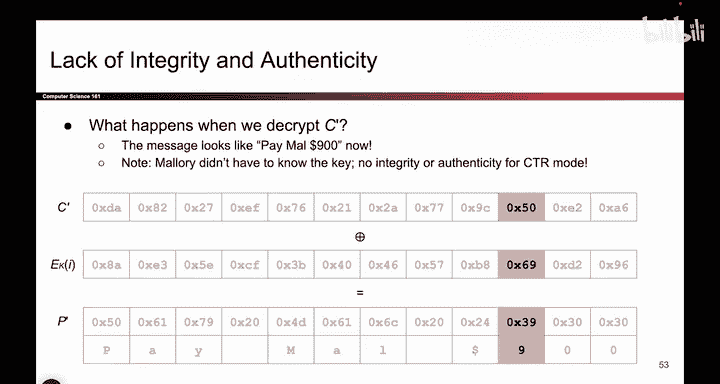
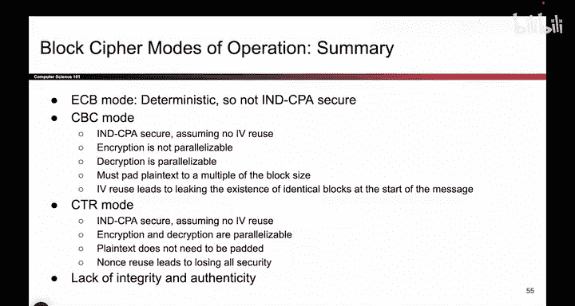

# 113：完整性缺失 🔓

在本节课中，我们将要学习分组密码链接模式的一个关键局限性：它们无法提供**完整性**和**真实性**。这意味着攻击者即使不知道密钥，也可能篡改密文，导致接收者解密出错误的信息。我们将通过一个具体的例子来理解这种攻击是如何发生的。

上一节我们介绍了分组密码的链接模式（如CBC和CTR）可以提供IND-CPA保密性。本节中我们来看看为什么这些模式无法保证消息的完整性。

## 完整性缺失的问题

分组密码及其链接模式是为**保密性**设计的，而非为**完整性**或**真实性**设计。这意味着，如果攻击者Mallory能够在消息通过信道发送时对其进行篡改，我们实际上无法保证能检测到错误的发生。加密可以确保攻击者无法读取我们的消息，但仅仅因为信息被加密，并不意味着攻击者无法篡改它。

为了给出一个具体的例子，假设我们正在使用CTR模式。使用CTR模式的方式是：获取消息，使用分组密码生成一个**一次性填充**，然后将消息与该填充进行异或运算，得到密文。

假设Alice发送给Bob的消息是“Pay $100”。她生成了一个随机的填充，然后得到了密文。问题是，当这个密文通过网络发送时，Mallory可能能够篡改密文，导致Bob解密出不同的内容。

## 一个具体的篡改攻击示例

考虑一个威胁模型：Mallory知道原始消息的内容（例如，通过某种泄露）。她知道原始消息是“Pay $100”，但她希望Bob解密出的消息是“Pay $900”。Mallory的目标是接收密文，并以某种方式篡改它，使Bob解密出“900”而不是“100”。

为了实现这个目标，首先注意到密文的大部分字节根本不需要修改。如果不触碰其他字节，解密出的前几个词仍然是“Pay”、“空格”、“Ma”、“空格”、“$”和“00”。因此，如果攻击者想将“100”改为“900”，唯一需要触碰的字节就是对应字符“1”的那个字节。

现在，我们可以通过一点代数运算来找出Mallory应该如何更改这个字节。当前该字节的值是`58`（十六进制），Mallory需要将其改为多少，才能使Bob解密时得到“900”？

以下是计算步骤：

1.  首先，写出异或运算的定义：`Ciphertext = Plaintext XOR Pad`。
2.  我们知道密文字节 `C = 58`。
3.  我们知道原始明文字节 `P = 31`（字符‘1’的ASCII码十六进制值）。
4.  因此，我们可以解出填充字节 `Pad`：`Pad = C XOR P = 58 XOR 31 = 69`。
5.  现在，Mallory希望解密出的明文字节 `P' = 39`（字符‘9’的ASCII码十六进制值）。
6.  她可以计算出需要的新密文字节 `C'`：`C' = P' XOR Pad = 39 XOR 69 = 50`。

所以，Mallory只需将密文中的字节`58`改为`50`。当Bob用相同的密钥和计数器（生成相同的填充字节`69`）解密时，他会计算：`P' = C' XOR Pad = 50 XOR 69 = 39`，即字符‘9’。这样，Bob解密出的消息就变成了“Pay $900”。

通过利用一点代数知识和对原始明文的了解，Mallory成功地篡改了消息，并且她**不需要知道密钥**。这证明了攻击者即使不知道密钥，也能破坏消息的完整性。

## CBC模式的情况

对于CBC模式，也可以尝试类似的攻击，但会稍微复杂一些。因为篡改单个密文块会影响后续的解密结果（误差传播）。然而，核心问题依然存在：Bob解密出的内容，他无法判断是否正确，或者是否被篡改过。我们仍然无法保证完整性或真实性。

## 本章总结

本节课中我们一起学习了分组密码链接模式在完整性方面的缺陷。

我们回顾了分组密码的发展：从确定性的ECB模式（不安全），到引入随机IV的CBC和CTR模式（在谨慎设计下可获得IND-CPA保密性）。我们分析了这些模式的各种属性，如并行性、填充要求以及IV/Nonce重用带来的危险。

最后，我们通过一个CTR模式下的具体攻击示例，清晰地展示了**保密性不等于完整性**。像CBC或CTR这样的分组密码链接模式可以阻止攻击者获知消息内容，但无法阻止他们篡改消息并导致接收者解密出不同的内容。

因此，我们需要寻找其他密码学方案（例如消息认证码MAC或认证加密）来提供我们所需的完整性和真实性保障。关于分组密码及其链接模式的讨论就到此为止。