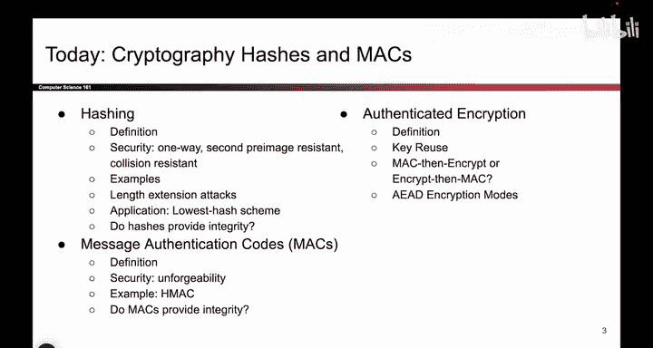
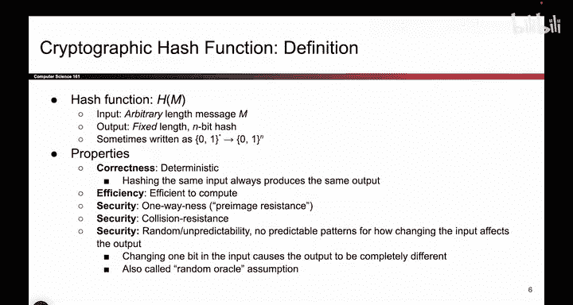
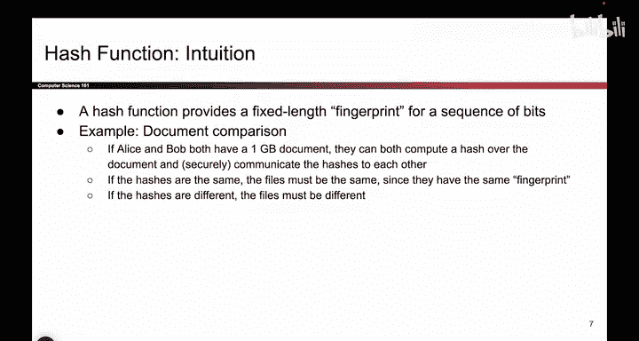

# 114：哈希函数定义 🔐


在本节课中，我们将要学习密码学哈希函数。哈希函数本身并不提供完整性或认证性，但它是构建能够提供这些安全属性的方案（如消息认证码）的必要基础模块。此外，哈希函数还有许多其他用途，因此了解它非常重要。

上一节我们介绍了分组密码及其工作模式（如CBC和CTR），它们能提供保密性，但无法保证消息的完整性。本节中，我们来看看一个关键的密码学组件——哈希函数。




## 哈希函数的数学定义


哈希函数 `H` 接受一个任意长度的输入 `M`，并输出一个固定长度为 `n` 比特的哈希值 `h`。其数学表示如下：
```
H: {0, 1}* -> {0, 1}^n
```
其中，`{0, 1}*` 表示任意长度的比特串，`{0, 1}^n` 表示固定长度为 `n` 比特的比特串。

## 哈希函数的基本属性

以下是哈希函数应具备的基本属性：

*   **确定性**：对于相同的输入，哈希函数必须总是产生相同的输出。
*   **高效性**：计算哈希值的过程应该是高效的，不应消耗过多计算资源。
*   **不可预测性**：哈希函数的行为应该是不可预测的。即使输入发生微小的改变（例如改变一个比特），其输出也应该看起来是随机的、全新的，无法从原输出推导出来。

一种理解密码学哈希函数的方式是将其视为数据的“指纹”。就像每个人的指纹是唯一的一样，每个（不同的）数据也应该产生一个唯一的“指纹”（哈希值）。这为数据比对提供了一种高效的方法。



## 哈希函数的应用示例：文档比对

以下是哈希函数的一个典型应用场景：

假设爱丽丝和鲍勃各自持有一个非常大的文件（例如1GB）。他们想确认双方的文件是否完全相同。一种低效的方法是直接通过网络传输整个文件进行逐字节比较。

更高效的做法是，双方各自在本地计算文件的哈希值。由于哈希值是固定长度（如128比特）的“指纹”，他们只需通过网络交换这个很小的哈希值。如果两个哈希值相同，那么文件极大概率是相同的；如果哈希值不同，则文件必然不同。



本节课中我们一起学习了密码学哈希函数的定义、基本属性以及一个简单的应用示例。哈希函数通过将任意长度的数据映射为固定长度的“指纹”，为高效的数据比对等操作奠定了基础。在接下来的章节中，我们将利用哈希函数来构建能够提供完整性和认证性的方案。