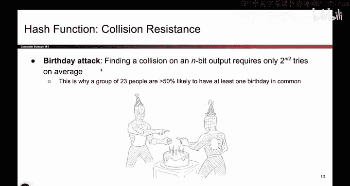
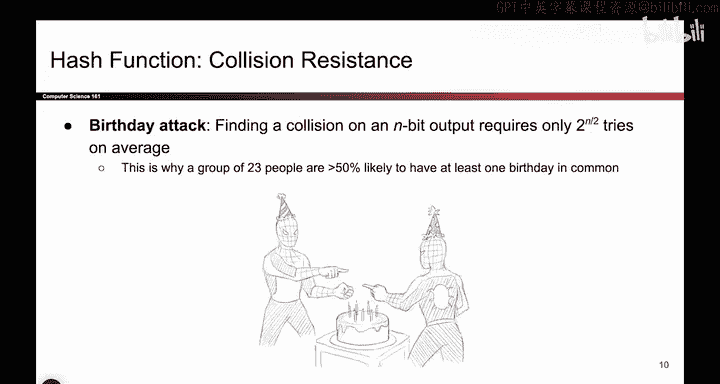
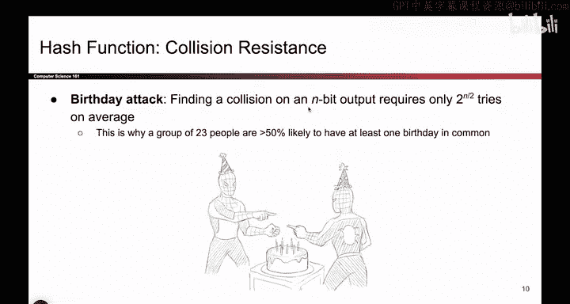

# 116：哈希函数的安全性 - 抗碰撞性 🔐

在本节课中，我们将要学习哈希函数的第二个核心安全属性：抗碰撞性。我们将详细解释其定义、与单向性的区别，以及为什么它在计算上是不可行的。

---

## 概述

上一节我们介绍了哈希函数的单向性。本节中，我们来看看另一个关键的安全属性：抗碰撞性。虽然这两个概念初看相似，但它们存在微妙的区别。我们将通过挑战游戏的形式来阐明这种区别，并解释为什么抗碰撞性对于哈希函数的安全性至关重要。

---

## 抗碰撞性挑战与单向性挑战的区别

在单向性挑战中，挑战者会提供一个特定的哈希输出（例如 `H(x) = 42`），攻击者的目标是找到一个输入 `x'`，使得 `H(x')` 也等于 `42`。攻击者必须匹配挑战者给出的特定输出。

相比之下，在抗碰撞性挑战中，挑战者**不会提供任何输出**。攻击者的任务是自行找到**任意两个不同的输入** `x` 和 `x'`，使得它们的哈希输出相同，即 `H(x) = H(x')`。攻击者不需要匹配任何预先给定的值，只需找到一对碰撞即可。

**核心区别公式化描述：**
*   **单向性挑战：** 给定 `y = H(x)`，寻找 `x'` 使得 `H(x') = y`。
*   **抗碰撞性挑战：** 寻找任意一对 `(x, x')`，其中 `x ≠ x'`，但 `H(x) = H(x')`。

成功找到这样一对输入的行为，就称为发现了一个**碰撞**。

---

## 碰撞必然存在吗？

一个自然的问题是：能否构造一个完全没有碰撞的哈希函数？答案是否定的。原因在于哈希函数的输入空间和输出空间大小不同。

以下是分析：
*   **输入空间：** 哈希函数接受任意长度的比特串，因此可能的输入数量是**无限**的。
*   **输出空间：** 哈希函数产生固定长度的输出（例如256比特），因此可能的输出数量是有限的，具体为 `2^n` 个（n为输出比特长度）。

根据**鸽巢原理**（Pigeonhole Principle），当试图将无限多的“鸽子”（输入）放入有限数量的“巢穴”（输出）时，必然至少有一个巢穴中包含多于一只鸽子。这意味着碰撞在数学上是必然存在的。

**结论：** 对于任何哈希函数，碰撞都必然存在。因此，抗碰撞性的安全目标不是“完全防止碰撞”，而是“使寻找碰撞在计算上不可行”。

---

## 抗碰撞性的正式定义

抗碰撞性要求，对于任何在多项式时间内运行的攻击者，找到一对碰撞 `(x, x')` 的概率是可以忽略不计的。

虽然碰撞在理论上是存在的，但一个安全的哈希函数应确保攻击者无法在现实可行的时间内（例如，在宇宙寿命结束前）找到它们。这被称为**计算不可行性**。

**注意：** 单向性也基于同样的“计算不可行性”理念来定义。两者都要求攻击者在有限的实际时间内无法解决相应的挑战。

---


## 寻找碰撞的难度：生日攻击

你可能会问，找到碰撞到底有多难？这涉及到**生日悖论**和由此衍生的**生日攻击**。

以下是其核心思想：
对于一个输出长度为 `n` 比特的哈希函数，一个通用的寻找碰撞的算法平均需要尝试大约 `2^(n/2)` 次哈希计算。

**例如：**
*   对于 `n=256` 比特的输出（如SHA-256），寻找碰撞大约需要 `2^128` 次尝试。
*   `2^128` 是一个天文数字，远超出任何多项式时间算法的能力，甚至在可观测宇宙的寿命内也无法完成。

**代码示例（概念性描述）：**
```python
# 这是一个概念性示例，说明生日攻击的复杂度是 O(2^(n/2))
# 在实际中，我们不会这样暴力搜索
n = 256 # 输出比特长度
birthday_attack_complexity = 2 ** (n // 2) # 2^128
print(f"对于 {n} 比特哈希，生日攻击复杂度约为 {birthday_attack_complexity} 次操作")
```

因此，只要哈希函数的输出长度足够大（例如256位或以上），就可以有效抵御生日攻击，从而满足抗碰撞性的要求。





---






## 总结


本节课中我们一起学习了哈希函数的抗碰撞性。我们明确了它与单向性的关键区别：抗碰撞性要求攻击者自行找到任意一对产生相同输出的不同输入，而单向性要求攻击者逆转一个给定的输出。


我们了解到，由于输入空间无限而输出空间有限，碰撞必然存在。因此，抗碰撞性的安全目标在于使寻找碰撞在计算上不可行。最后，我们通过生日攻击的概念，解释了为什么足够长的哈希输出（如256位）可以确保在实际中无法找到碰撞，从而保障了哈希函数的安全性。