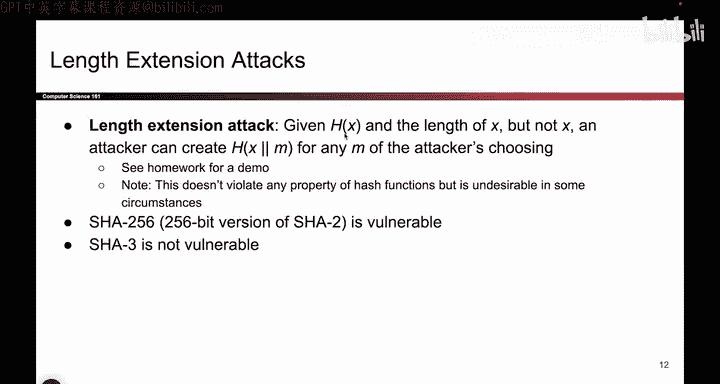
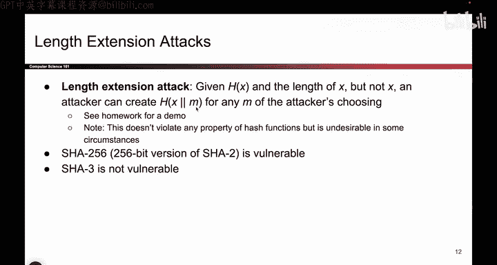
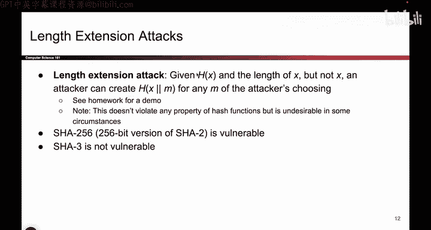
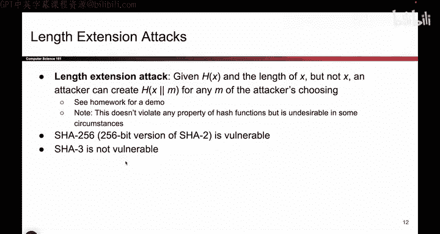
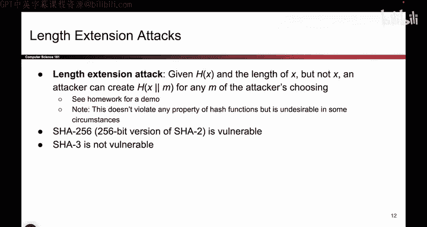
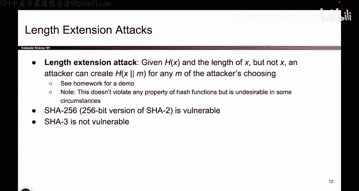
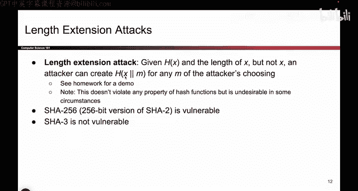

# 118：长度扩展攻击 🔐


在本节课中，我们将要学习一种针对特定哈希函数构造的攻击方式——长度扩展攻击。这种攻击虽然不直接破坏哈希函数的核心安全属性，但在某些应用场景下可能带来安全风险。

## 概述

长度扩展攻击利用了某些哈希函数（如SHA-256）的构造特性。攻击者即使不知道原始消息的具体内容，也能在已知其哈希值和长度的情况下，计算出“原始消息拼接上新消息”后的哈希值。

上一节我们介绍了哈希函数的基本安全属性，本节中我们来看看长度扩展攻击是如何工作的。


## 攻击原理





假设我选择了一个秘密值 `x`，并计算了它的哈希值 `H(x)`。我将这个哈希值以及原始消息的长度（例如10个字符）告诉你，但不告诉你 `x` 本身是什么。




长度扩展攻击指出，如果你获得了这个哈希值 `H(x)` 和原始消息长度，你就可以从哈希计算过程中断的地方继续执行，从而计算出 `H(x || y)` 的哈希值，其中 `y` 是你选择的任意消息。

**核心公式**：
```
已知：H(x), len(x)
可计算：H(x || padding || y)
```
即使你完全不知道 `x` 是什么。

## 攻击的影响与局限性

这种攻击的影响需要根据具体的安全威胁模型来评估。

以下是长度扩展攻击的几个关键点：


*   **不破坏核心属性**：该攻击既不破坏哈希函数的**单向性**（无法从 `H(x)` 反推出 `x`），也不破坏**抗碰撞性**（没有找到两个不同的消息产生相同的哈希值）。
*   **造成扩展风险**：攻击者能够计算出“秘密+附加数据”的合法哈希值。在某些依赖哈希进行身份验证或数据完整性的协议中，这可能被利用。
*   **实例**：SHA-2系列哈希函数（如SHA-256）容易受到此类攻击，而SHA-3则修补了这个问题。






## 总结








本节课中我们一起学习了长度扩展攻击。我们了解到，该攻击允许攻击者在已知原始消息哈希值和长度时，扩展消息并计算出新消息的合法哈希值。虽然它不直接攻破哈希函数的基础安全假设，但在设计密码学协议时仍需考虑此风险，并选择如SHA-3这类能抵抗长度扩展攻击的哈希函数。通过课程作业的实践，你将能更深入地理解这一攻击的具体过程。