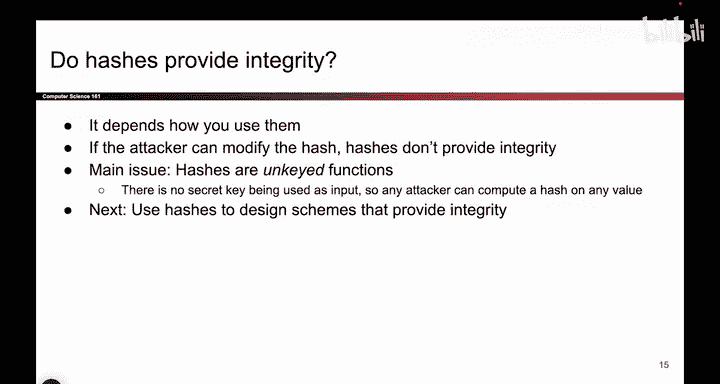
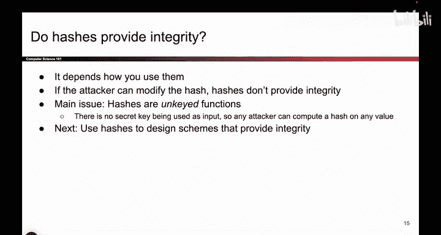
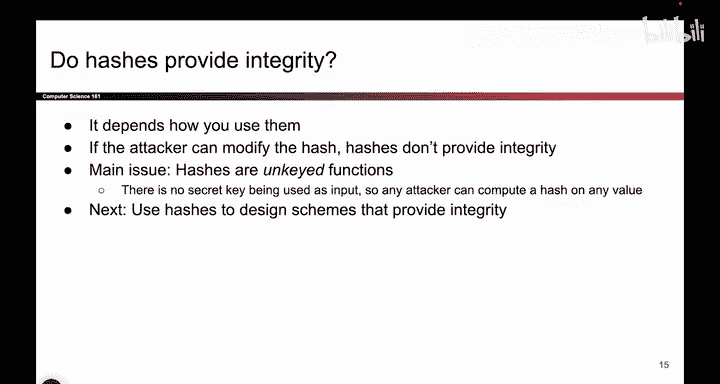

# 119：哈希函数能否提供完整性？🔐

在本节课中，我们将探讨一个核心问题：**哈希函数能否提供消息的完整性保证？** 我们将通过分析不同的威胁模型来理解其答案并非绝对，并解释为什么在某些场景下哈希函数有效，而在另一些场景下则无效。

---

## 概述

哈希函数常被比作“数字指纹”，它能将任意长度的数据映射为固定长度的哈希值。一个关键特性是：**对原始数据的任何微小改动，都会产生完全不同的哈希值**。这听起来像是验证完整性的完美工具。但实际情况是否如此？我们将通过两个具体的威胁模型来剖析这个问题。

---

## 场景一：软件下载验证 ✅

上一节我们介绍了哈希函数的基本特性。本节中，我们来看看一个哈希函数能提供完整性的典型场景：**软件发布与下载验证**。

在这个威胁模型中，我们假设攻击者可以篡改用户下载的软件文件，但**无法篡改软件官网发布的哈希值**。

**核心流程如下：**
1.  软件发布者（如Firefox）在官网上同时发布新版本的程序文件 `P` 及其哈希值 `H = Hash(P)`。
2.  用户爱丽丝可以从任何地方（包括不安全的镜像服务器）下载程序文件 `P‘`。
3.  爱丽丝在本地计算下载文件的哈希值 `Hash(P‘)`。
4.  她将计算结果与官网公布的哈希值 `H` 进行比较。

以下是验证过程的逻辑判断：
```python
if Hash(P‘) == H:
    print("文件完整，未被篡改。")
else:
    print("文件已被篡改，请重新下载。")
```

为什么这个方案能提供完整性？因为攻击者马洛里如果想在程序 `P` 中植入病毒，生成一个恶意程序 `P_malicious`，他必须让 `Hash(P_malicious)` 等于官方哈希 `H`。这正是哈希函数**抗碰撞性**和**单向性**要防范的：在计算上，无法找到另一个不同的输入产生相同的哈希输出。因此，只要官网的哈希值 `H` 是可信且未被篡改的，爱丽丝就能验证文件的完整性。

**此场景的关键假设是：哈希值本身的发布渠道是安全、可信的。** 我们假设攻击者无法修改官网上的哈希值。

---

## 场景二：开放信道通信验证 ❌

然而，我们最初关心的威胁模型并非如此。让我们回到之前几讲熟悉的场景：**爱丽丝和鲍勃在一个不安全的信道上通信，攻击者马洛里可以拦截并篡改任何消息。**

那么，如果爱丽丝简单地将消息 `M` 和它的哈希值 `Hash(M)` 一起发送给鲍勃，能否保证完整性？

**通信流程如下：**
1.  爱丽丝发送组合消息：`[M, Hash(M)]`。
2.  攻击者马洛里截获该消息。
3.  鲍勃最终收到消息。

这个方案存在致命缺陷。因为哈希函数的计算是公开的，没有任何秘密可言。马洛里可以轻松地进行以下操作：
1.  将消息篡改为 `M‘`。
2.  计算篡改后消息的哈希值 `Hash(M‘)`。
3.  将发送给鲍勃的组合消息替换为 `[M‘, Hash(M‘)]`。

当鲍勃收到 `[M‘, Hash(M‘)]` 后，他会重新计算 `Hash(M‘)`，并与收到的哈希值比较。由于两者完全匹配，鲍勃会错误地认为消息 `M‘` 是完整且未被篡改的。

**核心问题在于：整个过程中没有使用任何密钥（Secret Key）。** 哈希值本身不具备防篡改能力，因为任何人都能计算它。用公式表示，完整性未能实现的原因是：
```
攻击者可以生成： [ M‘, Hash(M‘) ] 替代 [ M, Hash(M) ]
而接收者无法区分。
```

因此，在攻击者能够同时篡改消息和其哈希值的威胁模型下，**仅使用哈希函数无法提供完整性保证。**


---

## 总结

本节课中我们一起学习了哈希函数在完整性保护中的作用，并理解了安全方案高度依赖于**威胁模型**。
*   在**哈希值发布渠道可信**的模型下（如软件下载验证），哈希函数能有效提供完整性，因为它利用了哈希的单向性和抗碰撞性。
*   在**通信信道完全开放**的模型下（攻击者可篡改一切），仅发送“消息+哈希值”无法提供完整性，因为缺少**密钥**来保护哈希值本身不被伪造。







虽然哈希函数本身未能解决我们最初的通信完整性问题，但它是一个至关重要的**密码学原语**。接下来，我们将学习如何将哈希函数与密钥结合，构建出真正能抵御主动攻击者的完整性保护方案。