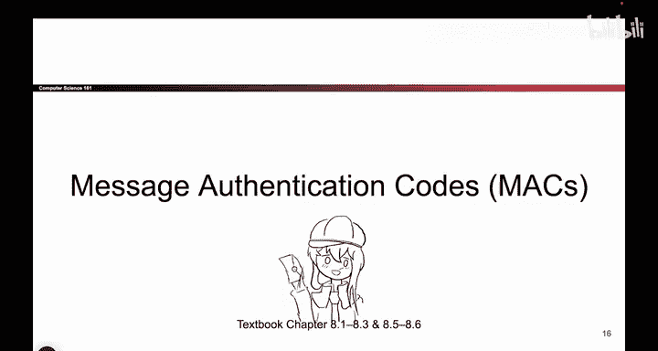
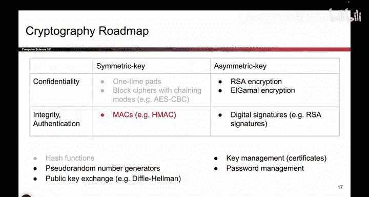
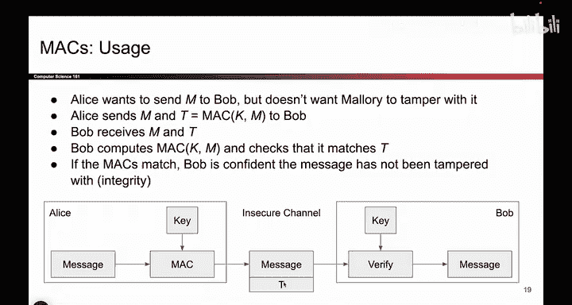
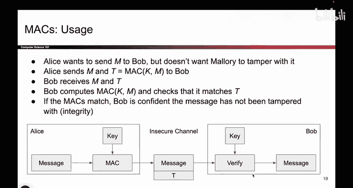

# 120：MAC定义 🧩

在本节课中，我们将学习消息认证码（MAC）的基本概念。MAC是一种密码学工具，用于确保消息的完整性和真实性。我们将从MAC的定义开始，逐步了解其工作原理、关键属性以及安全要求。

---

上一节我们介绍了哈希函数作为构建块，本节中我们来看看如何利用它们构建消息认证码（MAC），以实现消息的完整性和真实性保护。

我们目前处于左下角象限，目标是设计一种方案，在对称密钥场景下提供完整性和认证。我们继续假设Alice和Bob共享一个秘密密钥，且其他人都不知道这个密钥。他们如何获得这个密钥不是我们今天要讨论的问题。他们知道一个秘密密钥，其他人不知道。今天我们就当这是魔法。

记得在几节课前我们提到，提供完整性的方法是在消息上附加一个标签。这就像一个封印。因此，我们要做的是除了发送原始消息外，还要发送一个关于该消息的标签。这个标签将帮助我们证明消息未被篡改。

举个例子，这是你上次看到的方案。首先，Alice将消息和密钥输入到某个MAC算法（消息认证码）中。设计这个“黑盒子”里的内容是我们今天的目标。这个盒子里有一些代码，它接收两个参数。我们目前还不知道它们是什么，也不知道这个盒子如何工作，但我们会弄清楚。其输出是一个标签T。你也可以把它想象成一个签名，如果这样理解更直观的话。但这就是一个标签、封印或签名，它是与消息和密钥相关联的唯一值。发送消息时，你不仅发送原始消息，还发送这个标签。因此，你通过不安全的信道同时发送这两个值。

然后，当Bob收到消息和标签时，他将把消息、标签和密钥（共三个输入）传递给验证函数。同样，我们必须设计这个盒子里的内容。如果这个标签基于此密钥与消息匹配，那么我们就知道消息未被篡改，Bob可以安全地接收原始消息。

但是，如果消息或标签被篡改，如果Mallory试图改变消息中的哪怕一个比特，我们需要这个验证函数输出`false`，然后Bob会说“不，这个消息不正确，所以我不会接收它”。这就是完整性的含义：我们必须知道这个消息是否被篡改过，而添加标签将帮助我们做到这一点。

顺便提一个小的注意事项，在我们继续之前，你可能会怀疑我们以纯文本形式发送消息，Mallory可以阅读这个消息，你是对的。但请记住，目前我们只考虑完整性，我们只是试图防止消息被篡改。所以，目前我们并不关心Mallory是否能阅读消息。如果你想要同时具备完整性和机密性，我们必须组合多种方案，我们稍后会做。但现在，Mallory能阅读消息是可以的，我们只需要确保她不能修改它，而标签将帮助我们实现这一点。

好的，这是MAC的形式化定义。对于你设计的任何符合MAC“黑盒子”的方案，它都必须匹配这个定义。

首先，你必须说明密钥是如何生成的。目前，你可以假设Alice和Bob有一个随机的比特串，其他人不知道，这就是你生成密钥的方式。但如果你要公开发布MAC方案，你可能需要定义密钥是如何生成的。

然后，我们必须提出生成标签的方案。形式化地看，它看起来像这样：它接收两个参数，正如你刚才看到的，密钥和消息，并输出消息上的安全标签。为了更形式化一点，密钥是密钥生成产生的秘密密钥，消息是任意长度的。你可以计算短消息或长消息的MAC，对M的长度不应有限制，而标签是固定长度的。因此，无论你的消息多长，标签总是固定的长度，例如128位。

这听起来可能和哈希函数类似，也许你看出其中的联系了，但如果没有也没关系。只需知道消息是任意长度，标签是固定长度。

因此，如果你以这种方式定义MAC，那么有一些我们关心的属性。

一个是正确性。我们将再次说明，如果MAC是确定性的，那么它就是正确的。这意味着如果你用相同的密钥和相同的消息运行MAC算法，你最好得到相同的标签。如果你这样定义，你实际上可以回到这里稍微简化一下这个方案：与其在这里写一个不同的验证函数，你实际上可以在两个“黑盒子”中使用相同的MAC算法。为什么？因为如果消息和密钥相同，你会生成一个标签。当Bob收到标签时，他只需使用相同的密钥和相同的消息，我们生成相同的标签（或尝试生成）。如果我们生成的标签与T匹配，我们就知道消息是好的。因此，在我们讨论MAC是确定性的情况下，验证“黑盒子”不必是自定义算法，你可以直接再次运行MAC算法。如果消息相同、密钥相同，你将得到相同的标签；如果消息不同，你将得到不同的标签，你就知道它不匹配。

这不是你可以使用的唯一类型的MAC，你可以使用更复杂的类型，并做我们讨论过的事情：传入密钥、消息和标签，它输出`true`或`false`。但对于本课程，我们不会担心那些，我们只考虑确定性的MAC。

在效率方面，同样，这不是一个形式化定义，但希望你做的是计算机擅长的事情，比如移动比特，而不是做一些非常复杂、会消耗大量计算机时间的事情，因为那样就没有人想用你的MAC了。

最后，我们将定义一个不同的安全游戏，一个你以前没见过的，叫做“存在不可伪造性”。它有点像IND-CPA，但它是MAC的等价物。一旦我们定义了它，它就为我们提供了一个定义，来检查我们的MAC是否能安全抵御攻击者。这些是当你设计一个MAC时希望它具有的特性。

---

本节课中我们一起学习了消息认证码（MAC）的基本定义和工作流程。我们了解到MAC通过在消息上附加一个由密钥生成的固定长度标签来提供完整性和认证。关键点包括：MAC是确定性的，其正确性依赖于相同输入产生相同输出；消息可以是任意长度，而标签是固定长度；其安全性通过“存在不可伪造性”等概念来定义。在接下来的课程中，我们将探讨如何具体构建安全的MAC方案。