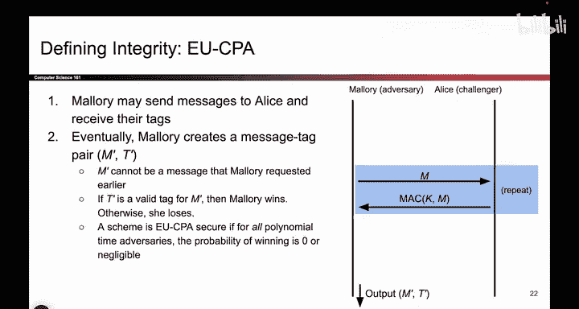
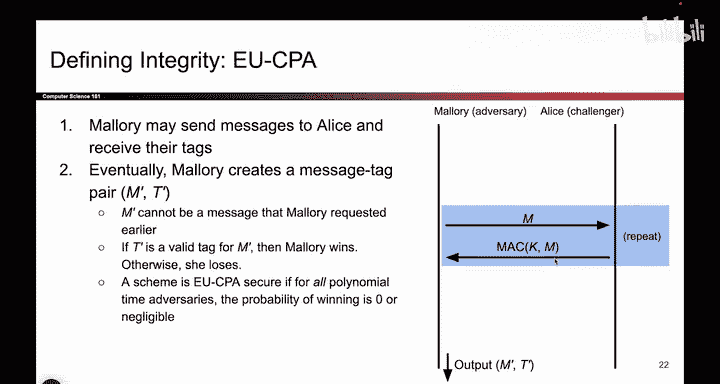
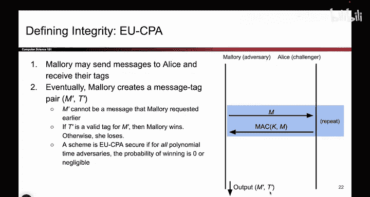

# 121：EU-CPA安全性 🔐

在本节课中，我们将学习如何定义消息认证码（MAC）的安全性。我们将介绍一个名为“存在性不可伪造性在适应性选择明文攻击下”（EU-CPA）的安全游戏，它用于衡量攻击者在不知道密钥的情况下，能否伪造出有效的消息认证标签。

## 概述

上一节我们介绍了消息认证码的基本概念。本节中，我们来看看如何形式化地定义其安全性。我们将通过一个安全游戏来模拟攻击者的能力，并判断一个MAC方案是否足够安全。

## 核心安全目标

我们希望达成的安全属性是：如果攻击者不知道密钥 `K`，那么他**不应该**能够为他自己选择的消息生成有效的认证标签（Tag）。这一点至关重要，因为如果攻击者能做到这一点，他就可以伪造消息，让接收者Bob误以为该消息是真实可信的。

另一种等价的表述是：如果有人给你一个消息 `M` 及其标签 `T`，在不知道密钥的情况下，你**不应该**能够修改消息内容，并相应地修改标签使其仍然通过验证。任何对消息的篡改都应导致认证失败。这就是“不可伪造性”的含义。

## EU-CPA安全游戏 🎮

我们将通过一个安全游戏来精确定义上述安全目标。在这个游戏中，攻击者Mallory的目标是伪造一个有效的消息-标签对。如果她成功，则说明该MAC方案不安全；如果她无法成功，则说明该方案是安全的。

游戏比我们之前学过的IND-CPA游戏要简短一些。它主要分为两个阶段。

### 第一阶段：查询阶段

这是攻击者Mallory可以“施展能力”的阶段。这里的“CPA”代表“选择明文攻击”，这是我们讨论的威胁模型。在此阶段，Mallory可以（在多项式时间内）多次进行以下操作：

以下是Mallory在查询阶段可以重复进行的操作：
1.  Mallory选择一个消息 `M_i`，发送给诚实的参与者Alice。
2.  Alice使用共享的密钥 `K` 和MAC算法，为消息 `M_i` 计算标签 `T_i = MAC(K, M_i)`。
3.  Alice将计算出的标签 `T_i` 发送回给Mallory。

通过这个过程，Mallory可以观察到任意多条她自己选择的消息所对应的有效标签。她可以利用这个阶段来尝试分析MAC方案的弱点，甚至试图推断出密钥 `K`。

### 第二阶段：挑战阶段

当Mallory认为自己已经准备好，或者找到了方案的破绽时，她宣布进入挑战阶段。

在挑战阶段，Mallory需要提交一个**伪造的**消息-标签对 `(M*, T*)`。这个伪造需要满足以下条件：
*   **有效性**：使用密钥 `K` 对消息 `M*` 进行认证计算，结果必须等于 `T*`。即 `MAC(K, M*) == T*`。
*   **新鲜性**：消息 `M*` 不能是她在第一阶段中查询过的任何消息 `M_i`。这是因为MAC通常是确定性的，如果允许重复提交已查询过的消息，Mallory总能轻松获胜，这使得游戏失去意义。

如果Mallory能够提交一个满足上述条件的新消息-标签对，那么她就赢得了游戏，该MAC方案被视为**不安全**。反之，如果无论Mallory采用何种策略，都无法在多项式时间内成功伪造，那么我们就说该MAC方案是 **EU-CPA安全** 的。

## 总结

本节课中，我们一起学习了消息认证码（MAC）的核心安全目标——不可伪造性。我们通过引入 **EU-CPA安全游戏** 来形式化地定义和评估这一目标。该游戏模拟了攻击者在适应性选择明文攻击下的能力，并以其能否成功伪造一个从未见过的新消息的有效标签，作为判断MAC方案是否安全的标准。一个安全的MAC方案应能确保，不知道密钥的攻击者无法赢得这个游戏。