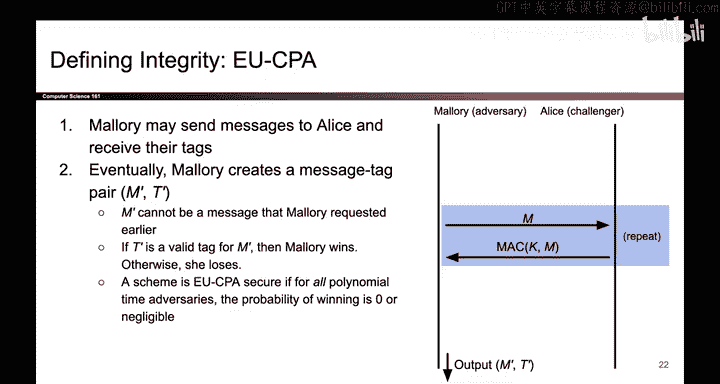
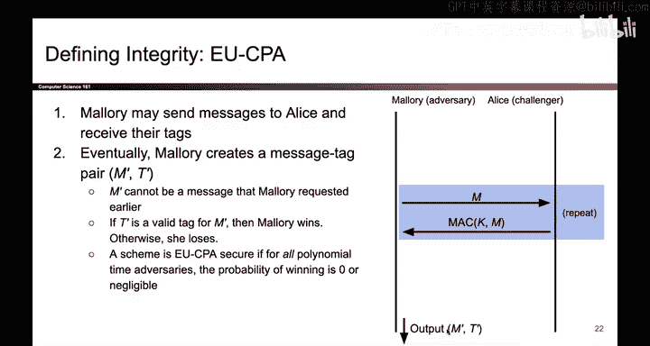
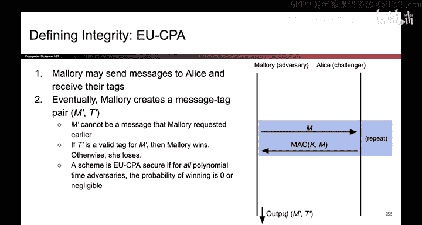

密码学4：122：为什么EU-CPA使用0.0而非0.5作为阈值 🎯

在本节课中，我们将要学习一个关于EU-CPA（不可伪造性）安全定义的重要细节：为什么其安全游戏中的获胜概率阈值被设定为0.0，而不是像IND-CPA（不可区分性）中那样是0.5。理解这个区别对于掌握不同安全概念的核心思想至关重要。

---

### 回顾IND-CPA游戏

上一节我们介绍了IND-CPA安全游戏，其中攻击者Mallory需要从两个消息（`message0`和`message1`）中猜出哪个被加密了。在这个游戏中，一个完全随机猜测的攻击者（例如抛硬币）有50%的概率猜对。

因此，在IND-CPA中，一个加密方案被认为是安全的，当且仅当任何攻击者赢得游戏的概率**不比0.5好**，即：
**公式：** `Pr[Win] ≤ 0.5 + negligible(λ)`

这里的`neglible(λ)`代表一个可忽略的函数。

---

### EU-CPA游戏的核心区别

本节中我们来看看EU-CPA（Existential Unforgeability under Chosen Plaintext Attack）游戏。它与IND-CPA有本质不同。

在EU-CPA游戏中，攻击者Mallory的目标是**伪造**一个有效的“消息-标签”对，而不是区分两个密文。她需要输出一个从未被查询过的消息`m*`及其对应的认证标签`t*`。

以下是EU-CPA游戏的关键步骤：
1.  挑战者生成密钥。
2.  Mallory可以适应性地查询任意消息`m`的标签`t`。
3.  Mallory最终输出一个伪造的`(m*, t*)`。
4.  她获胜的条件是：`m*`从未被查询过，且`t*`是`m*`的有效标签。

---

### 为什么阈值是0.0？

现在我们来解答核心问题：为什么EU-CPA的获胜阈值是0.0，而不是0.5？

关键在于，一个完全随机的攻击者在EU-CPA游戏中成功的概率**几乎为0**。

*   在IND-CPA中，随机猜测（二选一）有`0.5`的成功率。
*   在EU-CPA中，攻击者需要凭空构造一个有效的`(消息, 标签)`对。如果她只是随机生成一串比特作为标签，那么该标签通过验证的概率是极低的，可以认为是`0`。

因此，如果Mallory能够以**任何显著高于0的概率**（例如10%）成功伪造，这已经远远优于随机攻击了。所以，在EU-CPA中，我们设定：
**公式：** `Pr[Forge] ≤ negligible(λ)`

这意味着，一个方案是EU-CPA安全的，当且仅当任何攻击者成功伪造的概率是可忽略的（即，几乎为0）。

---

### 总结

本节课中我们一起学习了EU-CPA安全定义中获胜概率阈值的设定逻辑。

*   **IND-CPA（不可区分性）**：攻击者进行二选一猜测，随机成功率为`0.5`。因此安全阈值是`0.5`。
*   **EU-CPA（不可伪造性）**：攻击者需要伪造有效标签，随机成功率几乎为`0`。因此安全阈值是`0.0`。

这个区别源于两种安全游戏目标的不同：一个是“猜”，另一个是“造”。理解这一点有助于我们更清晰地把握密码学中不同安全属性的定义和评估标准。