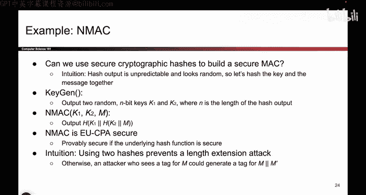
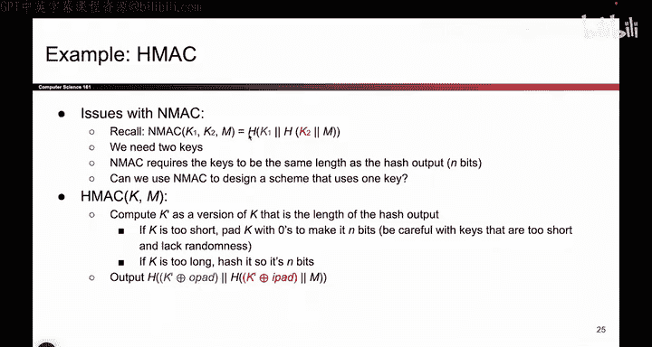
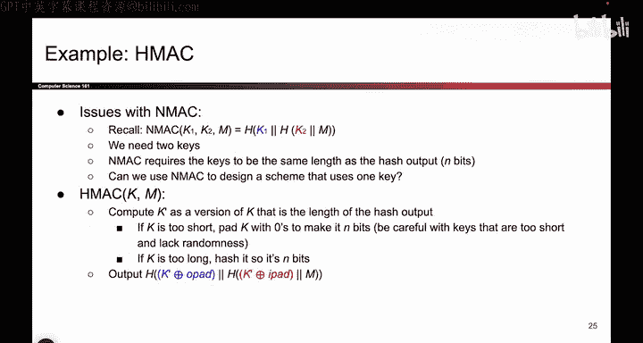

# 123：HMAC定义 🔐

在本节课中，我们将学习如何基于密码学哈希函数构建一个安全的消息认证码（MAC）。我们将从一种基础构造（NMAC）开始，分析其潜在问题，并最终推导出更实用、更安全的HMAC标准。

---

## 概述

上一节我们介绍了消息认证码（MAC）的基本概念。本节中，我们将探讨如何利用密码学哈希函数来具体构建一个MAC。我们将从一种直观但存在缺陷的简单想法出发，逐步改进，最终得到一个被广泛使用的标准——HMAC。

密码学哈希函数接收输入并产生看似随机的输出，但它本身不包含密钥。一个自然的想法是：**将密钥和消息一起进行哈希运算**，以此生成一个MAC标签。

---

## NMAC：一种基础构造

基于上述想法，我们首先定义一种称为NMAC的MAC方案。其工作流程如下：

以下是NMAC方案的关键步骤：

1.  **密钥生成**：生成两个独立的密钥 `K1` 和 `K2`。因此，完整的密钥是 `(K1, K2)`。
2.  **标签计算**：对于消息 `M`，MAC标签的计算公式为：
    `Tag = H( K1 || H( K2 || M ) )`
    其中 `H` 是密码学哈希函数，`||` 表示连接操作。

你可能会问：为什么需要两个密钥？为什么需要两次哈希运算，而不是一次？

如果只使用一次哈希，即计算 `H(K || M)`，会面临**长度扩展攻击**的威胁。攻击者即使不知道密钥 `K`，也可能在已知 `H(K || M)` 的情况下，计算出 `H(K || M || M')` 的值（`M'` 是攻击者附加的消息），从而伪造MAC标签。

通过在外层包裹第二个哈希函数 `H(K1 || ...)`，可以彻底杜绝此类攻击。攻击者无法从外层哈希的输出反推出内层哈希的结果，因此无法进行长度扩展。

从高层次理解，**双重哈希结构帮助防御了长度扩展攻击**。NMAC的安全性已被证明：只要底层哈希函数 `H` 是抗碰撞且单向的，那么NMAC就是不可伪造的。攻击者在不知道密钥的情况下，极难为任何消息计算出有效的标签。

---

## 从NMAC到HMAC的演进

虽然NMAC是安全的，但它存在两个不便之处：

以下是NMAC的两个主要缺点：

1.  **需要两个密钥**：用户必须管理两个密钥，这增加了复杂性。
2.  **密钥长度固定**：两个密钥的长度必须严格等于哈希函数输出长度 `n` 比特。如果用户共享的单个密钥长度不对，则无法直接使用。

为了解决这些问题，我们对NMAC进行包装和改造，得到**HMAC**。HMAC保持了NMAC的所有安全属性，但使用起来更加方便。

HMAC的核心思想是：**允许用户输入任意长度的单个密钥 `K`，然后在内部自动将其转换为NMAC所需格式的两个固定长度密钥。**

---

## HMAC的构造细节

HMAC的算法步骤如下：

以下是HMAC密钥处理与标签计算的过程：

1.  **密钥预处理**：
    *   如果密钥 `K` 长度大于哈希函数块长度 `n`，则先计算 `K' = H(K)` 将其压缩为 `n` 比特。
    *   如果密钥 `K` 长度小于 `n`，则在其后填充零比特（`0x00`）直到长度达到 `n` 比特。
    *   经过上述步骤，我们得到一个 `n` 比特的中间密钥 `K'`。
    *   **注意**：密钥 `K` 不应过短（如仅有几位），否则容易被暴力破解。

2.  **派生NMAC所需密钥**：
    *   计算内层密钥：`K1 = K' xor ipad`
    *   计算外层密钥：`K2 = K' xor opad`
    *   其中 `ipad`（inner pad）是重复的字节 `0x36`，`opad`（outer pad）是重复的字节 `0x5C`，重复次数以达到 `n` 比特长度。

3.  **计算MAC标签**：
    *   最终，HMAC标签的计算公式与NMAC一致：
        `HMAC(K, M) = H( K2 || H( K1 || M ) )`
    *   这等价于以 `(K1, K2)` 为密钥对消息 `M` 执行NMAC。

`ipad` 和 `opad` 是硬编码在HMAC标准中的常量。选择不同常量的目的是确保派生出的两个密钥 `K1` 和 `K2` 互不相同。只要攻击者不知道原始密钥 `K`，就无法推导出这两个派生密钥。

---

## 总结

本节课中我们一起学习了如何基于密码学哈希函数构建安全的MAC。

1.  我们从简单的“哈希(密钥||消息)”想法出发，发现了其易受长度扩展攻击的缺陷。
2.  为了修复缺陷，我们引入了**NMAC**构造，它通过双重哈希来防御攻击，但要求使用两个固定长度的密钥。
3.  为了提升实用性，我们在NMAC基础上设计了**HMAC**。HMAC允许使用任意长度的单个密钥，并在内部通过填充、哈希和与固定常量异或等操作，将其转换为NMAC所需格式，从而在保持安全性的同时提供了极大的使用便利。

最重要的是，我们掌握了**利用哈希函数构建MAC**的核心思路。HMAC是这一思路的标准化、实用化实现，如今被广泛应用于各种网络安全协议中。