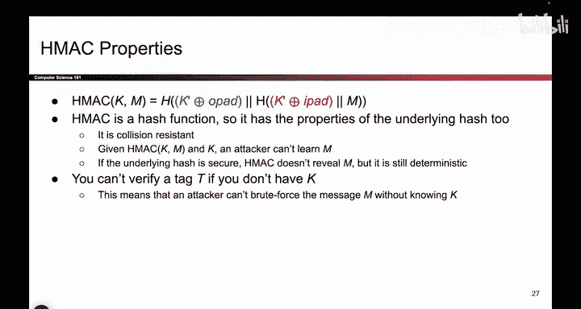
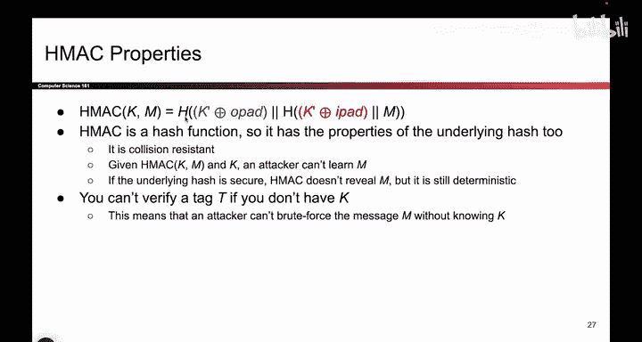
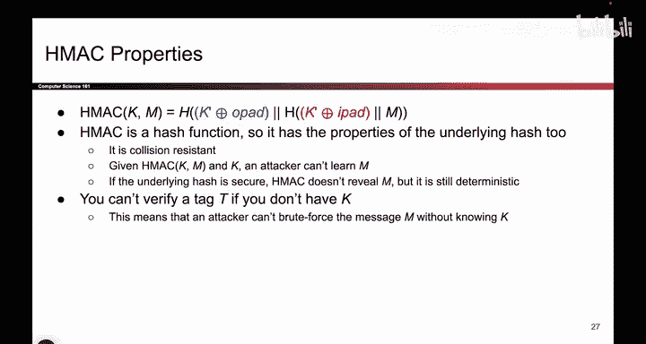
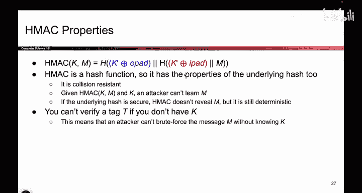
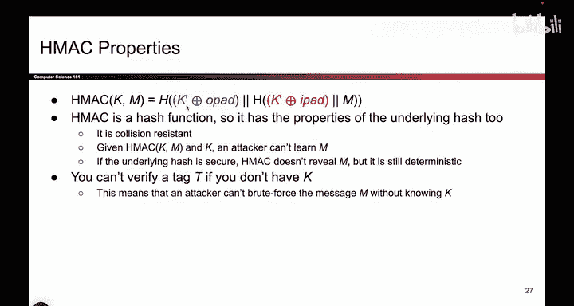
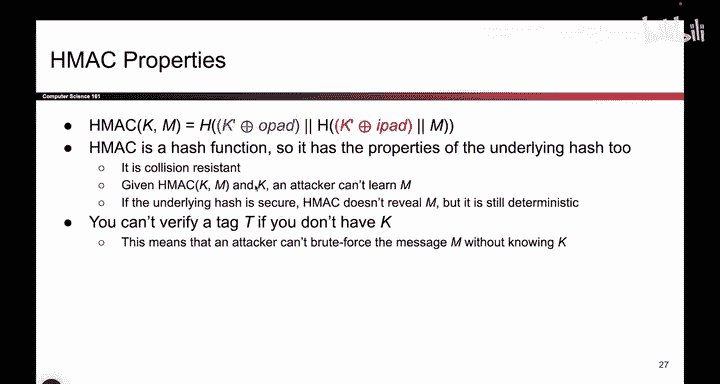
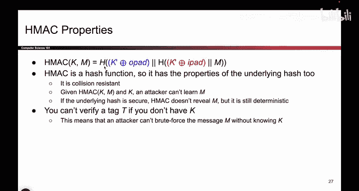
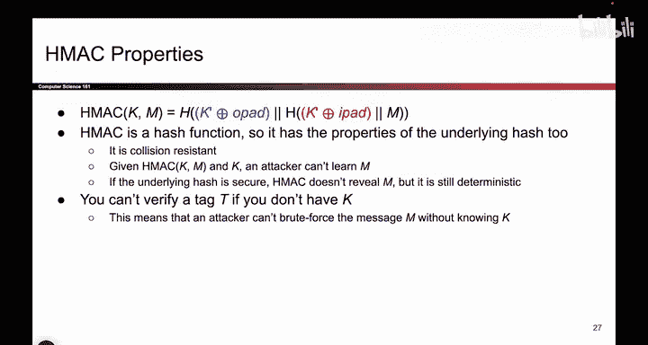
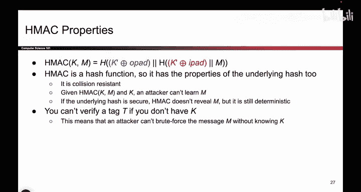

# 124：HMAC特性 🔐

在本节课中，我们将要学习HMAC（基于哈希的消息认证码）的核心特性。我们将看到，HMAC本质上是一个哈希函数，并因此继承了安全哈希函数的所有重要属性，如抗碰撞性和单向性。我们还将讨论其不可伪造性的证明，以及一个关于验证权限的有趣特点。

---

## 概述 📋

上一节我们介绍了HMAC的基本结构，它通过一些巧妙的代码从一个密钥生成两个密钥。本节中，我们来看看HMAC作为一个密码学原语，具体拥有哪些重要特性。

HMAC本质上是一个哈希函数。它接收输入，经过一些特殊处理后，最终输出一个哈希值。因此，HMAC的输出就是其内部哈希函数H的输出。

## HMAC继承哈希函数的属性 🔗

因为HMAC本身是一个哈希函数（只是在计算哈希前对输入做了一些额外处理），所以它继承了底层哈希函数H的所有属性。我们之前提到，这个哈希函数是一个安全的密码学哈希函数。

以下是安全哈希函数的关键属性，HMAC也同样具备：

### 抗碰撞性

这意味着你无法找到两条不同的消息，使它们产生相同的MAC（消息认证码）。这样的碰撞虽然理论上存在，但实际中极难被发现。

**核心概念**：对于一个抗碰撞的哈希函数H，找到任意两个不同的输入 `x` 和 `y`，使得 `H(x) = H(y)`，在计算上是不可行的。

这个属性非常有用。它防止了攻击者让Alice对一条消息生成MAC后，再拿出另一条具有相同MAC的消息来进行欺骗。由于HMAC的哈希是抗碰撞的，这种攻击无法实现。

### 单向性

这意味着即使有人告诉你HMAC的输出，你也无法逆向推导出原始的输入或密钥。

**核心概念**：给定输出 `h = H(m)`，要计算出原始输入 `m` 在计算上是不可行的。

## HMAC的不可伪造性 🛡️

之前我们提到，存在一个（此处不展示的）证明：只要底层的哈希函数是安全的，那么HMAC就是**不可伪造的**。

其大致原理是：哈希函数将消息和密钥“打乱”混合，最终生成一个同时基于消息和密钥的“指纹”。这使得攻击者在不知道密钥的情况下，无法为一个新的消息伪造出有效的MAC。

## 一个关于验证的有趣特点 🔑

最后，有一个值得注意的特点：**如果没有密钥K，你也无法验证一个标签（Tag）**。这取决于你的视角，可能是一个特性，也可能是一个限制。

回顾我们之前构建MAC的方式：当Bob想要验证时，他需要密钥和原始消息，然后重新生成标签进行比对。

这意味着，只有拥有对称密钥的人（比如Bob）才能验证消息的真实性。这是HMAC的一个固有特性：只有持有密钥的人才能对消息进行签名或验证。

---

## 总结 ✨

本节课中我们一起学习了HMAC的核心特性。

1.  **本质是哈希**：HMAC是一个哈希函数，继承了安全哈希函数的属性。
2.  **关键属性**：包括**抗碰撞性**（无法找到两条相同MAC的消息）和**单向性**（无法从输出反推输入）。
3.  **安全保证**：有证明表明，在底层哈希安全的前提下，HMAC具有**不可伪造性**。
4.  **验证权限**：只有密钥持有者才能进行有效的验证，这是由其对称密钥机制决定的。

理解这些特性，有助于我们明白为何HMAC被广泛用于确保消息的完整性和真实性。