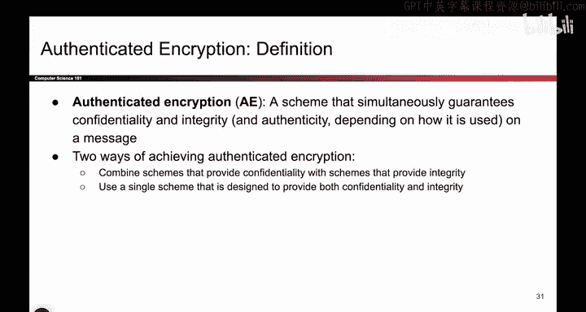

# 126：结合加密与MAC方案 🔐


在本节课中，我们将要学习如何将加密方案与消息认证码（MAC）方案结合起来，以实现同时具备**机密性**和**完整性**的认证加密。我们将探讨两种主要策略：一种是组合现有方案，另一种是设计全新的方案。课程内容将简单直白，确保初学者能够理解。

---

## 概述

到目前为止，我们已经学习了提供**机密性**的对称密钥方案（如AES-CBC、CTR模式），以及提供**完整性**和**认证**的方案（如HMAC）。然而，在实际应用中，我们通常需要同时确保消息的机密性和完整性。本节课程将探讨如何巧妙地组合这些方案，以实现**认证加密**。


---

## 组合现有方案



上一节我们介绍了认证加密的基本概念，本节中我们来看看第一种策略：组合我们已经学过的加密和MAC方案。我们可以使用以下两种构建模块：

*   一个IND-CPA安全的加密方案（例如AES-CBC或CTR模式），包含加密函数 `E` 和解密函数 `D`。
*   一个不可伪造的MAC方案（例如HMAC），包含标签生成函数 `MAC`。

### 首次尝试：分别加密与MAC

以下是我们的第一个组合思路：在发送消息时，先对明文进行加密，再单独计算明文的MAC。

```
发送内容 = (密文 = E(K1, M), 标签 = MAC(K2, M))
```

这个方案能提供完整性吗？看起来可以。如果攻击者篡改了密文或标签，接收方Bob解密后得到的明文将无法通过MAC验证。

然而，它**无法提供机密性**。因为MAC本身不保证机密性，对同一明文生成的MAC标签是确定性的。攻击者通过观察信道中重复的标签，可以推断出相同的消息被发送了多次。更极端的情况下，一个设计不当的MAC函数甚至可能直接泄露部分明文信息。

因此，我们的首次尝试失败了，它只提供了完整性，但牺牲了机密性。我们需要更巧妙的设计。

### 方案一：对密文计算MAC（Encrypt-then-MAC）

为了解决MAC泄露明文信息的问题，一个自然的想法是：不对明文计算MAC，而是对**密文**计算MAC。

```
发送内容 = (密文 = E(K1, M), 标签 = MAC(K2, 密文))
```

*   **完整性**：攻击者无法篡改密文或标签而不被察觉，因为他不知道MAC密钥 `K2`。
*   **机密性**：即使MAC可能泄露关于其输入（即密文）的信息，但密文本身已经是加密的。攻击者获得密文信息并不能帮助他恢复明文。

这个方案是可行的，它也是TLS等协议中使用的标准方法之一。

### 方案二：加密“消息+MAC”（Encrypt-and-MAC）

另一个思路是将MAC也保护起来，将其和明文一起加密。


```
发送内容 = 密文 = E(K1, (M, MAC(K2, M)))
```

*   **完整性**：如果攻击者篡改了外部密文，解密后得到的内部`(M, MAC)`对将无法通过验证。
*   **机密性**：由于整个数据包（包括消息和MAC）都被加密，攻击者无法获得任何明文或MAC标签信息。

这个方案同样有效。它与第一种方案的关键区别在于MAC标签的可见性。

---

## 构建全新方案

除了组合现有方案，另一种策略是设计一个全新的、从一开始就以同时实现机密性和完整性为目标的密码学原语。这类方案通常具有更高效和更简洁的设计。一个著名的例子是**认证加密关联数据（AEAD）** 模式，例如GCM（Galois/Counter Mode）。AEAD模式在一个统一的算法框架内，使用单个密钥处理加密和认证，并且能额外认证一些未加密的关联数据（如数据包头）。

---

## 总结

本节课中我们一起学习了如何实现认证加密。我们了解到，简单地并行使用加密和MAC（分别处理）是不够的，因为MAC可能破坏机密性。我们探讨了两种有效的组合方式：
1.  **Encrypt-then-MAC**：先加密，再对密文生成MAC。
2.  **Encrypt-and-MAC**：先对明文生成MAC，然后将“明文+MAC”一起加密。

此外，我们还了解到存在像GCM这样的**集成化AEAD方案**，它们被专门设计来一次性高效地解决机密性和完整性问题。在实际系统中，应根据安全需求和性能考虑选择合适的方法。