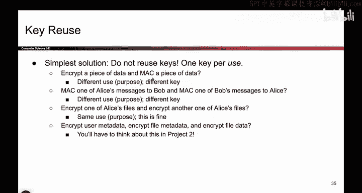
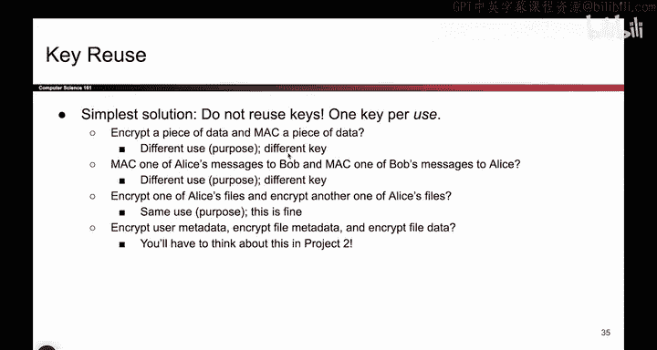
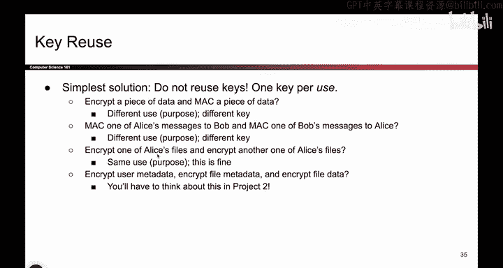
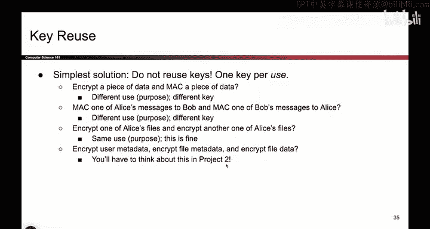
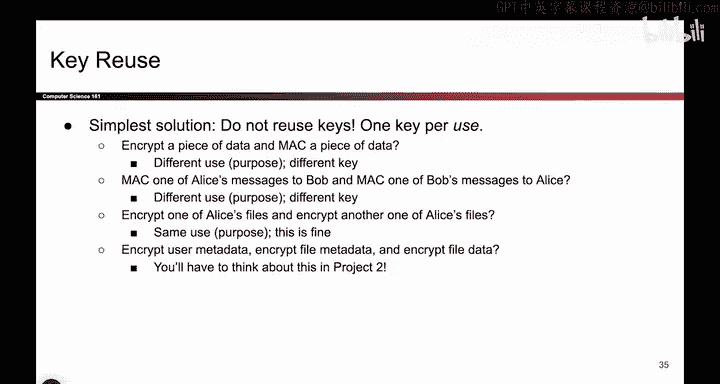
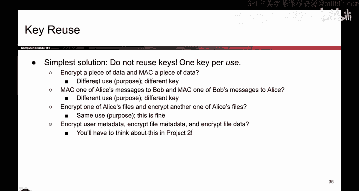
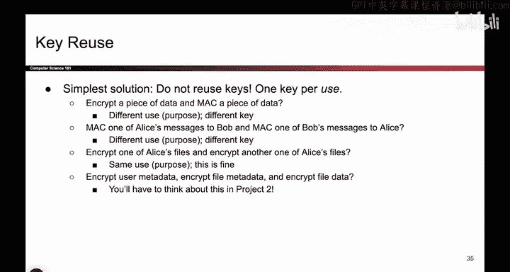

# 128：密钥复用 🔑

在本节课中，我们将要学习一个在密码学中需要特别注意的概念：**密钥复用**。我们将探讨什么是密钥复用，为什么它可能带来安全风险，以及如何避免这些问题。

## 概述

在之前的课程中，我们已经接触过使用不同密钥的场景。例如，在“先加密后MAC”方案中，我们使用一个密钥 `K1` 进行加密，而使用另一个完全不同的密钥 `K2` 来计算MAC。本节我们将深入探讨，如果在这两种不同的算法中使用同一个密钥会发生什么，以及为什么这通常是一个坏主意。

## 什么是密钥复用？🤔

上一节我们介绍了在加密和MAC中使用不同密钥的做法。本节中我们来看看，如果使用同一个密钥会怎样。

密钥复用，在本课程的语境下，特指**在两种不同的算法中使用同一个密钥**。例如，加密是一个算法，计算MAC是另一个算法。如果两者都使用同一个密钥 `K`，这就构成了密钥复用。

**核心概念公式：**
```
密钥复用 = 同一密钥K 用于 算法A 和 算法B
```

## 密钥复用的风险

以下是使用同一密钥可能引发的安全问题：

*   **算法间干扰**：如果加密方案和MAC方案都基于分组密码（例如，使用CBC模式的加密和基于分组密码的MAC算法），那么使用同一个密钥可能导致这两个算法以非常微妙的方式相互干扰。例如，加密过程可能将消息正向通过分组密码，而MAC过程可能无意中将消息反向通过同一个分组密码，这可能导致原始明文被意外恢复。
*   **安全分析复杂化**：密钥复用使得整个方案的安全性分析变得极其复杂。你需要额外证明，这两种算法在使用同一密钥时不会相互影响，不会引入新的漏洞。这通常是一项困难且容易出错的工作。

因此，结论是：**避免密钥复用**。使用不同的密钥可以彻底消除算法间干扰的可能性，让你无需进行复杂且容易出错的安全分析。

## 如何避免密钥复用？✅

上一节我们了解了密钥复用的风险，本节中我们来看看解决方案。

避免密钥复用的方法很简单：**为不同的算法使用不同的密钥**。

以下是一些具体的应用场景和最佳实践：






*   **加密与认证**：当你需要对消息同时进行加密和MAC计算时，请务必使用两个独立的密钥。例如，用 `K_enc` 加密，用 `K_mac` 计算MAC。
*   **不同通信对象**：如果你需要为发送给Bob的消息和发送给Alice的消息分别计算MAC，考虑使用不同的MAC密钥。这可以防止针对一个对象的攻击影响到另一个对象。
*   **相同算法的多次使用**：根据本课程的定义，使用同一密钥多次加密不同消息（例如，用同一个 `K_enc` 加密文件A和文件B）不被视为“密钥复用”，因为使用的是同一个算法。这在某些情况下可能是可接受的，但具体取决于你的威胁模型。在某些项目中，为不同的数据使用不同的加密密钥可能更安全。


**核心原则代码描述：**
```python
# 好的做法：不同算法，不同密钥
key_enc = generate_key()  # 用于加密的密钥
key_mac = generate_key()  # 用于MAC的密钥

ciphertext = encrypt(message, key_enc)
tag = mac(ciphertext, key_mac)

# 风险做法：密钥复用（应避免）
shared_key = generate_key()
ciphertext = encrypt(message, shared_key)  # 使用同一密钥
tag = mac(ciphertext, shared_key)          # 使用同一密钥
```





总而言之，一个绝对正确的做法是：**当涉及两个不同的算法时，始终使用两个独立的密钥**。这可以避免不必要的干扰，并简化安全保证。









## 一个历史案例：先MAC后加密的攻击




在密码学发展早期，人们曾普遍使用“先MAC后加密”的方案（即先计算MAC，再加密“消息+MAC”）。这个方案本身存在缺陷（例如，它向攻击者提供了一个解密预言机）。历史上，互联网早期确实出现过针对该方案的实际攻击。这一事件促使“先加密后MAC”成为了更受推荐的标准。如果你感兴趣，可以搜索相关历史攻击的详细信息。

## 总结

本节课中我们一起学习了**密钥复用**的概念。我们明确了在本课程中，密钥复用特指在两种不同的算法中使用同一个密钥。我们探讨了这样做可能引发的算法间干扰和安全分析复杂化等风险。为了避免这些风险，我们得出的最佳实践是：**为不同的密码学算法始终使用不同的密钥**。记住这个原则，可以帮助你构建更简单、更安全的密码学系统。