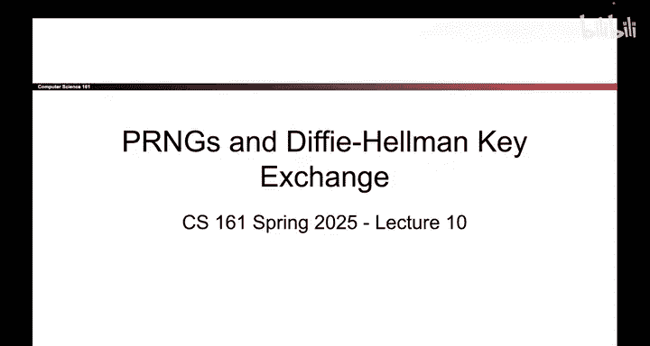
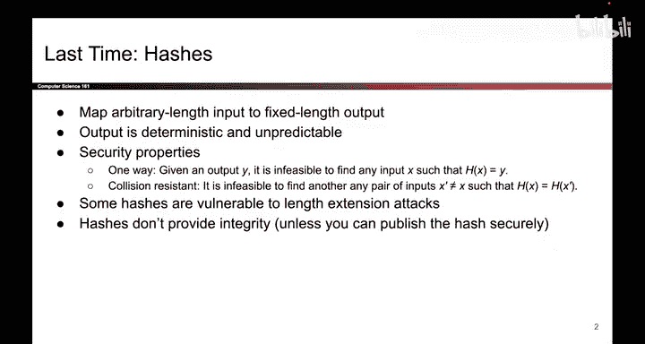
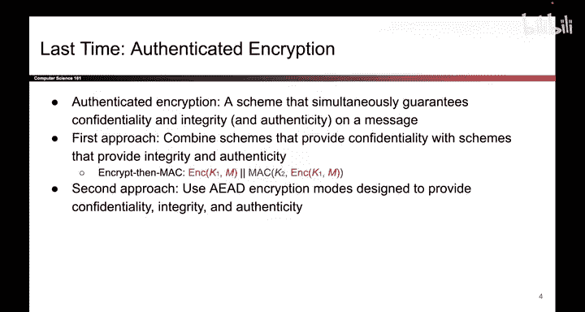
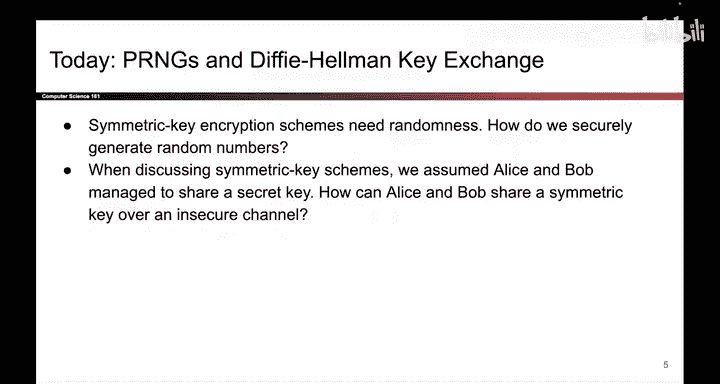

# 130：回顾与引言 🔄

在本节课中，我们将回顾之前学过的密码学核心概念，并引出两个尚未解答的关键问题：对称密钥方案中的随机性从何而来，以及通信双方如何首次获得共享的对称密钥。

---

上一节我们回顾了哈希函数和消息认证码（MAC）的基本概念。本节中，我们来看看如何将保密性和完整性方案结合起来。

## 哈希函数回顾 🔍

哈希函数将任意长度的输入映射为固定长度的输出。输出是确定性的，但具有不可预测性。这意味着即使只改变输入的一个比特，输出也应看起来完全不同且不可预测。我们讨论过使密码学哈希安全的两个安全属性。

然而，哈希函数的输入不包含任何密钥，因此在我们的威胁模型下，它无法提供完整性。

## 消息认证码（MAC） 🛡️

为了解决完整性问题，我们引入了消息认证码（MAC）。MAC在我们的威胁模型下能提供完整性。其输入是一个密钥和一条消息，输出是该消息的一个标签。

我们描述了安全的MAC应具备不可伪造性，并展示了一个基于哈希函数构建MAC的示例。最后我们指出，MAC提供完整性，但不提供保密性。

## 认证加密 🔐

最后，我们讨论了使用认证加密来结合保密性方案和完整性方案的两种方法。

以下是两种主要方法：
*   **先加密后MAC**：这种方式比“先MAC后加密”更优。
*   **AEAD加密模式**：这种方式存在风险，因为如果使用不当，可能会同时丧失保密性和完整性。

以上就是我们上节课讨论的内容。

---

## 本节课的核心问题 ❓

今天，我们将解答两个被搁置了一段时间的问题。

以下是本节课要解决的两个核心问题：
1.  在我们的对称密钥方案中，随机性从何而来？
2.  爱丽丝和鲍勃最初是如何获得那个共享的对称密钥的？

这两个问题我们回避了很久，但今天终于要给出答案了。

---

本节课中，我们一起回顾了哈希、MAC和认证加密的概念，并明确了接下来要探索的两个关于随机性和密钥交换的核心问题。在后续章节中，我们将深入探讨伪随机数生成器和迪菲-赫尔曼密钥交换协议。