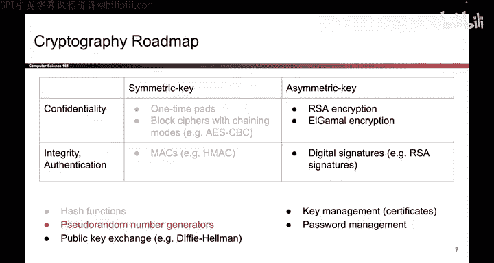

# 131：熵与真随机性

在本节课中，我们将要学习密码学中的一个核心概念：随机性。我们将探讨随机性的定义、如何衡量它，以及真随机数的来源。理解这些概念对于构建安全的密码系统至关重要。

## 什么是随机性？

在密码学中，随机性意味着不可预测性。许多我们已学过的加密方案和MAC计算都需要随机密钥。在加密方案中，每次加密也需要随机的初始化向量（IV）或随机数。如果攻击者能够预测这些随机值，整个系统的安全性将荡然无存。因此，我们需要讨论这些随机数从何而来，以及如何安全地生成它们。

## 如何衡量随机性？

在讨论如何生成随机数之前，我们首先需要定义“随机”的含义。在密码学中，“随机”意味着真正随机且不可预测。

为了直观理解不可预测性，假设我们需要生成一个攻击者无法猜测的密钥。一个理想的方法是反复抛掷一枚均匀的硬币（正面和反面各50%概率），正面记为0，反面记为1。这样生成的比特串对攻击者来说很难猜测，因为每个比特是0或1的概率完全相等。

相比之下，如果使用一枚有偏的硬币（例如正面90%，反面10%）来生成密钥，那么密钥中的大部分比特都将是0。攻击者知道这一点后，就更有可能猜中你的密钥。

我们需要一个更正式的方式来描述：均匀硬币（50%/50%）比有偏硬币（大部分输出为0）是更好的随机性来源。这个正式的衡量标准被称为**熵**。熵衡量了结果的不确定性或不可预测性。通常，在密码学中我们喜欢高熵的事件，因为高熵意味着结果难以预测。

例如，均匀硬币具有高熵，因为每次抛掷的结果（正面或反面）难以预测。而有偏硬币则具有低熵，因为结果（很可能是正面）是可预测的。

熵通常以比特为单位来衡量。例如，一枚均匀硬币具有1比特的熵（两种等可能的结果）。一个在8个值上均匀分布的随机源，其熵为 `log₂(8) = 3` 比特。对于本课程而言，重要的是理解熵让我们能够正式地衡量不确定性，而高熵事件是好的。

## 低熵的风险

以下是一个现实世界的例子，说明了使用低熵随机源的危险。某个比特币代码库中，有人提交了一个“改进”随机数生成器的代码。然而，这个“改进”实际上降低了生成器的熵。这意味着攻击者现在更容易猜出用此代码生成的私钥。如果攻击者能预测私钥，他们就能窃取你的比特币，所有安全性都将丧失。所以，这或许根本算不上什么改进。

## 真随机性从何而来？

既然我们知道了如何定义和衡量随机性，现在让我们思考随机性究竟从何而来。如果你想要真随机性，你必须依赖某种物理熵源，即现实世界中存在的、不可预测的物理现象。

以下是几个物理熵源的例子：

*   **CPU电路噪声**：在你的CPU上，可以设计一个电路，使其行为具有不可预测性。例如，让电压水平在0.5伏左右波动，这样有时被读取为1，有时被读取为0，任何时刻的电压水平都是不可预测的。
*   **人类活动时序**：以非常精确的时间尺度测量的人类活动。例如，记录你每次按下键盘按键时的微秒级时间戳。人类无法在微秒级别精确控制动作，因此这些时间戳数字可以视为随机的。
*   **更奇特的熵源**：例如，Cloudflare公司的办公室里有一整面墙的熔岩灯，并用摄像头对着它们拍摄。熔岩灯中光影的闪烁模式也可以被用作随机源。

使用真随机性的主要问题是，生成速度慢且成本高。因为你依赖于这些物理熵源，收集熵的过程可能很慢，与运行一段代码相比可能非常昂贵。因此，虽然理想情况下我们需要真随机性，但高效地生成它并不容易。

## 总结

本节课中，我们一起学习了密码学中随机性的核心概念。我们了解到，随机性在密码学中意味着不可预测性，而**熵**是衡量这种不可预测性的正式标准。高熵的随机源对安全至关重要，低熵则会导致严重的安全漏洞。最后，我们探讨了真随机性必须来源于物理世界的不可预测现象，例如硬件噪声或人类活动的精确时序，尽管这些方法在效率上存在挑战。理解这些是设计和评估安全密码系统的基础。