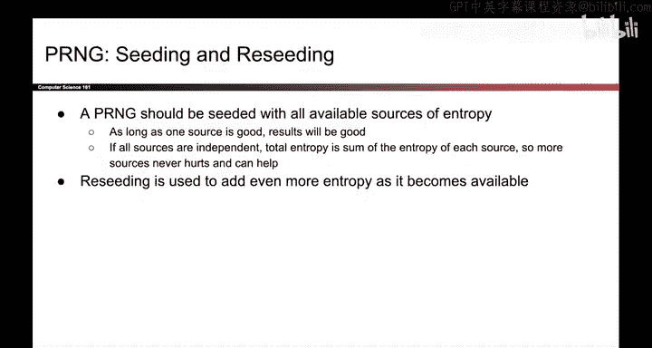

# 132：伪随机数生成器定义 🔐

在本节课中，我们将要学习伪随机数生成器的核心概念、定义方式以及其应具备的安全属性。我们将从为何需要PRNG开始，逐步深入到其工作原理和安全要求。

## 概述

由于真正的随机性获取成本高昂，我们转而寻求软件解决方案。伪随机数生成器就是一段软件代码，它接收少量真正的随机性作为输入，能够快速、高效地生成大量看似随机的输出。

## PRNG的工作原理

上一节我们提到了真随机数的局限性，本节中我们来看看软件如何模拟随机性。PRNG的使用方式如下：首先收集少量昂贵的真随机数，将其输入PRNG。随后，PRNG便能高效、廉价地输出大量看似随机的数字。

需要注意的是，PRNG是确定性的。这意味着，如果你两次输入相同的真随机比特，你将得到相同的“随机”输出。毕竟，PRNG只是一段代码，输入相同，输出必然相同。

然而，如果一个PRNG被设计为安全的，那么我们可以说其输出在计算上是不可区分的。

## 安全目标：计算不可区分性

从真正的随机性来看，这意味着如果你给攻击者一些以这种方式生成的PRNG输出，再给他们一些由熔岩灯或其他物理随机源生成的真正随机输出，那么具有多项式运行时间的攻击者将无法分辨哪些来自PRNG，哪些来自真正的随机源。

这就是我们对PRNG的目标：它是一段能够高效生成与随机数无异的数字的代码，尽管它们来自一个确定性算法。

## 如何定义PRNG

实际上，定义PRNG有多种方式。如果你查阅不同的研究论文，会看到PRNG的不同定义。但为了本课程的目的，我们将PRNG视为一个对象。

以下是PRNG作为对象的核心方法：

*   **seed方法**：此方法接收一些真随机比特，并用它们来初始化PRNG的内部状态。作为一个对象，PRNG拥有一些内部实例变量来帮助生成伪随机数。播种就是使用真随机性作为输入来初始化该内部状态。
*   **reseed方法**：如果你决定输入更多真随机性，可以调用此方法。它再次接收一些真随机性，并更新内部状态以纳入这些随机比特。
*   **generate方法**：这是实际产生输出的方法，也是你生成伪随机比特的方式。你传入一个数字N，表示需要N比特的伪随机输出。PRNG使用其内部状态（可能根据需要更新这些内部变量），在软件中廉价且高效地生成你所请求的N个伪随机比特。

## PRNG的正确性与安全性

那么，什么使一个PRNG正确且安全呢？

以下是PRNG应具备的关键属性：

*   **确定性**：它是一段代码。如果用相同的输入运行它，应该得到相同的输出。
*   **高效性**：我们不会正式定义这一点，但可以理解为，无论它做什么，都应该是计算机擅长的位操作之类的事情，以便相比真随机性，它确实能带来效率优势。
*   **计算不可区分性**：在安全性方面，我们希望它在计算上与随机数不可区分。我们将更正式地定义这一点。
*   **回滚抵抗性**：你可能还希望一个额外的安全属性，称为回滚抵抗性，我们也将讨论这一点。

## 熵源与PRNG安全性

一个好的PRNG应该能够处理你能提供的所有熵源。

如果你给PRG一个好的熵源，那很棒。现在，想要预测你PRG输出的攻击者必须猜测那个初始输入熵，才能运行算法并生成与你相同的输出。

但一个好的PRG也应该能够处理坏的熵源，并使PRG变得更好。

例如，如果你传入一个有偏硬币的输出。我们知道它的熵很低，但它仍然应该有助于PRG变得更安全。攻击者仍然必须猜测那个有偏硬币抛掷的结果，才能以你播种的方式重建PRG。

即使你传入一些完全没有熵的源，比如它总是1，这也不应该使PRG变差。攻击者总是知道你传入了输入1，这是一个非常糟糕的熵源，但它不应该使PRG变差。

因此，只要其中一个源是好的，整个PRNG对攻击者来说就应该是难以猜测的。

另一种说法是，PRNG的总熵应该是你提供的每个熵源之和。因此，如果你提供更多源，即使它们是低熵或零熵的，它们也应该只会有帮助，而不应该使PRNG变差。

这意味着，如果你正在使用PRNG，只要你有一个熵源，即使它很糟糕，就用这个额外的熵重新播种你的PRNG。这应该只会让事情变得更好，而不是更糟。

## 总结

本节课中我们一起学习了伪随机数生成器的核心概念。我们了解到，PRNG是一种通过确定性算法高效生成“看似随机”数字的软件工具，其安全性核心在于输出的“计算不可区分性”。我们将其定义为一个具有`seed`、`reseed`和`generate`方法的对象，并探讨了其应具备的确定性、高效性和安全性（包括对各类熵源的鲁棒性）等关键属性。理解这些是构建和使用安全密码系统的基础。