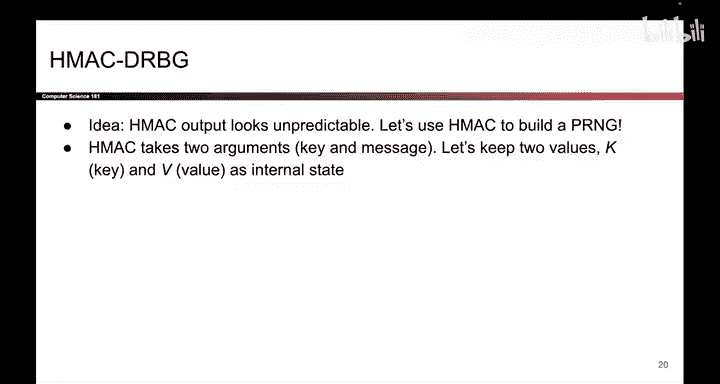
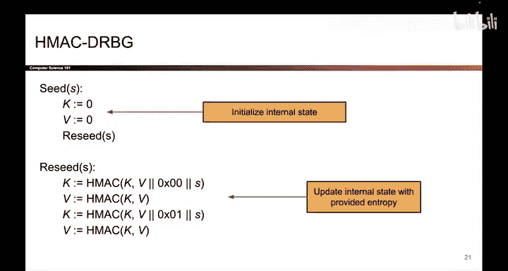
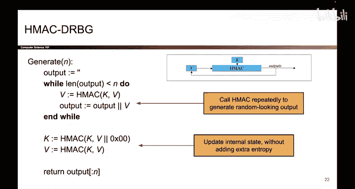

# 135：PRNG的实现 🔐

在本节课中，我们将学习伪随机数生成器的具体实现。我们将探讨两种常见的、安全的PRNG构造方法：基于计数器模式和基于HMAC的实现。

---

上一节我们介绍了PRNG的定义，本节中我们来看看一些具体的实现例子。

事实证明，一个PRNG的例子一直隐藏在我们眼前。当我们讨论CTR模式时，我们提到CTR模式的行为类似于一次性密码本，其中用于与明文进行异或操作的随机“密码本”是由分组密码的输出生成的。

如果你只看这张图的上半部分，即生成随机“密码本”的部分，它本身就是一个PRG。种子是随机数和密钥，即你传入的真实随机性。而分组密码的输出就是由这个PRG生成的伪随机输出。

因此，基于计数器的PRNG是一种可以用来构建安全PRNG的可能结构，这基于一个事实：分组密码的输出与随机数是不可区分的。所以，这个RNG的输出也与随机数不可区分。

---

现在，让我们看看另一种构建安全PRNG的方法。

另一种构建安全PRNG的方法实际上是基于HMAC的。请记住，HMAC本身基于哈希函数，并且哈希函数的输出是不可预测的。如果你改变输入的任何一位，输出看起来都完全不可预测。我们将利用这个想法来构建我们的PRNG。

以下是该构造的示意图。不必过于担心这里的精确细节，这不是最重要的。只需记住，我们正在多次调用HMAC，而底层哈希函数的不可预测性正是我们获得不可预测输出的原因。

如果你好奇，以下是所有确切的细节，尽管它们在这里不是最重要的。

基于HMAC的PRNG有两个实例变量：`K` 和 `V`。它们恰好从零开始。任何时候你调用 `seed` 或 `reseed` 时，请注意我们正在将种子 `S` 输入到HMAC中，以产生一些不可预测的输出，然后我们将 `K` 和 `V` 重新分配给该HMAC的输出。实际上，我们正在借助HMAC将你引入的随机性合并到我们的实例变量 `K` 和 `V` 中。

现在，如果你想生成输出，过程可能如下所示。

这里有一个循环，该循环反复调用HMAC，直到输出了足够的比特。因此，如果你请求很多比特，这个循环将运行很多次，直到HMAC被调用了足够次数以生成足够的输出。此外，每次我们调用HMAC时，我们也会更新一个内部变量 `V`，然后我们将其传递回HMAC，这确保了在这个循环中每次调用HMAC都会产生不同的输出。

同样，不必过于担心这里的精确细节。重要的是，我们正在循环中调用HMAC，并且每次都会更新内部状态，这就是产生看似随机输出的原因。最后，我们再次更新内部状态（这不太重要），但这就是基于HMAC的PRNG可能的样子。

这里需要注意的一点是，这里的一切都是确定性的。它完全基于用户输入 `S` 和 `N`。在任何时候，我们实际上都没有使用真正的随机性。代码本身是确定性的，真正的随机性是由用户输入的。这就是为什么我们说PRNG是确定性的。它们从外部或用户提供的 `S` 中获取真正的随机性，然后确定性地生成伪随机输出。

---

接下来，我们讨论一下基于HMAC的PRNG的安全性和一个重要特性。

基于HMAC的PRNG是安全的，前提是你所使用的底层哈希函数是安全的。我们不会在本课程中证明这一点，我们不是一个基于证明的课程。但如果你好奇，证明将类似于归约证明，即如果你能破解HMAC，那么你也破解了底层的哈希函数；因此，如果底层哈希函数是安全的，那么基于HMAC的PRG也是安全的。我们不会讨论证明，但大纲会是那样的。

基于HMAC的PRG的另一个巨大好处是它具有**抗回滚性**。请记住，该属性意味着你无法反向运行HMAC PRG算法。即使有人告诉你当前的内部状态，即 `K` 和 `V` 这些内部实例变量的值，你也无法反向运行此算法来找出此PRG之前的输出。

原因在于，这个PRG一直在调用哈希函数，反复调用HMAC，而HMAC是你无法反向调用的。给定HMAC的输出，你并不知道输入是什么，因此你无法反向运行此算法。

总而言之，基于HMAC的PRG是安全的。它们与随机数不可区分，并且还具有抗回滚性。我们拥有这个额外的属性，即你无法反向运行该算法。

还有一件事我之前没有提到，现在不妨提一下：**DRBG** 代表确定性随机比特生成器，这只是人们有时对PRG使用的另一个名称。有很多缩写，但这就是DRBG的含义。

---

本节课中我们一起学习了两种安全的伪随机数生成器实现：基于计数器模式和基于HMAC的构造。我们了解到，它们都依赖于密码学原语的安全性来保证输出的伪随机性，并且基于HMAC的实现还具有抗回滚的重要特性。记住，PRNG本质上是确定性的算法，它们将有限的真实随机种子扩展为看似随机的长序列。