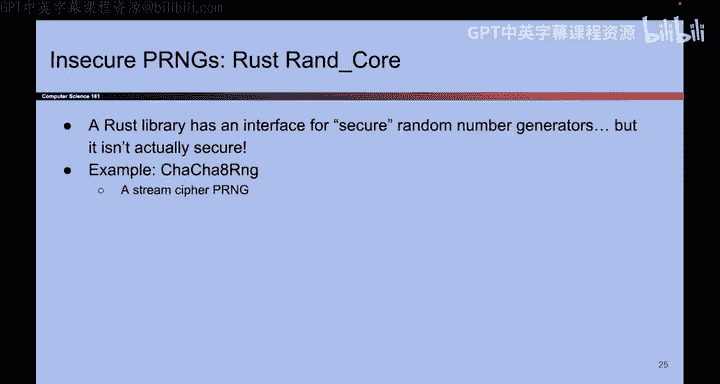

# 136：使用随机性生成唯一ID 🔑

在本节课中，我们将学习伪随机数生成器的实际应用之一：生成全局唯一标识符。我们将探讨其原理、实现方式以及需要注意的安全事项。

## 伪随机数生成器的安全问题 ⚠️

上一节我们介绍了伪随机数生成器的构建方式，本节中我们来看看实际应用中常见的安全隐患。

不安全的伪随机数生成器在现实中出现得相当频繁，因此我们有很多反面案例。请不要成为下一个案例。

如果使用安全的伪随机数生成器，但没有提供足够的熵，攻击者就可能预测未来的随机输出，从而导致整个安全体系被破坏。

以下是更多相关案例：

*   案例一
*   案例二
*   案例三

我不再逐一讲解这些案例，如果你感兴趣可以自行阅读。但请务必记住，在使用伪随机数生成器时，必须选择安全的算法，并在种子中传入足够的熵。

## 全局唯一标识符的应用 🆔

随机性的一个与我们之前讨论内容不同的应用，是生成所谓的“全局唯一标识符”。在第二个密码学项目中，你将实际使用到它。

应用场景如下：假设你拥有许多对象，例如文件系统中的文件，你需要为每个对象分配一个唯一且不可预测的ID。你不想简单地使用1、2、3、4、5这样的顺序编号，而是希望编号不可预测，并且确保没有任何两个对象的ID会重复。

事实证明，一种实现方法就是为每个对象随机选择一个数字。你可能会担心运气不好，为两个不同的对象选到了相同的随机数。但如果使用的数字足够大，就可以使这种概率变得极低。

例如，如果你的UUID是128位长，那么生成两个重复数字的概率是 **1/(2^128)**。我们已经讨论过，这个概率是天文数字般的低，基本上等于零。因此，选择随机数几乎等同于获得了唯一性。

这很酷：通过使用随机性，我们可以为所有不同的对象获得唯一的标识符，这就是UUID。你实际上可以使用伪随机数生成器来实现它，并可以在项目二中用它来为项目中需要定义的不同事物分配唯一ID。

这是一个不同且有用的随机性应用示例。

## 本章总结 📝

本节课中我们一起学习了伪随机数生成器及其一个重要应用。

我们首先指出，真正的随机性成本高昂。为了解决这个问题，我们设计了伪随机数生成器。它是一个确定性算法，接收少量称为“种子”的真正随机性，然后高效地生成大量看似随机的输出。

如果将伪随机数生成器视为代码中的一个对象，它有三种方法：
*   `seed`方法：接收熵，不输出任何内容。
*   `reseed`方法：接收熵，不输出任何内容。
*   `generate`方法：接收一个数字，生成相应位数的伪随机输出。

伪随机数生成器的安全性在于其输出在计算上与真正的随机性不可区分。一个额外但不同的理想属性是“回滚抵抗性”。

我们看到了两种构建伪随机数生成器的方法：一种基于分组密码，另一种基于哈希函数，当然也存在其他构造方法。

最后，我们展示了一个不同的随机性应用实例。

关于伪随机数生成器的内容就到这里，接下来我们将学习迪菲-赫尔曼密钥交换。