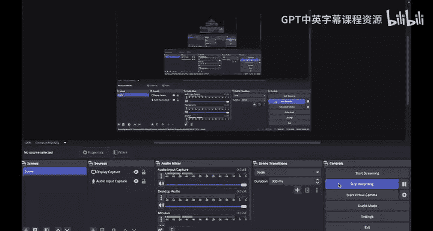
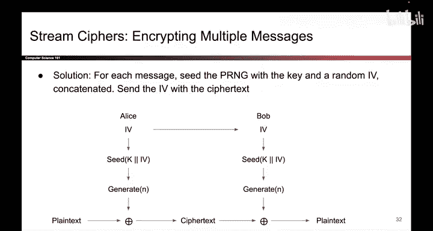

# 137：流密码定义

在本节课中，我们将学习流密码的概念。流密码是一种对称加密算法，它结合了伪随机数生成器和一次性密码本的思想，能够高效地加密数据。

上一节我们介绍了伪随机数生成器，本节中我们来看看如何将其应用于加密，构建一个称为流密码的加密方案。

## 流密码的基本原理

流密码是一种对称密钥加密方案。它假设通信双方，例如爱丽丝和鲍勃，共享一个其他人不知道的密钥。

以下是加密过程：
1.  爱丽丝使用她的秘密密钥作为种子，初始化一个伪随机数生成器。
2.  她生成与明文长度相同的伪随机比特流。
3.  她将明文与此伪随机比特流进行异或运算，得到密文。
4.  她将密文发送给鲍勃。

鲍勃的解密过程与之对称：
1.  鲍勃使用相同的秘密密钥作为种子，初始化相同的伪随机数生成器。
2.  由于伪随机数生成器是确定性的，鲍勃会生成与爱丽丝完全相同的伪随机比特流。
3.  他将收到的密文与此比特流进行异或运算，即可恢复原始明文。

对于窃听者夏娃而言，由于她不知道秘密密钥，因此无法生成正确的伪随机比特流，也就无法解密消息。

## 引入初始化向量

我们目前的构造存在一个问题：它不允许加密多条消息。如果爱丽丝尝试加密第二条消息，她会使用相同的种子，导致伪随机数生成器产生相同的输出。这相当于在一次性密码本中重复使用密钥，这是不安全的。

为了解决这个问题，我们需要引入一个初始化向量。改进后的方案如下：

当爱丽丝想要加密消息时：
1.  她首先生成一个随机的初始化向量。
2.  她使用**秘密密钥**和**本次消息的初始化向量**共同作为种子，来初始化伪随机数生成器。
3.  然后，她生成所需的伪随机比特流。
4.  最后，她将这些伪随机比特与明文进行异或运算，得到密文。

爱丽丝发送给鲍勃的数据包括两部分：加密得到的密文，以及用于本次加密的初始化向量。

鲍勃的解密过程：
1.  鲍勃收到公开的初始化向量。
2.  他使用共享的**秘密密钥**和收到的**初始化向量**共同作为种子，初始化伪随机数生成器。这会生成与爱丽丝加密时完全相同的伪随机比特流。
3.  他将此比特流与密文进行异或运算，即可恢复原始明文。

为了加密多条消息，我们必须引入初始化向量，并且**切记为每条消息使用不同的初始化向量**。这样就能安全地工作。

本节课中我们一起学习了流密码的定义和工作原理。我们了解到，流密码通过伪随机数生成器模拟一次性密码本，实现了高效的对称加密。同时，为了支持多消息加密并保证安全，必须为每次加密引入一个唯一的初始化向量。