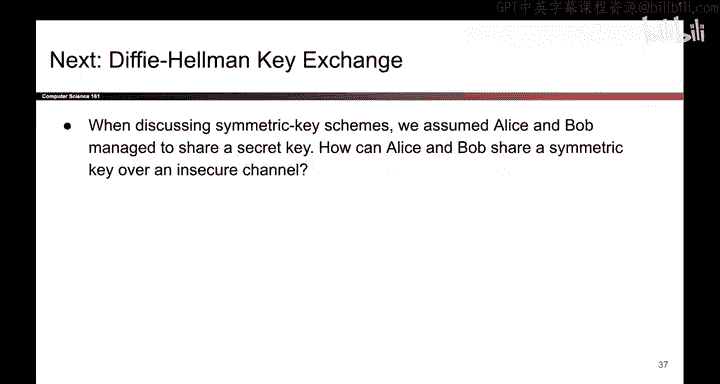

# 138：流密码特性 🔐

在本节课中，我们将要学习流密码的几个关键特性。我们将探讨流密码的不同构建方式、其安全性证明，以及它们在实际应用中的优势，例如支持流式处理和随机访问解密。

---

## 流密码的构建方式

流密码有多种构建方式。仔细观察，你可以认为AES CTR模式就是一种流密码。在加密流程的上半部分，它使用分组密码生成大量伪随机输出，然后将其作为一次性密码本方案中的密钥流。因此，可以说这也是一种流密码。

## 流密码的安全性

只要假设伪随机生成器的输出是安全的，流密码就可以被证明是IND-CPA安全的。其证明过程与我们证明一次性密码本安全性的过程非常相似。

一个非常次要的注意事项是，必须小心不要一次性加密过多数据。例如，在AES CTR模式中，如果加密的消息过长，可能会导致计数器回绕到零，从而开始重复使用密钥流，这会破坏安全性。虽然这种情况在实践中不常发生，但务必注意不要加密大到导致AES CTR计数器回绕的数据。

## 流密码的优势：流式处理

正如其名，流密码的一个好处是支持流式处理。这意味着你可以随着数据的流入，逐步加密和解密额外的数据。

以下是流式处理的具体应用场景：

*   **场景一：解密大文件**：假设你下载了一个大文件的一半。你可以生成足够的伪随机数生成器输出，来解密你当前拥有的这一半文件。当文件的另一半稍后被下载时，你只需从上次停止的地方继续运行PRNG，它就会生成更多字节，用于解密文件的第二部分。
*   **场景二：加密流数据**：如果你正在加密数据，但目前没有全部数据，你可以运行PRNG来加密现有的部分。当后续数据到达时，你只需继续运行PRG，它就会从上次中断的地方继续生成输出，从而允许你加密不断流入的剩余数据。

## 流密码的优势：随机访问

某些流密码的另一个好处是，它们允许你加密或解密消息的任意部分，而无需处理消息的其余部分。

例如，假设你有一个1GB大小的密文，但你只关心最后128字节。一些流密码允许你直接跳转到末尾，仅解密你关心的部分，而无需处理整个密文。

AES CTR模式支持此功能。如果你只想解密第 `i` 个数据块，操作如下：

1.  取随机数 `nonce`。
2.  将其与代表第 `i` 块的数字 `i` 连接起来。
3.  将结果传入分组密码加密函数。
4.  得到的输出就是第 `i` 块对应的密钥流。
5.  用这个密钥流与密文进行异或操作，即可得到原始明文，而无需处理密文的任何其他部分。

然而，并非所有流密码都支持此功能。例如，如果使用基于HMAC的流密码，并且你想解密最后一个块，你必须生成直到最后一个块的所有PRNG输出。因为PRNG的工作原理是反复调用HMAC。所以，要得到最后一个块，你必须多次调用HMAC来生成直到最后一个块的所有输出，因此无法任意跳转到末尾。

---

在本节课中，我们一起学习了流密码的特性。我们了解了其构建思路与安全性基础，并重点探讨了流式处理和随机访问解密这两个实用优势。这些特性使得流密码在特定场景下非常高效。接下来，我们将可以进入迪菲-赫尔曼密钥交换的学习。